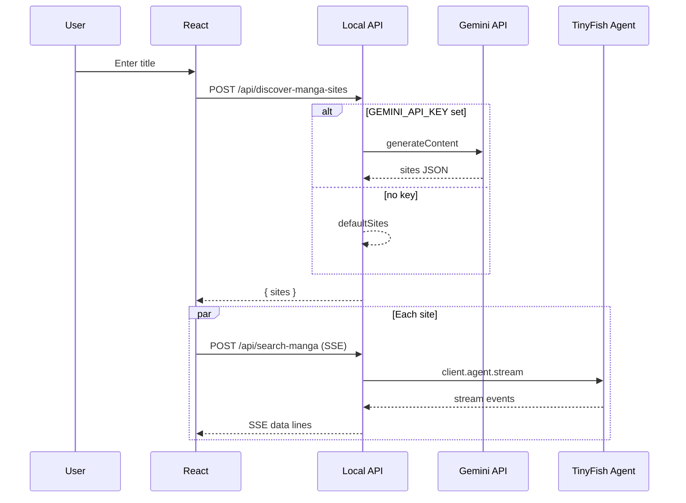

# Manga Availability Finder — Architecture

This app searches multiple manga/webtoon sites in parallel using **TinyFish Agent** (browser automation) and optional **Google Gemini** for site discovery. The backend is a **local Node.js API** in `server/index.mjs`. The React app calls it at `/api/*`; Vite proxies `/api` to `http://localhost:8787` during development.

## System overview

```
┌─────────────────────────────────────────────────────────────────┐
│  React (Vite)  →  useMangaSearch  →  AgentCard + SSE preview   │
└───────────────────────────────┬─────────────────────────────────┘
                                │  fetch("/api/...")
                                ▼
┌─────────────────────────────────────────────────────────────────┐
│  Local API (Express), PORT default 8787                         │
│  POST /api/discover-manga-sites  |  POST /api/search-manga      │
└───────────────────────────────┬─────────────────────────────────┘
                                │
              ┌─────────────────┴─────────────────┐
              ▼                                   ▼
       Gemini (optional)                  TinyFish Agent (@tiny-fish/sdk)
       JSON site list                     streaming run + JSON result
```

## API endpoints

| Method | Path | Purpose |
|--------|------|---------|
| `GET` | `/api/health` | Health check |
| `POST` | `/api/discover-manga-sites` | Body: `{ mangaTitle }`. Returns `{ sites: [{ name, url }] }`. Uses Gemini if `GEMINI_API_KEY` is set; otherwise built-in fallback URLs. |
| `POST` | `/api/search-manga` | Body: `{ url, mangaTitle }`. **SSE** (`text/event-stream`) with `data: {...}` lines terminated by blank lines. |

## SSE events (client)

The hook `src/hooks/useMangaSearch.ts` expects:

```json
{"type":"stream","streamingUrl":"..."}
{"type":"complete","found":true}
{"type":"error","error":"..."}
```

## Agent prompt

The natural-language goal sent to TinyFish is defined in `server/index.mjs` (navigate → analyze results → return JSON with `found`, `match_confidence`, etc.).

## Environment variables

| Variable | Required | Used by |
|----------|----------|---------|
| `TINYFISH_API_KEY` | Yes for live searches | `/api/search-manga` |
| `GEMINI_API_KEY` | No | `/api/discover-manga-sites` (fallback sites if unset) |
| `PORT` | No | API port (default `8787`) |

Set them in `.env.local` at the project root (see `.env.example`). Ensure the API process receives them (e.g. same shell as `npm run dev`, or use a tool that loads `.env`).

## Sequence (Mermaid)



## Client-side SSE consumption

See `src/hooks/useMangaSearch.ts`: it reads the response body as a stream, parses `data: ` JSON lines, and updates agent cards.
