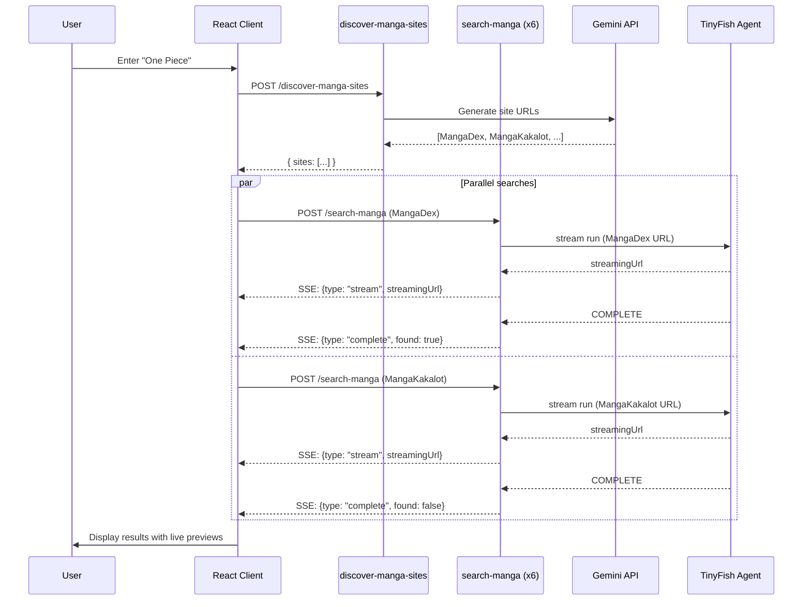

# TinyFish Agent Integration Documentation

## Product Architecture Overview

This application is a **Manga/Webtoon Finder** that uses AI-powered browser automation to search for manga availability across multiple websites simultaneously.

### System Architecture

```
┌─────────────────────────────────────────────────────────────────────────────┐
│                              Client (React)                                  │
│                                                                             │
│  ┌─────────────┐    ┌──────────────────┐    ┌─────────────────────────────┐ │
│  │ SearchHero  │───▶│  useMangaSearch  │───▶│  AgentCard (x6 parallel)   │ │
│  │  Component  │    │      Hook        │    │  with Live Stream Preview   │ │
│  └─────────────┘    └──────────────────┘    └─────────────────────────────┘ │
└─────────────────────────────────────────────────────────────────────────────┘
                                    │
                                    ▼
┌─────────────────────────────────────────────────────────────────────────────┐
│                           Local API (Node.js)                                │
│                                                                             │
│  ┌────────────────────────────┐     ┌───────────────────────────────────┐   │
│  │  /api/discover-manga-sites  │     │      /api/search-manga (x6)       │   │
│  │  (Called: 1x)               │     │      (Called: 6x parallel)        │   │
│  │  Gemini (optional) → URLs   │     │  TinyFish Agent → Browser auto     │   │
│  │  (fallback sites if missing)│     │  (SSE Streaming)                   │   │
│  └────────────────────────────┘     └───────────────────────────────────┘   │
└─────────────────────────────────────────────────────────────────────────────┘
                                    │
                                    ▼
┌─────────────────────────────────────────────────────────────────────────────┐
│                            External APIs                                     │
│                                                                             │
│  ┌────────────────────────┐         ┌────────────────────────────────────┐  │
│  │      Gemini API        │         │        TinyFish Agent              │  │
│  │  (Site Discovery)      │         │ (Browser automation + streaming)   │  │
│  └────────────────────────┘         └────────────────────────────────────┘  │
└─────────────────────────────────────────────────────────────────────────────┘
```

### API Call Summary

| API | Purpose | Calls per Search | Response Type |
|-----|---------|------------------|---------------|
| Gemini API | Discover manga reading sites | 1x | JSON |
| TinyFish Agent (via SDK) | Automate browser search on each site | 5-6x (parallel) | Streaming (forwarded as SSE) |

### Orchestration Flow

1. **User enters manga title** → Client triggers `useMangaSearch.search(title)`
2. **Site Discovery** → `discover-manga-sites` edge function calls Gemini API (or uses fallback)
3. **Agent Initialization** → Client creates 5-6 agent cards in "idle" state
4. **Parallel Browser Automation** → `search-manga` edge function called for each site simultaneously
5. **Real-time Updates** → TinyFish streaming provides live browser preview URL + final result (forwarded as SSE)
6. **Results Display** → Each agent card updates independently as results arrive

---

## Code Snippets

### 1. Calling TinyFish Agent (Edge Function)

```typescript
// supabase/functions/search-manga/index.ts

import { serve } from "https://deno.land/std@0.168.0/http/server.ts";

const corsHeaders = {
  "Access-Control-Allow-Origin": "*",
  "Access-Control-Allow-Headers": "authorization, x-client-info, apikey, content-type",
};

serve(async (req) => {
  if (req.method === "OPTIONS") {
    return new Response(null, { headers: corsHeaders });
  }

  const { url, mangaTitle } = await req.json();
  const apiKey = Deno.env.get("TINYFISH_API_KEY") || Deno.env.get("MINO_API_KEY");

  // Define the automation goal (see Goal section below)
  const goal = `You are searching for a manga/webtoon called "${mangaTitle}"...`;

  // Stream TinyFish Agent events and forward a simplified SSE stream to client
  // (see `supabase/functions/search-manga/index.ts`)
});
```

### 2. Client-Side SSE Consumption

```typescript
// src/hooks/useMangaSearch.ts

const searchSite = async (agent: SiteAgent, title: string) => {
  const response = await fetch(`${supabaseUrl}/functions/v1/search-manga`, {
    method: "POST",
    headers: {
      "Content-Type": "application/json",
      "Authorization": `Bearer ${supabaseKey}`,
      "apikey": supabaseKey,
    },
    body: JSON.stringify({ url: agent.siteUrl, mangaTitle: title }),
  });

  // Handle SSE stream
  const reader = response.body?.getReader();
  const decoder = new TextDecoder();

  while (true) {
    const { done, value } = await reader.read();
    if (done) break;

    const chunk = decoder.decode(value);
    const lines = chunk.split("\n");

    for (const line of lines) {
      if (line.startsWith("data: ")) {
        const data = JSON.parse(line.slice(6));

        // Handle streaming URL for live preview
        if (data.type === "stream" && data.streamingUrl) {
          updateAgent(agent.id, { 
            streamingUrl: data.streamingUrl,
            statusMessage: "Agent browsing..." 
          });
        }

        // Handle completion
        if (data.type === "complete") {
          updateAgent(agent.id, {
            status: data.found ? "found" : "not_found",
            statusMessage: data.found 
              ? "Manga found on this site!" 
              : "Not available on this site",
          });
        }
      }
    }
  }
};
```

## Goal (Prompt)

The following natural language prompt is sent to **TinyFish Agent** to instruct the browser automation agent:

```
You are searching for a manga/webtoon called "${mangaTitle}" on this website.

STEP 1 - NAVIGATION:
If there's a search bar or search input, enter "${mangaTitle}" and submit the search.
If there's no search bar visible, look for a search icon or link to a search page.

STEP 2 - ANALYZE RESULTS:
Look at the search results or page content carefully.
Check if "${mangaTitle}" appears in the results (exact match or very close match).

STEP 3 - RETURN RESULT:
Return a JSON object:
{
  "found": true or false,
  "manga_title": "${mangaTitle}",
  "site_url": "current page URL",
  "match_confidence": "high" or "medium" or "low",
  "notes": "brief explanation of what you found or didn't find"
}

IMPORTANT: Only return "found": true if you see a clear match for "${mangaTitle}" in the results.
```

### Prompt Design Principles

| Principle | Application |
|-----------|-------------|
| **Structured Steps** | Breaks down the task into clear navigation → analysis → output phases |
| **Fallback Handling** | Accounts for sites without visible search bars |
| **Strict Matching** | Prevents false positives by requiring exact/close matches |
| **JSON Output** | Ensures machine-parseable response for automation |

---

## Sample Output

### Stream Events

The `search-manga` edge function forwards a simplified Server-Sent Events (SSE) stream during execution. Sequence:

#### Event 1: Streaming URL (Immediate)

```json
data: {
  "type": "STREAM_URL",
  "streamingUrl": "https://stream.tinyfish.ai/session/abc123xyz"
}
```

This URL can be embedded in an iframe to show **live browser automation** in real-time.

#### Event 3: Completion (Final Result)

```json
data: {"type":"complete","found":true}
```

### Processed Client Events

The edge function transforms TinyFish Agent events into simplified client events:

```json
// Live preview available
data: {"type": "stream", "streamingUrl": "https://stream.tinyfish.ai/session/abc123xyz"}

// Search complete - manga found
data: {"type": "complete", "found": true}

// Search complete - manga not found
data: {"type": "complete", "found": false}

// Error occurred
data: {"type": "error", "error": "Search failed"}
```

---

## Error Handling

### Rate Limiting (Gemini API)

When Gemini API returns `429 Too Many Requests`, the system falls back to predefined sites:

```typescript
const defaultSites = [
  { name: "MangaDex", url: `https://mangadex.org/search?q=${encodedTitle}` },
  { name: "MangaKakalot", url: `https://mangakakalot.com/search/story/${encodedTitle}` },
  { name: "MangaReader", url: `https://mangareader.to/search?keyword=${encodedTitle}` },
  { name: "Webtoon", url: `https://www.webtoons.com/en/search?keyword=${encodedTitle}` },
  { name: "Manganato", url: `https://manganato.com/search/story/${encodedTitle}` },
  { name: "Tapas", url: `https://tapas.io/search?q=${encodedTitle}` },
];
```

### TinyFish Errors

```typescript
if (data.type === "ERROR") {
  const event = `data: ${JSON.stringify({ 
    type: "error", 
    error: data.message || "Search failed" 
  })}\n\n`;
  controller.enqueue(encoder.encode(event));
}
```

---

## Environment Variables

| Variable | Purpose | Where Used |
|----------|---------|------------|
| `TINYFISH_API_KEY` | Authenticate with TinyFish | local API `/api/search-manga` |
| `GEMINI_API_KEY` | Authenticate with Gemini API (optional) | local API `/api/discover-manga-sites` |
| `PORT` | Local API port (default 8787) | local API server |

---

## Quick Start

1. **Create** `Manga-Availability-Finder/.env.local`:
   - `TINYFISH_API_KEY` - Create at `agent.tinyfish.ai/api-keys`
   - `GEMINI_API_KEY` - Optional (fallback sites used if missing)

2. **Run local dev**:
   - `npm run dev` (starts Vite + the local API server)

3. **Test the flow**:
   ```typescript
   import { useMangaSearch } from "@/hooks/useMangaSearch";
   
   const { search, agents, isSearching } = useMangaSearch();
   
   // Trigger search
   search("One Piece");
   
   // agents array updates in real-time with status and streamingUrl
   ```

---

## Architecture Diagram (Mermaid)


```mermaid
sequenceDiagram
    participant User
    participant Client as React Client
    participant Discover as discover-manga-sites
    participant Search as search-manga (x6)
    participant Gemini as Gemini API
    participant Agent as TinyFish Agent

    User->>Client: Enter "One Piece"
    Client->>Discover: POST /discover-manga-sites
    Discover->>Gemini: Generate site URLs
    Gemini-->>Discover: [MangaDex, MangaKakalot, ...]
    Discover-->>Client: { sites: [...] }
    
    par Parallel searches
        Client->>Search: POST /search-manga (MangaDex)
        Search->>Agent: stream run (MangaDex URL)
        Agent-->>Search: streamingUrl
        Search-->>Client: SSE: {type: "stream", streamingUrl}
        Agent-->>Search: COMPLETE
        Search-->>Client: SSE: {type: "complete", found: true}
    and
        Client->>Search: POST /search-manga (MangaKakalot)
        Search->>Agent: stream run (MangaKakalot URL)
        Agent-->>Search: streamingUrl
        Search-->>Client: SSE: {type: "stream", streamingUrl}
        Agent-->>Search: COMPLETE
        Search-->>Client: SSE: {type: "complete", found: false}
    end
    
    Client->>User: Display results with live previews
```
