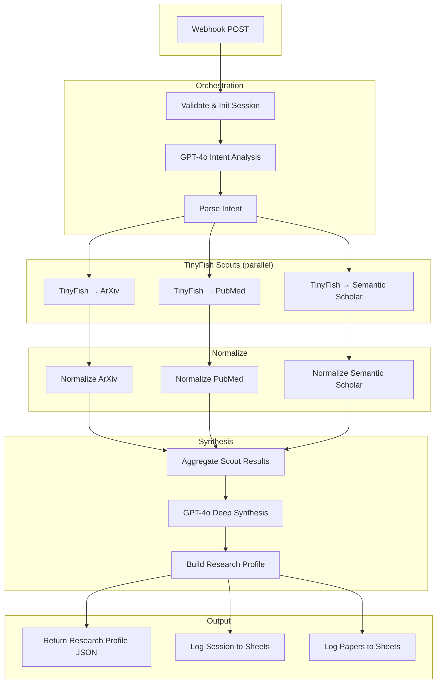
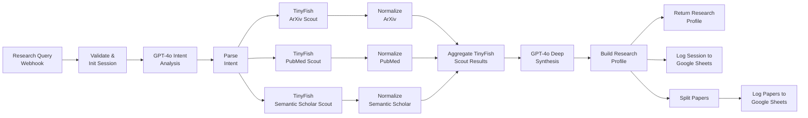

# Research Sentry — TinyFish Autonomous Research Agent

This n8n workflow turns a research query into a structured intelligence report by:

- **Webhook** — accept `query` and optional `sources` via POST
- **OpenAI (GPT-4o)** — intent analysis (goals per source) and deep synthesis (themes, breakthroughs, gaps)
- **Tinyfish Web Agent** — live browsing of ArXiv, PubMed, and Semantic Scholar via `POST /v1/automation/run`
- **Optional** — log sessions and papers to Google Sheets; respond with full research profile as JSON

This guide assumes you have basic n8n experience.

---

## Table of contents

1. [What you get](#1-what-you-get)
2. [Architecture overview](#2-architecture-overview)
3. [Workflow diagram](#3-workflow-diagram)
4. [Prerequisites](#4-prerequisites)
5. [Install & open n8n](#5-install--open-n8n)
6. [Import the workflow](#6-import-the-workflow)
7. [Credentials](#7-credentials)
8. [Running the workflow](#8-running-the-workflow)
9. [Output & JSON response](#9-output--json-response)
10. [Optional: Google Sheets](#10-optional-google-sheets)
11. [Troubleshooting](#11-troubleshooting)
12. [File reference](#12-file-reference)

---

## 1) What you get

**Input (POST body to webhook):**

- **query** (required) — e.g. `"LLM hallucination mitigation"`, `"transformer efficiency 2024"`
- **sources** (optional) — array or string; default `['arxiv', 'pubmed', 'semantic_scholar']`

**Output:**

- **JSON response** — full research profile: `research_context`, `discovery_summary`, `papers_discovered`, `top_recommendations`, `recommended_action`, `metadata`
- **Optional:** rows in Google Sheets (Research Log + Papers Database)

**Sources used:** ArXiv, PubMed, Semantic Scholar (each has a dedicated Tinyfish scout).

---

## 2) Architecture overview



**Flow in short:** Webhook → validate → GPT-4o intent → parse → **three parallel Tinyfish scouts** (ArXiv, PubMed, Semantic Scholar) → normalize each → **aggregate & deduplicate** → GPT-4o synthesis → build research profile → **return JSON** and optionally log to Google Sheets.

---

## 3) Workflow diagram

**Node-by-node (left to right):**



| Node | Type | Purpose |
|------|------|--------|
| Research Query Webhook | Webhook | Receives POST with `query` and optional `sources`. |
| Validate & Init Session | Code | Validates input, builds `sessionId`, passes to intent. |
| GPT-4o Intent Analysis | OpenAI | Converts natural-language goal into structured goals per source (arxiv_goal, pubmed_goal, semantic_scholar_goal). |
| Parse Intent | Code | Parses GPT JSON into `intent_analysis`. |
| TinyFish → ArXiv / PubMed / Semantic Scholar Scout | HTTP Request | POST to `https://agent.tinyfish.ai/v1/automation/run` with url + goal; uses **X-API-Key** header. |
| Normalize ArXiv / PubMed / Semantic Scholar Results | Code | Extracts papers from Tinyfish response, normalizes title, authors, abstract, url, source. |
| Aggregate TinyFish Scout Results | Code | Merges all papers, deduplicates by title, sorts by citations/recency. |
| GPT-4o Deep Synthesis | OpenAI | Produces themes, summary, breakthroughs, gaps, recommended_action, top_paper_indices. |
| Build Research Profile | Code | Assembles final `research_context`, `discovery_summary`, `papers_discovered`, `top_recommendations`, etc. |
| Return Research Profile | Respond to Webhook | Sends full research profile as JSON response. |
| Log Session to Google Sheets | Google Sheets | Optional: append row to "Research Log" sheet. |
| Split Papers → Log Papers to Google Sheets | SplitOut + Sheets | Optional: one row per paper in "Papers Database" sheet. |

---

## 4) Prerequisites

| Need | Purpose |
|------|--------|
| **Tinyfish API key** | All three TinyFish Scout nodes (Header Auth: **X-API-Key**). |
| **OpenAI API key** | GPT-4o Intent Analysis and GPT-4o Deep Synthesis. |
| **Google account** (optional) | Only if you use the Google Sheets nodes. |
| **n8n** | Desktop, Docker, or Cloud. |

---

## 5) Install & open n8n

- **Desktop:** Install from [n8n docs](https://docs.n8n.io/hosting/desktop/), open the app.
- **Docker:**
  `docker run -it --rm -p 5678:5678 -v ~/.n8n:/home/node/.n8n n8nio/n8n`
  Then open **http://localhost:5678**.

---

## 6) Import the workflow

1. In n8n: **Workflows** → **Import from file**.
2. Select **`Research Sentry via TinyFish.json`** (or the workflow JSON in this folder).
3. Save.

You should see the canvas with: Webhook → Validate & Init → GPT-4o Intent → Parse Intent → three TinyFish Scouts → Normalize nodes → Aggregate → GPT-4o Synthesis → Build Research Profile → Return Research Profile (and optional Sheets nodes).

---

## 7) Credentials

### 7.1 Tinyfish (required)

Used by all three **TinyFish → … Scout** HTTP Request nodes.

1. **Credentials** → **New** → **Header Auth**.
2. **Name:** e.g. `TinyFish API Key`.
3. **Header Name:** **`X-API-Key`** (exactly — Tinyfish requires this).
4. **Header Value:** your Tinyfish API key (no `Bearer`).
5. Save, then assign this credential to **TinyFish → ArXiv Scout**, **TinyFish → PubMed Scout**, and **TinyFish → Semantic Scholar Scout**.

### 7.2 OpenAI (required)

Used by **GPT-4o Intent Analysis** and **GPT-4o Deep Synthesis**.

1. **Credentials** → **New** → **OpenAI API**.
2. Paste your OpenAI API key.
3. Save, then assign to both GPT-4o nodes.

### 7.3 Google Sheets (optional)

Only if you use **Log Session to Google Sheets** or **Log Papers to Google Sheets**.

1. Create a Google Cloud project, enable Google Sheets API (and Drive if needed).
2. Create OAuth 2.0 credentials (Web application), add redirect URI (e.g. `http://localhost:5678/rest/oauth2-credential/callback` for local n8n).
3. In n8n: **Credentials** → **New** → **Google Sheets OAuth2** → paste Client ID/Secret → Connect and authorize.
4. Assign to both Google Sheets nodes.
5. In each Sheets node, set **Document** to your spreadsheet ID and **Sheet** to `Research Log` and `Papers Database` (create these sheets/tabs if needed).

---

## 8) Running the workflow

1. **Activate** the workflow (toggle **Active** on).
2. Note the **Webhook URL** from the **Research Query Webhook** node (e.g. `https://your-n8n.com/webhook/research-sentry` or `http://localhost:5678/webhook/research-sentry`).
3. Send a **POST** request with JSON body:

```json
{
  "query": "LLM hallucination mitigation",
  "sources": ["arxiv", "pubmed", "semantic_scholar"]
}
```

Or minimal:

```json
{
  "query": "transformer efficiency 2024"
}
```

4. The workflow runs (intent → parallel scouts → aggregate → synthesis → build profile).
5. The **Respond to Webhook** node returns the full research profile as JSON (see below).

**Example (curl):**

```bash
curl -X POST "http://localhost:5678/webhook/research-sentry" \
  -H "Content-Type: application/json" \
  -d '{"query": "LLM survey 2024"}'
```

---

## 9) Output & JSON response

The **Return Research Profile** node sends a JSON body with this shape:

- **research_context** — `topic`, `sources`, `intent`, `session_id`, `timestamp`
- **discovery_summary** — `yield`, `raw_collected`, `source_breakdown`, `scout_statuses`, `primary_themes`, `confidence`, `trend`, `summary`, `key_breakthroughs`, `research_gaps`
- **papers_discovered** — array of `{ title, source, url, published, authors, citation_count, abstract_excerpt, evidence, doi }`
- **top_recommendations** — top 3 papers (title, url, source, citations, published)
- **recommended_action** — string
- **metadata** — `keywords_used`, `tinyfish_verified`, `agent_powered`

Response headers include `Content-Type: application/json`, `X-TinyFish-Verified: true`, and `X-Session-ID`.

---

## 10) Optional: Google Sheets

- **Log Session to Google Sheets** — one row per run in the **Research Log** sheet (session ID, topic, intent, sources, papers found, confidence, themes, summary, breakthroughs, gaps, recommended action, top 3 papers, etc.).
- **Build Research Profile** also branches to **Split Papers**, which splits `papers_discovered` into one item per paper; **Log Papers to Google Sheets** appends each to **Papers Database** (title, source, URL, authors, citations, abstract excerpt, DOI, etc.).

Replace `YOUR_GOOGLE_SHEET_ID` in both Sheets nodes with your spreadsheet ID. Create tabs **Research Log** and **Papers Database** with the column names used in the node mappings (or use "Auto-map" and align headers).

---

## 11) Troubleshooting

| Issue | Fix |
|-------|-----|
| **405 Method Not Allowed** | Tinyfish URL must be **`https://agent.tinyfish.ai/v1/automation/run`** (not `/v1/runs`). Method: POST. |
| **Authorization failed / X-API-Key header is required** | Use **Header Auth** with **Header Name** `X-API-Key` and **Header Value** = your Tinyfish API key (no Bearer). Assign to all three Scout nodes. |
| **Webhook not found** | Activate the workflow; use the URL from the Webhook node (path `research-sentry`). |
| **Missing required field: query** | POST body must include `"query": "your topic"`. |
| **OpenAI errors** | Check OpenAI credential and that both GPT-4o nodes use it. |
| **Sheets errors** | Confirm OAuth, spreadsheet ID, sheet names (Research Log, Papers Database), and column mapping. |
| **Empty or partial papers** | Check Normalize nodes' input: Tinyfish sync endpoint returns `result` in the response; Normalize code reads `result` or `resultJson`. |

---

## 12) File reference

| File | Description |
|------|-------------|
| `Research Sentry via TinyFish.json` | n8n workflow to import (Research Sentry — TinyFish Autonomous Research Agent). |
| `README.md` | This guide. |

---

*Research Sentry uses Tinyfish for live browsing and GPT-4o for intent and synthesis. All results can be returned as JSON and optionally logged to Google Sheets.*
