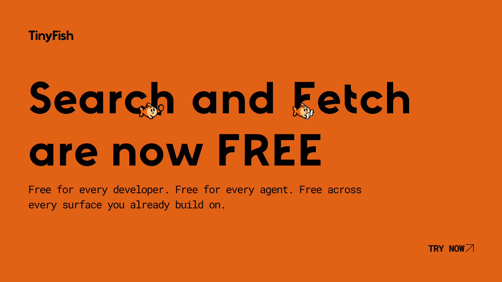

# The TinyFish Cookbook

<a href="https://agent.tinyfish.ai/">
  
</a>

<div align="center">

[](https://tinyfish.ai/)
[](https://docs.tinyfish.ai/)
[](https://discord.gg/tinyfish)
[](LICENSE)
[](https://x.com/Tiny_Fish)
[](https://www.linkedin.com/company/tinyfish-ai/)
[](https://www.threads.com/@tinyfish_ai)
[](https://www.instagram.com/tinyfish_ai/)

</div>

---

> **Search and Fetch are now FREE**
>
> TinyFish **Search** and **Fetch endpoints** are now free for everyone with generous rate limits, no credit card required. Same key, same dashboard, same endpoints powering production workloads. [Grab a key &rarr;](https://agent.tinyfish.ai/)

---

## About This Repository

Welcome to the **TinyFish Cookbook!** A growing collection of recipes, demos, and automations built on TinyFish — the web layer for AI agents.

If your agent needs to search the live web, read a page cleanly, run a multi-step browser flow, or hit any site that doesn't expose an API, this is where to start.

## The Endpoints

TinyFish gives you four endpoints, layered from lightning-fast retrieval to fully managed browser automation. **Search** and **Fetch** are free.

| Endpoint | What it does | Best for | Speed | Pricing |
|----------|-------------|----------|-------|---------|
| **Search** &nbsp; `api.search.tinyfish.ai` | Fast, structured web search built for agents — JSON results, rank-stable across calls. | Drop-in retrieval layer for any agent. Designed for LLM consumption, not blue-link browsing. | < 0.5s | **Free** |
| **Fetch** &nbsp; `api.fetch.tinyfish.ai` | Any URL &rarr; clean markdown / JSON / HTML. Real full-browser rendering. Failed URLs are free. | Reading specific pages and feeding clean content to LLMs. Drop-in replacement for Firecrawl, native LLM fetch, or hand-rolled Playwright. | A few seconds | **Free** |
| **Agent** | Provide a URL and a natural-language goal. The agent navigates, acts, and returns clean JSON. | Multi-step flows, complex tasks, structured data extraction. | ~10s to minutes | Metered |
| **Browser** | Rent a fully managed cloud browser. Connect your own Playwright or Selenium scripts. | Hardcore custom agents and scripts. | Real-time | Metered |

## Why TinyFish?

- **Any website &rarr; API** — turn sites without APIs into programmable data sources
- **Natural-language goals** — send a URL + plain English, get structured JSON back
- **Real browser automation** — multi-step flows, forms, filters, calendars, dynamic content
- **Built-in stealth** — rotating proxies and stealth profiles included, no extra cost
- **Vault** — agent-grade credentials and session memory for authenticated workflows (1Password JIT, encrypted session reuse)
- **Production-grade observability** — full logs and debugging on every run
- **Token-efficient by design** — Fetch strips nav, scripts, and cookie banners, so you stop paying tokens on junk HTML

## Ways to use TinyFish

One API key. Use it from wherever you build.

### REST API

```bash
# Search
curl "https://api.search.tinyfish.ai?query=web+automation+tools" \
  -H "X-API-Key: $TINYFISH_API_KEY"

# Fetch
curl -X POST https://api.fetch.tinyfish.ai \
  -H "X-API-Key: $TINYFISH_API_KEY" \
  -H "Content-Type: application/json" \
  -d '{"urls": ["https://www.tinyfish.ai/"]}'

# Agent (streaming)
curl -N -X POST https://agent.tinyfish.ai/v1/automation/run-sse \
  -H "X-API-Key: $TINYFISH_API_KEY" \
  -H "Content-Type: application/json" \
  -d '{"url": "https://agentql.com", "goal": "Find all subscription plans and prices. Return JSON."}'
```

### MCP Server

Drop the server URL into Claude Code, Cursor, Codex, ChatGPT desktop, or any MCP-aware client.

```json
{
  "mcpServers": {
    "tinyfish": { "url": "https://mcp.tinyfish.ai" }
  }
}
```

### CLI

```bash
npm install -g @tiny-fish/cli
tinyfish auth login
tinyfish search query "web automation tools"
tinyfish fetch content get https://example.com
```

The CLI writes results to the filesystem instead of piping them through your model's context window — tokens stay low, output stays structured.

### Scripts

Drop TinyFish into everyday tools with small copyable scripts.

| Script | Description |
|--------|-------------|
| [Raycast TinyFish Search](./scripts/raycast-tinyfish-search) | Search the web from Raycast and get formatted result URLs, titles, and snippets |

### Agent Skill

One-line install. Works with Claude Code, Codex, Cursor, OpenCode, Antigravity, and other coding agents. The Skill teaches your agent **when** to reach for Search vs. Fetch vs. Agent, and **how** to call them.

```bash
npx skills add github.com/tinyfish-io/tinyfish-cookbook --skill use-tinyfish
```

Browse it on [skills.sh/tinyfish-io/tinyfish-cookbook/use-tinyfish](https://skills.sh/tinyfish-io/tinyfish-cookbook/use-tinyfish).

### SDKs

```bash
pip install tinyfish              # Python
npm install @tiny-fish/sdk        # TypeScript
```

Both SDKs cover Search, Fetch, Browser, Agent, and Vault — full parity.

### Where it's already wired up

Check out our [Integrations](https://www.tinyfish.ai/integrations)

## The Recipes

Each folder is a standalone project. Categorized below by what they do, not what's under the hood.

### Featured (live demos)

These use the latest TinyFish SDK and are deployed with live demos you can try right now.

| Recipe | Description | Live demo |
|--------|-------------|-----------|
| [viet-bike-scout](./viet-bike-scout) | Motorbike rental price comparison across Vietnamese cities using parallel browser agents | [Demo](https://cookbook-viet-bike-scout.vercel.app/) |
| [tutor-finder](./tutor-finder) | AI-powered tutor discovery for competitive exams across multiple platforms | [Demo](https://cookbook-tutor-finder.vercel.app/) |
| [openbox-deals](./openbox-deals) | Real-time open-box and refurbished deal aggregator across 8 retailers | [Demo](https://cookbook-openbox-deals.vercel.app/) |
| [silicon-signal](./silicon-signal) | Semiconductor supply chain tracker for lifecycle, availability, and lead-time signals | [Demo](https://cookbook-silicon-signal.vercel.app/) |
| [summer-school-finder](./summer-school-finder) | Discover and compare summer school programs from universities around the world | [Demo](https://cookbook-summer-school-finder.vercel.app/) |
| [tinyskills](./tinyskills) | Multi-source AI skill guide generator that scrapes docs, GitHub, and blogs into a single SKILL.md | [Demo](https://cookbook-tinyskills.vercel.app/) |
| [saigon-happy-hour-sniper](./saigon-happy-hour-sniper) | Find happy hour deals across Saigon in seconds | [Demo](https://saigon-happy-hour-sniper.vercel.app/) |

### Shopping & Deals

| Recipe | Description |
|--------|-------------|
| [bestbet](./bestbet) | Sports betting odds comparison across books |
| [game-buying-guide](./game-buying-guide) | Video game pricing across 10 gaming platforms in parallel |
| [lego-hunter](./lego-hunter) | Rare Lego inventory across 15+ retailers with price and availability analysis |
| [openbox-deals](./openbox-deals) | Real-time open-box and refurbished deal aggregator |
| [waifu-deal-sniper](./waifu-deal-sniper) | Discord bot for anime figure collectors hunting AmiAmi, Mercari, Solaris Japan |
| [wing-command](./wing-command) | Chicken wing tracker — find the best wings near you by flavor preference |

### Travel, Stays & Local

| Recipe | Description |
|--------|-------------|
| [stay-scout-hub](./stay-scout-hub) | Cross-site lodging search for conventions and events |
| [viet-bike-scout](./viet-bike-scout) | Motorbike rental price comparison across Vietnamese cities |
| [district-rent-shark](./district-rent-shark) | Vietnamese rental market intelligence + neighborhood walkability scores |
| [restaurant-comparison-tool](./restaurant-comparison-tool) | Pre-visit restaurant safety + allergen intelligence from Google Maps |
| [saigon-happy-hour-sniper](./saigon-happy-hour-sniper) | Live happy hour deal aggregator for Saigon |

### Research & Market Intelligence

| Recipe | Description |
|--------|-------------|
| [research-sentry](./research-sentry) | Voice-first academic research co-pilot scanning ArXiv, PubMed, and more |
| [silicon-signal](./silicon-signal) | Semiconductor supply chain & lead-time signals |
| [competitor-analysis](./competitor-analysis) | Live competitive pricing intelligence dashboard |
| [competitor-scout-cli](./competitor-scout-cli) | Natural-language CLI for researching competitor feature decisions |
| [logistics-sentry](./logistics-sentry) | Port congestion and carrier-risk tracking |
| [tenders-finder](./tenders-finder) | Singapore government tender discovery across multiple portals |

### Education & Discovery

| Recipe | Description |
|--------|-------------|
| [tutor-finder](./tutor-finder) | AI-powered tutor discovery for competitive exams |
| [summer-school-finder](./summer-school-finder) | Compare summer school programs from universities worldwide |
| [scholarship-finder](./scholarship-finder) | Scholarship discovery pulling live data from official sources |

### Developer Tools

| Recipe | Description |
|--------|-------------|
| [code-reference-finder](./code-reference-finder) | Find real-world usage examples for any code snippet from GitHub and Stack Overflow |
| [fast-qa](./fast-qa) | No-code QA testing platform with parallel test execution and live browser previews |
| [tinyskills](./tinyskills) | Generates comprehensive SKILL.md guides from docs, GitHub, and developer blogs |

### Finance & Decisioning

| Recipe | Description |
|--------|-------------|
| [loan-decision-copilot](./loan-decision-copilot) | Loan comparison across banks and regions |

### Lifestyle & Health

| Recipe | Description |
|--------|-------------|
| [anime-watch-hub](./anime-watch-hub) | Find sites to read or watch your favorite manga and anime |
| [pharmacy-panic](./pharmacy-panic) | Compare medicine prices across Vietnam's top pharmacy chains in real time |

> New recipes land weekly. See [CONTRIBUTING.md](CONTRIBUTING.md) to add yours.

### n8n Workflows

Pre-built n8n workflows using TinyFish — import the JSON and go.

| Workflow | Description |
|----------|-------------|
| [Competitor Scout](./N8N_WorkFlows/Competitor%20Scout%20CLI) | Research competitor feature decisions with OpenAI planning + TinyFish evidence collection |
| [Web Research Agent](./N8N_WorkFlows/Web%20Research%20Agent) | Chatbot that scrapes any website with TinyFish and saves summaries to Notion |
| [Daily Product Hunt Tracker](./N8N_WorkFlows/Daily%20Product%20Hunt%20Tracker) | Scheduled workflow delivering daily top 5 trending Product Hunt products to Telegram |

## Getting Started

### 1. Get your API key

Sign up at [agent.tinyfish.ai](https://agent.tinyfish.ai/). No credit card. Search and Fetch are free out of the box.

### 2. Run something

#### cURL

```bash
curl -N -X POST https://agent.tinyfish.ai/v1/automation/run-sse \
  -H "X-API-Key: $TINYFISH_API_KEY" \
  -H "Content-Type: application/json" \
  -d '{
    "url": "https://agentql.com",
    "goal": "Find all AgentQL subscription plans and their prices. Return result in json format"
  }'
```

#### Python

```python
import json, os, requests

response = requests.post(
    "https://agent.tinyfish.ai/v1/automation/run-sse",
    headers={
        "X-API-Key": os.getenv("TINYFISH_API_KEY"),
        "Content-Type": "application/json",
    },
    json={
        "url": "https://agentql.com",
        "goal": "Find all AgentQL subscription plans and their prices. Return result in json format",
    },
    stream=True,
)

for line in response.iter_lines():
    if line:
        line_str = line.decode("utf-8")
        if line_str.startswith("data: "):
            event = json.loads(line_str[6:])
            print(event)
```

#### TypeScript

```typescript
const response = await fetch("https://agent.tinyfish.ai/v1/automation/run-sse", {
  method: "POST",
  headers: {
    "X-API-Key": process.env.TINYFISH_API_KEY,
    "Content-Type": "application/json",
  },
  body: JSON.stringify({
    url: "https://agentql.com",
    goal: "Find all AgentQL subscription plans and their prices. Return result in json format",
  }),
});

const reader = response.body.getReader();
const decoder = new TextDecoder();

while (true) {
  const { done, value } = await reader.read();
  if (done) break;
  console.log(decoder.decode(value));
}
```

> Sharing a localhost demo with a friend? Use [tinyfi.sh](https://tinyfi.sh/) — free and dead simple.

## Star History

<p align="center">
  <a href="https://www.star-history.com/#tinyfish-io/tinyfish-cookbook&type=date">
    
  </a>
</p>

## Contributors

<a href="https://github.com/tinyfish-io/tinyfish-cookbook/graphs/contributors">
  
</a>

Got something cool you built with TinyFish? We want it in here. See the [Contributing Guide](CONTRIBUTING.md) for the full rundown.

## Community & Support

- [Discord](https://discord.gg/tinyfish) — ask questions, share what you're building, hang out
- [Docs](https://docs.tinyfish.ai/)
- [tinyfish.ai](https://tinyfish.ai/)

## Legal Disclaimer

This repository is a community-driven space for sharing derivatives, code samples, and best practices related to TinyFish products. By using the materials in this repository, you acknowledge and agree to the following:

- **"As-Is" Basis**: All code, scripts, and documentation shared here are provided "AS IS" and "AS AVAILABLE." TinyFish makes no warranties of any kind, whether express or implied, regarding the accuracy, reliability, or security of community-contributed content.
- **No Obligation to Maintain**: TinyFish is under no obligation to monitor, update, or fix bugs, errors, or security vulnerabilities found in community-contributed derivatives.
- **User Responsibility**: You are solely responsible for vetting and testing any code before implementing it in a production environment. Use of these derivatives is at your own risk.
- **Limitation of Liability**: In no event shall TinyFish be held liable for any claim, damages, or other liability — including but not limited to system failures, data loss, or security breaches — arising from the use of or inability to use the contents of this repository.

> Note: Contributions from the community do not represent the official views or supported products of TinyFish.

---


