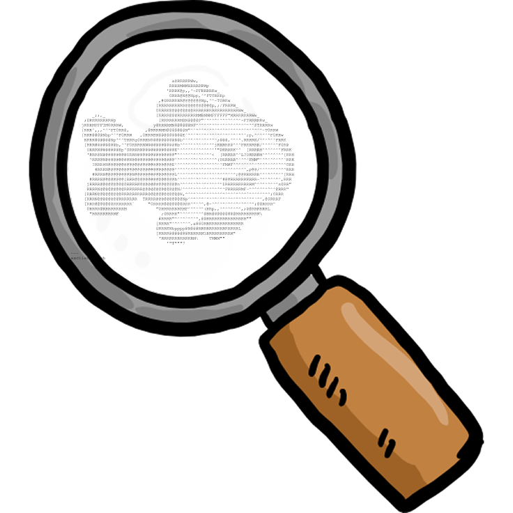
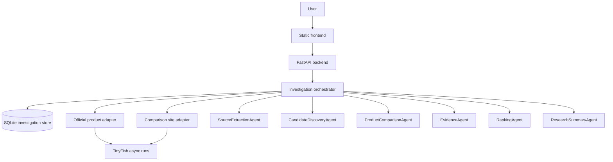

# TinyDetective

## Creators

- [Darrius](https://github.com/darriusnjh)
- [Wei Sin Tai](https://github.com/weisintai)
- [Zane Chee](https://github.com/injaneity)

TinyDetective was built at **LotusHacks x HackHarvard Vietnam 2026**, where it placed **second in the Enterprise track**. The project came out of the TinyFish-sponsored challenge and focused on a practical enterprise workflow: counterfeit research across official brand sites and marketplace listings.

**Live link:** Local run only

**Source repo:** https://github.com/darriusnjh/TinyDetective

TinyDetective is a counterfeit research platform with a modular multi-agent pipeline. It accepts an official product URL plus marketplace URLs, runs TinyFish-powered source extraction and listing analysis, then returns ranked findings with evidence and a short risk summary.

The app keeps the workflow intentionally modular: adapters handle site-specific extraction, agents score and summarize results, and the backend persists investigations so unfinished runs can resume after restarts.

## Demo



## TinyFish API usage

TinyDetective uses the official [`tinyfish`](https://pypi.org/project/tinyfish/) Python SDK. The app queues TinyFish runs with `AsyncTinyFish.agent.queue(...)`, then resumes or polls them with `AsyncTinyFish.runs.get(...)` until structured JSON is ready:

```python
from tinyfish import AsyncTinyFish

client = AsyncTinyFish(api_key=settings.tinyfish_api_key)
queued = await client.agent.queue(
    goal=goal,
    url=url,
    browser_profile=self._browser_profile(),
    proxy_config=self._proxy_config(),
)

run = await client.runs.get(queued.run_id)
```

## How to run

```bash
uv sync --dev
uv run python -m backend
```

You can also run the backend entry file directly:

```bash
cd backend
uv run main.py
```

Open `http://127.0.0.1:8000`.

Create `.env` from `.env.example` and set:

```bash
TINYFISH_API_KEY=your-real-key
TINYFISH_HTTP_TIMEOUT_SECONDS=15.0
TINYFISH_RUN_SOFT_TIMEOUT_SECONDS=300.0
TINYFISH_RUN_HARD_TIMEOUT_SECONDS=1800.0
TINYFISH_RUN_STALL_TIMEOUT_SECONDS=120.0
BRAND_LANDING_PAGE_URL=https://www.yourbrand.com/
ECOMMERCE_STORE_URLS=https://shopee.sg/,https://www.lazada.sg/
INVESTIGATION_STORE_PATH=data/investigations.sqlite3
```

If `comparison_sites` is omitted from `POST /investigate`, the backend falls back to `ECOMMERCE_STORE_URLS`.

Run tests with:

```bash
uv run pytest
```

## Architecture diagram



## Project structure

- `backend/`: FastAPI app and API entrypoint.
- `agents/`: Source extraction, discovery, comparison, evidence, ranking, and summary agents.
- `adapters/`: TinyFish-backed official-product extraction and marketplace candidate discovery adapters.
- `models/`: Typed Pydantic schemas for API payloads and pipeline data.
- `services/`: Investigation orchestrator, SQLite-backed persistence, and TinyFish runtime/client abstractions.
- `frontend/`: Minimal static UI for launching investigations and inspecting results.
- `tests/`: Basic tests and sample fixture output.

## Workflow

1. `POST /investigate` creates an investigation and starts async orchestration.
2. `SourceExtractionAgent` extracts a normalized `SourceProduct`.
3. `CandidateDiscoveryAgent` searches the target comparison sites with TinyFish.
4. `ProductComparisonAgent` scores similarity and counterfeit risk.
5. `EvidenceAgent` converts comparisons into audit-friendly evidence.
6. `RankingAgent` returns up to 5 precision-oriented matches.
7. `ResearchSummaryAgent` writes the final investigation summary.
8. `GET /investigation/{id}` returns status, reports, and raw agent outputs.

## Notes

- Investigation runs are stored in SQLite and survive backend restarts by default.
- The default database file is `data/investigations.sqlite3`, configurable with `INVESTIGATION_STORE_PATH`.
- The frontend restores the latest saved investigation after a page refresh using browser local storage.
- On backend startup, unfinished investigations are resumed from SQLite, including pending TinyFish provider runs that already have a saved `run_id`.
- Backend agent activity is written to `logs/tinydetective.log`.
