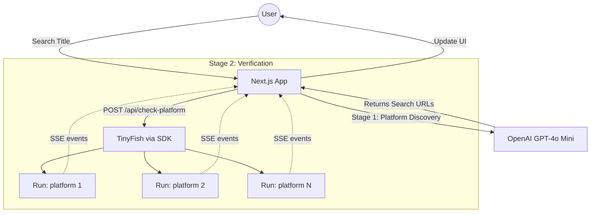

# Anime Watch Hub

**Live**: [https://cookbook-anime-watch-hub.vercel.app/](https://cookbook-anime-watch-hub.vercel.app/)

Next.js app that discovers streaming-platform search URLs with OpenAI, then verifies availability in parallel using the **[@tiny-fish/sdk](https://www.npmjs.com/package/@tiny-fish/sdk)** agent in **SSE streaming** mode (same event model as [Run browser automation with SSE streaming](https://docs.tinyfish.ai/api-reference/automation/run-browser-automation-with-sse-streaming)).

## What This Project Is

Anime Watch Hub helps users find where a specific anime is available to stream. It uses AI-powered platform discovery and real-time browser automation to check Netflix, Crunchyroll, Hulu, Prime Video, and more—in parallel.

## Demo

https://github.com/user-attachments/assets/5425211a-43b9-40c1-b5f7-8451c7549931

## How It Works

1. **User enters an anime title** — e.g. "Attack on Titan"
2. **OpenAI discovers platform URLs** — GPT-4o Mini returns search URLs for several streaming platforms
3. **TinyFish checks each platform in parallel** — For each URL, `client.agent.stream({ url, goal })` runs browser automation; the API route forwards SSE events to the client
4. **Live UI** — `STREAMING_URL` (live preview iframe), `PROGRESS`, then `COMPLETE` with the parsed result JSON

## Implementation Notes

| Piece | Role |
|--------|------|
| `app/api/discover-platforms` | OpenAI: returns `{ platforms: [{ id, name, searchUrl }] }` |
| `app/api/check-platform` | Server: `TinyFish` + `agent.stream`, emits `data: {...}\n\n` SSE lines to the browser |
| `hooks/use-anime-search.ts` | Client: reads the stream and updates per-platform UI state |
| `app/dashboard` | Redirects to `/` (avoids 404 if something hits `/dashboard`) |

The production app does **not** call `https://agent.tinyfish.ai/.../run-sse` directly; it uses the SDK, which speaks the same SSE event types.

## Tech Stack

- **Framework**: Next.js 16 (App Router)
- **Language**: TypeScript
- **Styling**: Tailwind CSS 4 + shadcn/ui
- **APIs**: OpenAI (gpt-4o-mini) for discovery; **TinyFish SDK** (`@tiny-fish/sdk`) for browser automation
- **Deployment**: Vercel

## Setup

1. Clone the repo and install dependencies:

```bash
cd anime-watch-hub
npm install
```

2. Copy the example environment file and fill in your API keys:

```bash
cp .env.example .env.local
```

| Variable | Description |
|----------|-------------|
| `OPENAI_API_KEY` | OpenAI API key for platform URL discovery ([get one](https://platform.openai.com/api-keys)) |
| `TINYFISH_API_KEY` | TinyFish API key for browser automation ([get one](https://agent.tinyfish.ai/api-keys)) |

3. Start the dev server:

```bash
npm run dev
```

4. Open [http://localhost:3000](http://localhost:3000)

## Architecture



## Further Reading

- [TinyFish: Run browser automation with SSE streaming](https://docs.tinyfish.ai/api-reference/automation/run-browser-automation-with-sse-streaming) — event types (`STARTED`, `STREAMING_URL`, `PROGRESS`, `COMPLETE`, etc.)
- In-repo detail: [`docs/tinyfish-api-integration.md`](docs/tinyfish-api-integration.md)
