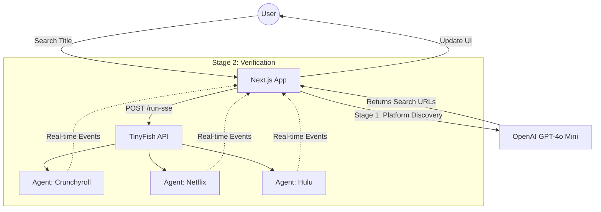

# Anime Watch Hub

**Live**: [https://cookbook-anime-watch-hub.vercel.app/](https://cookbook-anime-watch-hub.vercel.app/)

## What This Project Is

Anime Watch Hub helps users find exactly where a specific anime is available to stream. It uses AI-powered platform discovery and real-time browser automation to check Netflix, Crunchyroll, Hulu, Prime Video, and more -- all in parallel.

## Demo

https://github.com/user-attachments/assets/5425211a-43b9-40c1-b5f7-8451c7549931

## How It Works

1. **User enters an anime title** -- e.g., "Attack on Titan"
2. **OpenAI discovers platform URLs** -- GPT-4o Mini generates search URLs for 6-8 streaming platforms (Crunchyroll, Netflix, Hulu, etc.)
3. **TinyFish agents check each platform in parallel** -- One browser agent per platform navigates to the search URL, dismisses popups, reads search results, and determines availability
4. **Results streamed back live** -- Each agent streams SSE events back to the UI with live browser previews and final availability results

## TinyFish API Usage

After getting search URLs from OpenAI, the app calls the TinyFish SSE endpoint for each platform simultaneously. Each call spawns a browser agent that navigates to the platform's search page and verifies the anime's presence.

```typescript
// app/api/check-platform/route.ts
const tinyFishResponse = await fetch("https://agent.tinyfish.ai/v1/automation/run-sse", {
  method: "POST",
  headers: {
    "X-API-Key": process.env.TINYFISH_API_KEY,
    "Content-Type": "application/json",
  },
  body: JSON.stringify({
    url: searchUrl,
    goal: `You are checking if the anime "${animeTitle}" is available to stream on ${platformName}.

STEP 1 - HANDLE POPUPS:
Dismiss any cookie banners, login prompts, or modal dialogs.

STEP 2 - SEARCH:
If a search box is visible, search for "${animeTitle}".

STEP 3 - ANALYZE SEARCH RESULTS:
- Check if "${animeTitle}" or a very close match appears
- Verify it is the anime series, not related content

STEP 4 - RETURN RESULT:
{
  "available": true/false,
  "watchUrl": "URL if available",
  "message": "Brief description of what was found"
}`,
  }),
});
```

The app processes the SSE stream to show live browser status updates and provides a "Live View" iframe via the `streaming_url` event.

## Tech Stack

- **Framework**: Next.js 16 (App Router)
- **Language**: TypeScript
- **Styling**: Tailwind CSS 4 + shadcn/ui
- **APIs**: OpenAI GPT-4o Mini (platform discovery), TinyFish (browser automation)
- **Deployment**: Vercel

## Setup

1. Clone the repo and install dependencies:

```bash
cd anime-watch-hub
npm install
```

2. Copy the example environment file and fill in your API keys:

```bash
cp .env.example .env.local
```

| Variable | Description |
|----------|-------------|
| `OPENAI_API_KEY` | OpenAI API key for platform URL discovery ([get one](https://platform.openai.com/api-keys)) |
| `TINYFISH_API_KEY` | TinyFish API key for browser automation ([get one](https://tinyfish.ai/api-keys)) |

3. Start the dev server:

```bash
npm run dev
```

4. Open [http://localhost:3000](http://localhost:3000)

## Architecture


