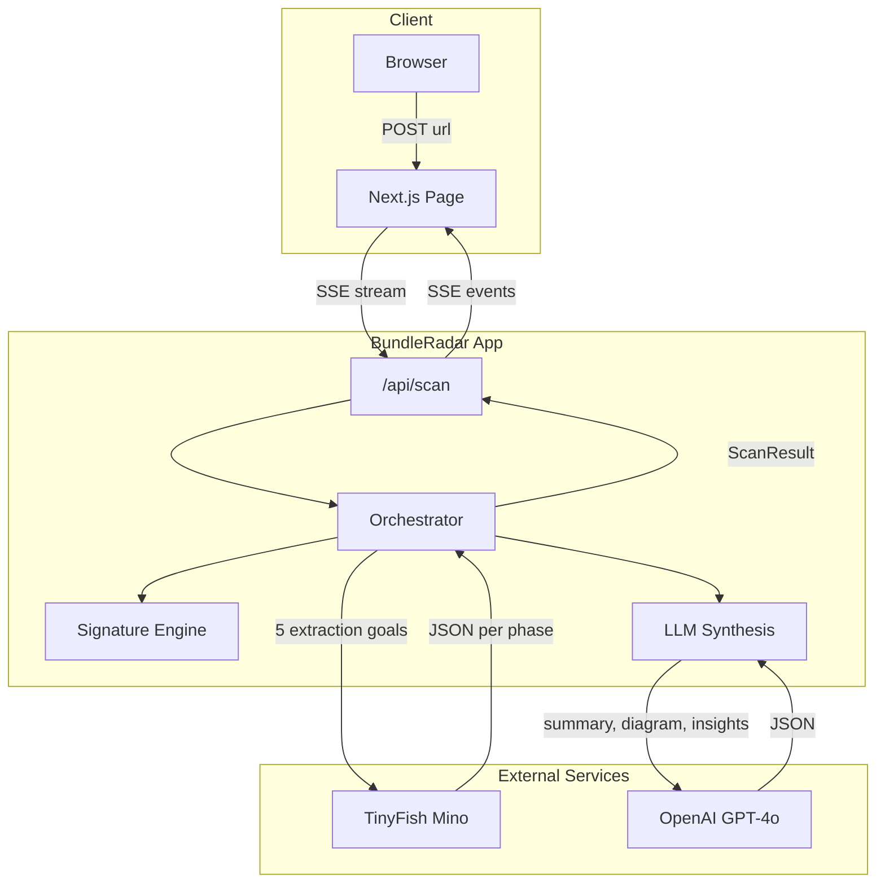
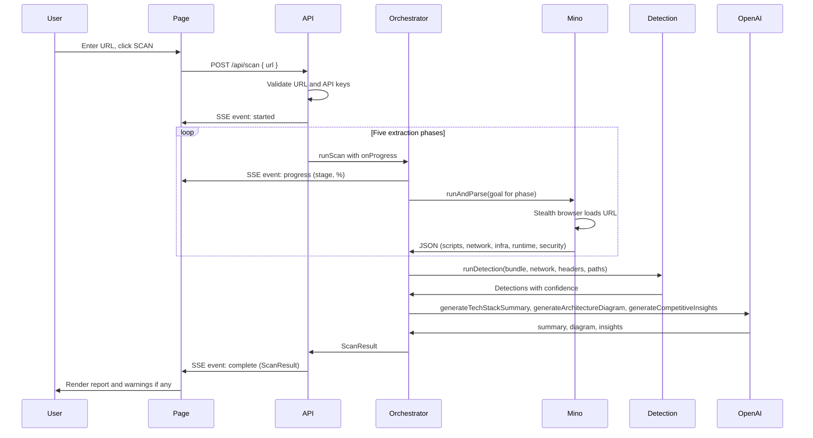

# BundleRadar

**Competitive Frontend Intelligence — Reconstruct any website's tech stack from production runtime signals.**

Paste a URL. BundleRadar uses TinyFish (a smart browser agent that sees the page like a user) to load the site, read what’s on the page — scripts, DOM, source — and infer the tech stack. No DevTools; we work from what the agent can observe.

> We go beyond static header fingerprinting: a real browser runs the page (dynamic imports, lazy chunks, runtime init), and the agent reads the result. Signature detection + LLM synthesis turn that into a clear tech and security picture.

---

## What It Detects

| Category | Examples |
|----------|----------|
| **Frameworks** | React, Next.js, Vue, Nuxt, Angular, Svelte/SvelteKit, Remix, Gatsby, Astro |
| **UI Libraries** | Tailwind CSS, Material UI, Chakra UI, Radix UI, shadcn/ui |
| **Build Tools** | Webpack, Vite, Turbopack |
| **State Management** | Redux, Apollo Client, Relay, Zustand |
| **Analytics** | GA4, Segment, Mixpanel, Amplitude, PostHog, Heap, Plausible, Hotjar |
| **Monitoring** | Sentry, Datadog RUM, LogRocket, FullStory, New Relic |
| **Feature Flags** | LaunchDarkly, Statsig, Split.io, Optimizely |
| **Auth** | Auth0, Clerk, Firebase Auth, Supabase |
| **Payments** | Stripe, PayPal |
| **CDN & Hosting** | Vercel, Netlify, Cloudflare, AWS CloudFront, Shopify |
| **CMS** | Webflow, WordPress |
| **Third-Party** | Intercom, Drift, Crisp, HubSpot, Zendesk |

Plus: security posture (CSP, HSTS, source map exposure, leaked secrets) from response headers where visible, and inferred signals from script/link URLs.

## TinyFish and BundleRadar

**TinyFish (Mino) is a smart agent that looks at the screen and performs actions** — like a person using the browser. It does *not* have programmatic access to DevTools (e.g. Network tab, Performance API, or low-level request inspection). So we treat it as:

- **What the agent can do:** Load the page, execute JavaScript, read the DOM and page source, inspect script tags and link tags, see what’s in the document and in global variables after the page runs.
- **What we don’t assume:** Full network waterfalls, a list of every XHR/Fetch from the Network tab, or WebSocket URLs from internal browser APIs.

BundleRadar’s “network” and “API” signals are therefore **inferred from what the agent can observe**: script `src` URLs, `link` hrefs, resource URLs in the page source or DOM, and any third-party domains visible from those URLs. Where the agent can reliably see response headers (e.g. for the main document), we use those for infra and security. This keeps our positioning accurate and aligned with TinyFish’s strengths.

## How It Works

```
URL → Mino (stealth browser render) → 5 extraction passes → Signature engine → LLM synthesis → Report
```

**5 Mino extraction passes** (each is a goal given to the agent; the agent sees the page like a user, not DevTools):
1. **Bundle Intelligence** — Script tags, global variables, framework signatures, meta tags, inline scripts (from DOM and page source)
2. **Page-visible resources** — Script/link URLs, third-party domains inferred from `src`/`href`, prefetch links (from what the agent can read in the document)
3. **Infrastructure Signals** — Hosting platform, CDN, server headers where visible (e.g. from document response), deployment clues from DOM/source
4. **Runtime Config** — Feature flags, A/B testing, analytics IDs, chat widgets (from globals and script sources the agent can see)
5. **Security Signals** — CSP, HSTS, source map exposure, leaked credentials (from headers the agent can observe and from scanning page source)

After extraction, the **signature detection engine** matches signals against 50+ technology signatures with confidence scoring (high/medium/low). Then **OpenAI** synthesizes the findings into a technical architecture summary, ASCII diagram, and competitive intelligence insights.

## System Architecture

High-level components and how they connect:



- **Client:** User enters a URL; the page sends `POST /api/scan` and consumes Server-Sent Events for progress and the final report.
- **Orchestrator:** Runs the scan pipeline: calls Mino five times (one per extraction phase), runs the in-process signature engine, then calls OpenAI for narrative synthesis.
- **Mino (TinyFish):** Headless stealth browser; each phase is one automation run with a natural-language goal; returns structured JSON.
- **Signature engine:** Pure in-process logic; matches globals, script paths, headers, DOM signals, and meta tags against 50+ rules.

## Data Flow

End-to-end flow from URL to report:



**Phase order and outputs:**

| Phase        | Mino goal focus                    | Feeds into                          |
|-------------|-------------------------------------|-------------------------------------|
| 1. Bundle   | Scripts, globals, framework DOM      | Detection (globals, paths, scripts) |
| 2. Resources | Script/link URLs, third-party domains from page  | Detection paths; endpoint hints from URLs  |
| 3. Infra    | Headers, platform, CDN              | Detection headers; InfraProfile    |
| 4. Runtime  | Feature flags, analytics, chat      | Detection; runtime detections      |
| 5. Security | CSP, HSTS, source maps, secrets     | SecuritySignals                    |

Failed phases are recorded in `failedPhases` and `warnings` on the result; the UI shows a warnings panel when present.

## Why TinyFish?

Think of TinyFish as **a really smart person looking at the screen**, able to perform actions and read what’s on the page — not as a developer with DevTools open. That’s the right mental model:

- **Real browser, real execution** — The agent loads the page and runs it. Dynamic imports, lazy-loaded chunks, and runtime initialization happen; the agent sees the result (DOM, globals, script tags).
- **Bot protection** — Many sites block simple scrapers; TinyFish’s stealth profile helps the agent get through like a real user.
- **What’s visible is usable** — Script `src`s, link hrefs, meta tags, and globals after load are all things the agent can read from the page. We build our “network” and “API” picture from those observable URLs and from headers the agent can see, not from a Network tab.

**Optimized for TinyFish:** Extraction goals are written so the agent can succeed with screen + source only: (1) **Scroll then capture** — we ask the agent to scroll the page to trigger lazy-loaded scripts before capturing. (2) **Step-by-step goals** — each pass has clear steps (wait for load, scroll, then extract from DOM/source). (3) **Fallbacks** — infra and security say "if you cannot read response headers, infer from URLs and DOM." (4) **No DevTools** — we never ask for Network tab or Performance API.

## Quick Start

```bash
cd bundleradar
npm install

cp .env.example .env.local
# Set DATABASE_URL (Postgres — e.g. from Neon), TINYFISH_API_KEY, and OPENAI_API_KEY.

npx prisma db push
# Creates the Scan and Subscription tables. Run once before first dev/start.

npm run dev
```

Open [http://localhost:3000](http://localhost:3000), paste a URL, and hit **SCAN**.

For production, deploy to Vercel and set the same env vars there; see [Deploying to Vercel](#deploying-to-vercel).

## Project Structure

```
bundleradar/
├── src/
│   ├── app/
│   │   ├── api/scan/route.ts       # SSE scan endpoint
│   │   ├── page.tsx                 # Terminal-aesthetic UI
│   │   ├── page.module.css          # Styles
│   │   ├── layout.tsx               # Root layout
│   │   └── globals.css              # Design system
│   ├── lib/
│   │   ├── mino/
│   │   │   ├── client.ts            # Mino REST API client
│   │   │   └── extractors.ts        # 5 specialized extraction goals
│   │   ├── detection/
│   │   │   └── signatures.ts        # 50+ technology signature rules
│   │   ├── analyzers/
│   │   │   └── synthesis.ts         # LLM-powered analysis & insights
│   │   └── orchestrator.ts          # Scan orchestrator
│   └── types/
│       └── index.ts                 # TypeScript types
├── .env.example
├── package.json
└── tsconfig.json
```

## Tech Stack

- **Next.js 14** (App Router) + React + TypeScript
- **Mino** (TinyFish Web Agent, [agent.tinyfish.ai](https://agent.tinyfish.ai)) — stealth browser rendering & DOM extraction
- **OpenAI** (GPT-4o) — architecture synthesis & competitive insights
- **SSE** — real-time scan progress streaming

## Use Cases

- **Competitive Analysis** — Know your competitor's exact tech stack before they know yours
- **Acquisition Due Diligence** — Technical assessment of target companies from public signals
- **Build vs Buy** — See what tools successful companies in your space actually use
- **Vendor Evaluation** — Compare the engineering maturity of potential vendors
- **Security Audits** — Client-side security posture assessment from the outside

## API

### `POST /api/scan`

SSE-streamed scan endpoint.

**Request:** `{ "url": "https://example.com" }`

**Events:** `started`, `progress` (stage/detail/%), `complete` (full ScanResult), `error`

## Deploying to Vercel

This app is built to run on **Vercel** (serverless). There are no local-only assumptions: no file-system queues, no long-lived in-process state, and no localhost callbacks. Auth is **anonymous** (cookie-based session ID); no sign-in. **Neon** is the recommended database.

### Before first deploy

1. Create a [Neon](https://neon.tech) project and copy the connection string (use the **pooled** connection string for serverless; see [Neon + Vercel](https://neon.tech/docs/guides/vercel)).
2. In your Vercel project (**Settings → Environment Variables**), set `DATABASE_URL` and the other required variables below.
3. Run the database schema once: `npx prisma db push` (e.g. locally with `DATABASE_URL` pointing at your Neon database, or via a one-off script).

### Required environment variables (Vercel)

Set these in your Vercel project (**Settings → Environment Variables**):

| Variable | Required | Notes |
|----------|----------|--------|
| `DATABASE_URL` | Yes | Postgres connection string from [Neon](https://neon.tech) (recommended). Used for scans, history, and quota. |
| `TINYFISH_API_KEY` (or `MINO_API_KEY`) | Yes | From [agent.tinyfish.ai](https://agent.tinyfish.ai). Server-only. |
| `OPENAI_API_KEY` | Yes | For LLM synthesis. Server-only. |
| `MINO_BASE_URL` | No | Defaults to `https://agent.tinyfish.ai`. Override only if needed. |
| `OPENAI_MODEL` | No | Defaults to `gpt-4o`. |

### Function duration

- The scan API uses `maxDuration = 300` (5 minutes). On **Vercel Pro** (or higher), this is supported.
- On **Vercel Hobby**, serverless function execution is capped at 10s; long scans will time out. Upgrade to Pro or use a queue (e.g. Inngest) to run scans in a separate invocation.

### Best practices on Vercel

- **Database:** Use [Neon](https://neon.tech) (or [Vercel Postgres](https://vercel.com/docs/storage/vercel-postgres), Supabase) and set `DATABASE_URL`. Neon’s connection pooler is well-suited for serverless.
- **Rate limiting:** Use a serverless-friendly store (e.g. [Upstash Redis](https://upstash.com) with `@upstash/ratelimit`) so limits work across all serverless instances.
- **Background jobs:** For queued scans or cron, use [Inngest](https://www.inngest.com), [Trigger.dev](https://trigger.dev), or [Vercel Background Functions](https://vercel.com/docs/functions/background-functions) so work runs in a separate invocation and does not depend on request lifetime.
- **Secrets:** Keep `TINYFISH_API_KEY` and `OPENAI_API_KEY` in Vercel env only; never commit or expose them to the client.

---

**Built with [Mino](https://docs.mino.ai/) by TinyFish Solutions**
