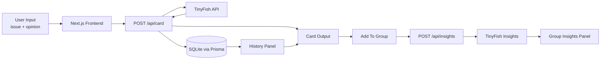

# CommonGround Cards

Live link: `https://common-ground-cards.vercel.app`

CommonGround Cards is a Governance & Collaboration app built at the ASU Claude Builder Club Hackathon. It turns student opinions into structured civic discussion cards, saves persistent issue history, and generates group insights that surface shared values, tradeoffs, and constructive next steps.

TinyFish powers the two core AI workflows in this app:
- card generation from a campus issue + student opinion
- group insight generation across multiple saved cards

## Demo Video

Demo video: `https://drive.google.com/file/d/1pqdi_4xbsgR9UGuSuACHG9slFNTiI7hZ/view?usp=sharing`

Suggested caption:

`Generate a card -> save it to history -> reload past cards -> add cards to a group -> generate shared-value insights`

## Where TinyFish Is Used

TinyFish is called from the backend in two places:

1. Card generation
   - The app sends an official ASU source URL plus the student's opinion to TinyFish.
   - TinyFish returns structured JSON for concern, values, affected stakeholders, common ground, next step, evidence, and ethical notes.

2. Group insights
   - The app sends multiple generated cards to TinyFish.
   - TinyFish returns shared values, a compromise summary, a recommended solution, tradeoffs, pilot suggestion, and success metrics.

## TinyFish Code Snippet

From `lib/common-ground.js`:

```js
const response = await fetch(`${TINYFISH_BASE_URL}/v1/automation/run`, {
  method: "POST",
  headers: {
    "Content-Type": "application/json",
    "X-API-Key": TINYFISH_API_KEY
  },
  body: JSON.stringify({
    url: source.officialUrl,
    goal,
    browser_profile: "lite",
    api_integration: "hackasu-common-ground"
  }),
  cache: "no-store"
});

const text = await response.text();
const data = JSON.parse(text);
const resultObj = coerceTinyFishResultObject(data.result);
```

The group insights flow uses the same TinyFish endpoint with a different goal payload:

```js
const response = await fetch(`${TINYFISH_BASE_URL}/v1/automation/run`, {
  method: "POST",
  headers: {
    "Content-Type": "application/json",
    "X-API-Key": TINYFISH_API_KEY
  },
  body: JSON.stringify({
    url: "https://example.com",
    goal: `${goal}\n\nCards:\n${JSON.stringify(compactCards, null, 2)}`,
    browser_profile: "lite",
    api_integration: "hackasu-common-ground-insights"
  }),
  cache: "no-store"
});
```

## How to Run

Requirements:
- Node.js 18+
- npm

Environment variables:

```bash
PORT=3000
DATABASE_URL="file:dev.db"
TINYFISH_API_KEY=your_tinyfish_key
TINYFISH_BASE_URL="https://agent.tinyfish.ai"
```

Install and run:

```bash
npm install
npm run db:generate
npm run db:push
npm run dev
```

Then open:

```bash
http://localhost:3000
```

Optional production-style run:

```bash
npm run build
npm start
```

## Architecture Diagram



## Project Highlights

- Persistent history sidebar with newest-first saved issues
- Click-to-reload past cards into the main card view
- Remove individual history items or clear all history
- TinyFish-backed evidence and structured civic framing
- TinyFish-backed multi-card group insights
- Fallback mode if TinyFish is unavailable
- ASU-inspired interface tuned for hackathon demos

## Repository Notes

Important app files:
- `app/api/card/route.js`
- `app/api/insights/route.js`
- `app/api/history/route.js`
- `components/common-ground-app.js`
- `lib/common-ground.js`
- `prisma/schema.prisma`
