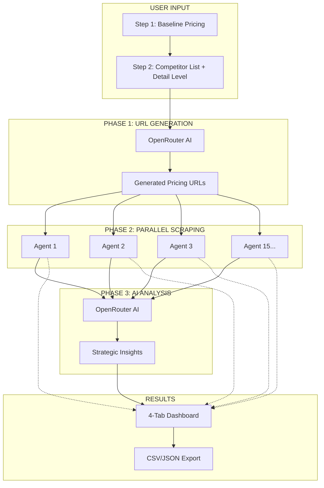
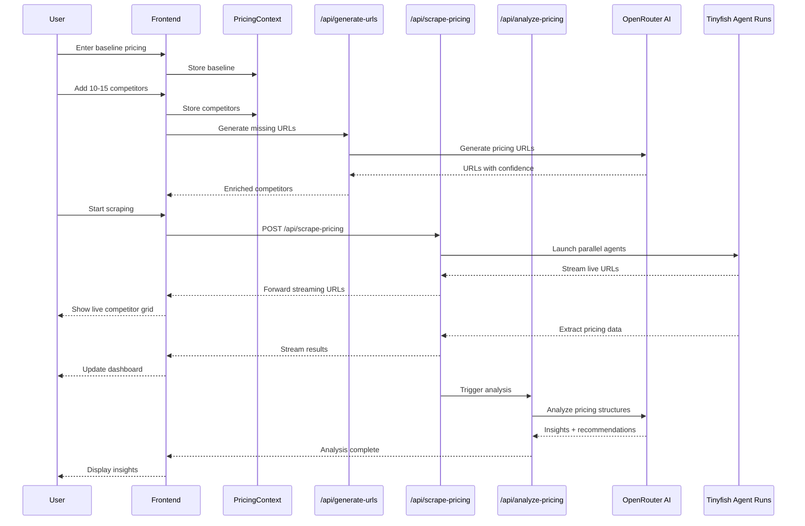
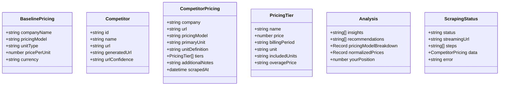

# Competitive pricing intelligence (TinyFish cookbook)

**Package:** `competitor-analysis` (see `package.json`)

**Live demo:** https://competitor-priceanalysis.vercel.app/

A competitive pricing intelligence app for tracking many competitors at once. It follows **Source → Extract → Present**: OpenRouter helps discover pricing URLs, **Tinyfish Agent** (via `@tiny-fish/sdk`) scrapes and extracts structured JSON from pricing pages in parallel, and OpenRouter analyzes the results for the dashboard.

**Status:** Working

---

## Stack

| Piece | Role |
|-------|------|
| Next.js 16 (App Router) | UI and API routes |
| `@tiny-fish/sdk` | Tinyfish Agent streaming runs (`client.agent.stream`) in `/api/scrape-pricing` |
| OpenRouter | URL hints, pricing analysis (`/api/generate-urls`, `/api/analyze-pricing`) |
| React 19, Tailwind, shadcn/ui | Frontend |

---

## How Tinyfish Agent is wired

Scraping is implemented in `app/api/scrape-pricing/route.ts`: for each competitor URL it calls `new TinyFish({ apiKey }).agent.stream({ url, goal, browser_profile: 'lite' })`, forwards step and `streamingUrl` events to the browser over SSE, and on `COMPLETE` maps `resultJson` into the app’s `CompetitorPricing` schema. Environment variable: `TINYFISH_API_KEY`.

---

## Demo

*[Demo video/screenshot to be added]*

---

## Quick start

```bash
npm install
export TINYFISH_API_KEY=your_key
export OPENROUTER_API_KEY=your_key
npm run dev
```

Or use a `.env.local` file (see `.env.local.example`).

---

## How to Run

### Prerequisites

- Node.js 18+
- Tinyfish API key (set `TINYFISH_API_KEY`)

### Setup

1. Clone the repository:
```bash
git clone https://github.com/tinyfish-io/TinyFish-cookbook
cd TinyFish-cookbook/competitor-analysis
```

2. Install dependencies:
```bash
npm install
```

3. Create `.env.local` file:
```bash
TINYFISH_API_KEY=xxx          # Browser automation
OPENROUTER_API_KEY=xxx    # AI URL generation + pricing analysis
```

4. Run the development server:
```bash
npm run dev
```

5. Open [http://localhost:3000](http://localhost:3000) in your browser

---

## Architecture Diagram








