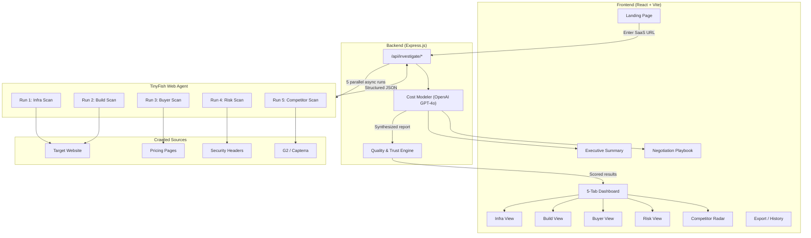
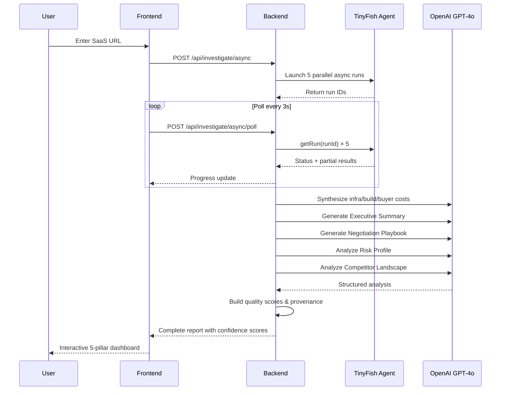

# CostLens — Reverse-Engineer the True Cost of Any SaaS

**Live Demo:** [https://naked-saa-s-tiny-fish.vercel.app](https://naked-saa-s-tiny-fish.vercel.app)

CostLens is an open-source intelligence tool that reverse-engineers the real cost behind any SaaS product across **five pillars**: Infrastructure, Build, Buyer, Risk, and Competitors. It uses the **TinyFish Web Agent** to autonomously crawl live websites and extract structured data — pricing pages, tech stacks, security headers, and competitor landscapes — then synthesizes everything with OpenAI GPT-4o into actionable reports with confidence scores.

---

## Demo

*Demo video coming soon*

---

## TinyFish API Usage

CostLens launches **5 parallel TinyFish async runs** — one per pillar — to scrape structured data from live websites. Each run receives a natural-language goal and returns JSON.

### Code Snippet

```javascript
import { TinyFishWebAgentClient } from "./tinyfish/tinyfish-web-agent-client.js";

const tinyfish = new TinyFishWebAgentClient({
  endpoint: "https://agent.tinyfish.ai",
  apiKey: process.env.TINYFISH_API_KEY,
  browserProfile: "stealth",
});

// Launch 5 parallel async runs — one per pillar
const [infraRun, buildRun, buyerRun, riskRun, competitorsRun] =
  await Promise.allSettled([
    tinyfish.runAsync({
      url: targetUrl,
      goal: "Analyze the site and infer infrastructure + traffic signals. Return strict JSON...",
    }),
    tinyfish.runAsync({
      url: targetUrl,
      goal: "Analyze the product site and return detected build-relevant features. Return strict JSON...",
    }),
    tinyfish.runAsync({
      url: targetUrl,
      goal: "Find and extract pricing page details including plan cards. Return strict JSON...",
    }),
    tinyfish.runAsync({
      url: targetUrl,
      goal: "Analyze the site for security and compliance signals. Return strict JSON...",
    }),
    tinyfish.runAsync({
      url: targetUrl,
      goal: "Find top 3-5 competitors or alternatives. Return strict JSON...",
    }),
  ]);

// Poll for results
const result = await tinyfish.getRun(infraRun.value.run_id);
// result.status === "COMPLETED" → result.result contains structured JSON
```

---

## How to Run

### Prerequisites

- **Node.js 22+**
- **TinyFish API Key** — get one at [tinyfish.ai](https://tinyfish.ai)
- **OpenAI API Key** — get one at [platform.openai.com](https://platform.openai.com)

### Setup

1. Clone the repository and navigate to the project:

```bash
git clone https://github.com/tinyfish-io/TinyFish-cookbook
cd TinyFish-cookbook/costlens
```

2. Install dependencies:

```bash
npm install
```

3. Create a `.env` file from the example:

```bash
cp .env.example .env
```

4. Fill in your API keys in `.env`:

```
TINYFISH_API_KEY=your_tinyfish_api_key
OPENAI_API_KEY=your_openai_api_key
```

5. Start the development server:

```bash
npm run dev
```

6. Open [http://localhost:3000](http://localhost:3000) in your browser.

### Environment Variables

| Variable | Required | Description |
|---|---|---|
| `TINYFISH_API_KEY` | Yes | TinyFish Web Agent API key |
| `OPENAI_API_KEY` | Yes | OpenAI API key (GPT-4o) |
| `PORT` | No | Server port (default: 3000, auto-fallback on conflict) |
| `CORS_ORIGIN` | No | Comma-separated allowed origins |
| `TINYFISH_BROWSER_PROFILE` | No | Browser profile: `stealth` (default) |
| `TINYFISH_PROXY_ENABLED` | No | Enable geo-proxy (`false` default) |
| `OPENAI_MODEL` | No | Model override (default: `gpt-4o`) |

---

## Architecture Diagram



### Scan Flow


