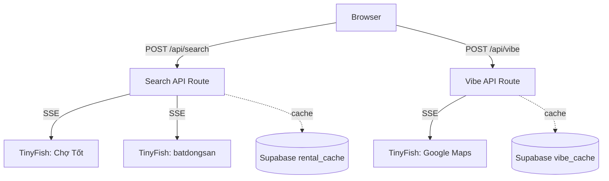

# District Rent Shark

> English-first apartment hunting in Vietnam. Scrapes Chợ Tốt and batdongsan.com.vn using TinyFish browser agents, with trust scoring, building rules, and neighborhood vibe data from Google Maps.

**Live demo → [district-rent-shark.vercel.app](https://district-rent-shark.vercel.app)**

---

## What it does

Finding apartments in Vietnam means visiting 2-3 different websites, each with different layouts, Vietnamese-only listings, and no way to compare prices or trust signals. This app sends TinyFish browser agents to Chợ Tốt and batdongsan.com.vn **simultaneously**, extracts structured rental data with English translations, and streams results to an interactive dashboard in real time.

- Search across **3 cities** — HCMC, Hanoi, Da Nang
- **Trust scoring** — detects brokers, reposts, suspicious pricing, and deposit terms
- **Building rules** — pets, parking, curfew, and other restrictions extracted from listings
- **Neighborhood vibe** — Google Maps integration for walkability, transit, and local vibes
- **Interactive Mapbox** — visualize listings on a map with filters
- Toggle between **live scraping** and **cached results** (6-hour TTL)
- Results stream in as each site completes — no waiting for the slowest one

---

## Demo


---

## How it works

```
User clicks Search
       │
       ▼
POST /api/search
       │
       ├── Cache hit? → stream result instantly via SSE
       │
        └── Cache miss? → fire TinyFish SSE requests for all sites in parallel
                              │
                              ├── STREAMING_URL event → forward iframe URL to client
                              │
                              └── COMPLETED event → parse JSON, stream to client, upsert to cache
```

Each city has 2 target sites (Chợ Tốt and batdongsan). TinyFish handles all the hard parts: cookie banners, dynamic loading, Vietnamese-to-English translation, pagination. The API route streams results via **Server-Sent Events** so the UI updates as sites finish — typically within 30-60 seconds for a full city scrape.

---

## TinyFish SDK snippet

Here's the core SDK stream from `/api/search/route.ts` (goal prompt truncated):

```typescript
import { TinyFish } from "@tiny-fish/sdk";

const GOAL_PROMPT = `You are extracting rental apartment/room listings from a Vietnamese real estate website.

Steps:
1. Wait for the page content to fully render — these are JavaScript SPAs that load content dynamically.
2. Handle any popups, cookie banners, or login modals by dismissing/closing them.
3. Extract the first 10 rental listings visible on the page. For each listing, extract ALL of the following fields:
   - title_en, price_vnd_monthly, area_m2, address_en, district, bedrooms, bathrooms
   - post_date, poster_name, poster_type, amenities, description_en, listing_url, thumbnail_url
   - trust_signals: is_likely_broker, is_repost, price_suspicious, deposit_mentioned, deposit_terms
   - building_rules: pets_allowed, parking, curfew, notes

4. TRANSLATE all Vietnamese text to English in the output fields marked with _en suffix.
5. Return a JSON object with platform, city, and listings[] array.`;

async function runTinyFishSseForSite(url: string, enqueue: (payload: unknown) => void): Promise<boolean> {
  const client = new TinyFish({ timeout: 780_000 });
  const stream = await client.agent.stream({
    url,
    goal: GOAL_PROMPT,
    browser_profile: "stealth",
    proxy_config: {
      enabled: true,
      country_code: "VN",
    },
  });

  for await (const event of stream) {
    if (event.type === "STREAMING_URL") {
      enqueue({ type: "STREAMING_URL", streamingUrl: event.streaming_url });
    }
    if (event.type === "COMPLETE" && event.status === "COMPLETED") {
      enqueue({ type: "LISTING_RESULT", data: event.result });
    }
  }
}
```

---

## Running locally

```bash
git clone https://github.com/tinyfish-io/tinyfish-cookbook
cd tinyfish-cookbook/district-rent-shark
npm install
```

Create a `.env.local` file:

```env
# Required
TINYFISH_API_KEY=your_key_here

# Optional — for result caching (app works fine without it)
NEXT_PUBLIC_MAPBOX_TOKEN=your_mapbox_token
NEXT_PUBLIC_SUPABASE_URL=your_supabase_url
SUPABASE_SERVICE_ROLE_KEY=your_service_role_key
```

Get a TinyFish API key at [tinyfish.ai](https://tinyfish.ai/).

```bash
npm run dev
```

Open [http://localhost:3000](http://localhost:3000).

---

## Architecture



---

## Tech stack

| Layer | Choice | Why |
|---|---|---|
| Framework | Next.js 16 (App Router) | SSE streaming via Node.js runtime |
| UI | React 19 + Tailwind CSS 4 + shadcn/ui | Fast, clean, no design system overhead |
| Scraping | [TinyFish API](https://tinyfish.ai/) | Parallel browser agents, structured JSON output, Vietnamese translation |
| Mapping | Mapbox GL | Interactive map visualization with filters |
| Validation | Zod | Type-safe schema validation for listing data |
| Caching | Supabase (Postgres) | 6-hour TTL, graceful degradation if unavailable |
| Testing | Vitest | Fast unit tests for data parsing and trust scoring |
| Hosting | Vercel | Zero-config, auto-deploys |

---

Built as a take-home demo for [TinyFish](https://tinyfish.ai) — showing what's possible when you give TinyFish a list of niche local websites and let it run in parallel.
