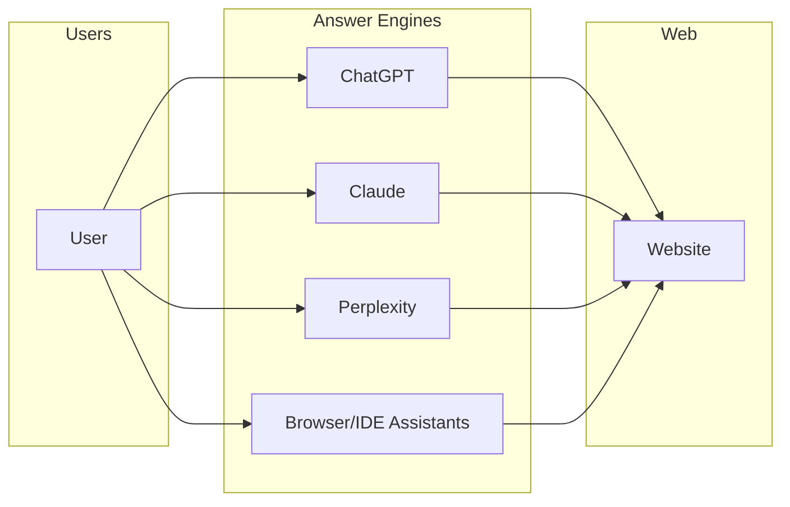
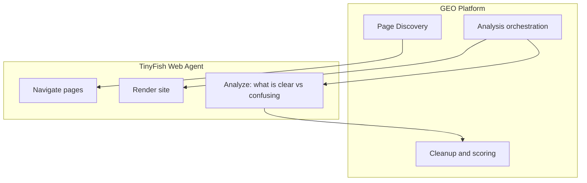
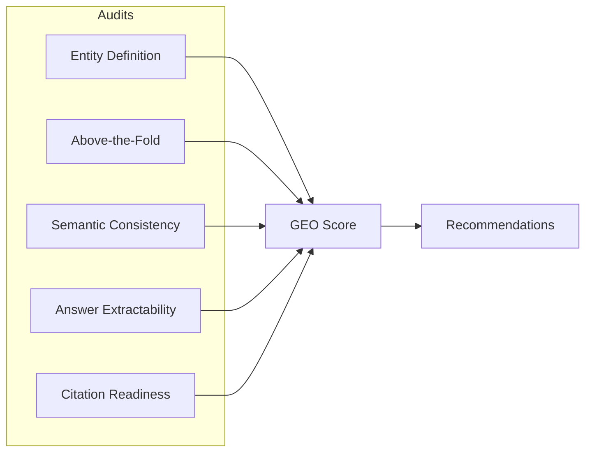
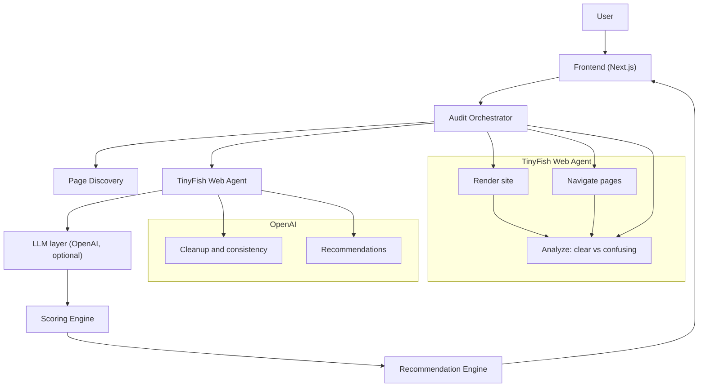
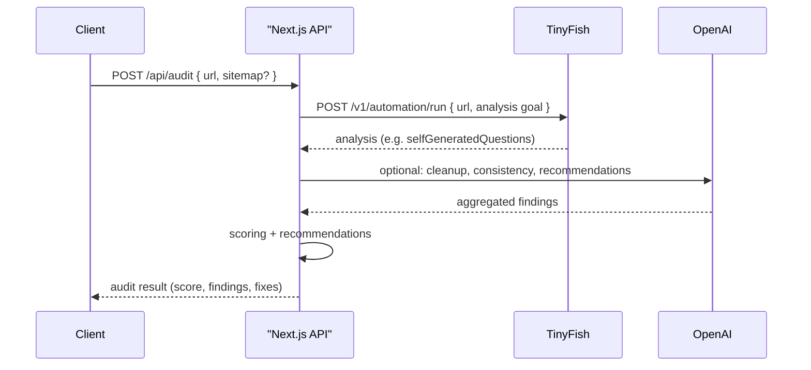

# GEO — Generative Engine Optimization

**LLM Visibility Audit and Optimization Platform**

---

## Executive Summary

GEO (Generative Engine Optimization) is an audit and improvement system that evaluates how generative answer engines—such as ChatGPT, Claude, and Perplexity—interpret a given website. It produces structured findings and actionable recommendations to improve large-language-model (LLM) understanding, answer accuracy, and citation readiness.

The system is distinct from search engine optimization (SEO): it targets answer engines and semantic comprehension rather than search ranking or keyword placement.

---

## 1. Definition and Scope

**Definition:** GEO is an audit and improvement system that evaluates how generative answer engines interpret a website and delivers concrete, actionable fixes to improve LLM understanding, accuracy, and citation readiness.

**Scope:** Optimization for answer engines and LLM-based assistants, not for traditional search engines.

---

## 2. Problem Statement

A growing share of user discovery happens through:

- ChatGPT
- Claude
- Perplexity
- AI assistants embedded in browsers and integrated development environments

These systems do not rank pages, do not rely on keyword-based ranking, and do not expose ranking criteria. They consume rendered content, infer meaning semantically, and are prone to incorrect or vague answers when source material is ambiguous or poorly structured.

Many websites are not authored or structured with LLM consumption in mind. GEO identifies these gaps and provides structured remediation guidance.

### 2.1 Key Features (Implemented)

- **Sitemap-based multi-page audits (limit 10):** When sitemap mode is enabled, GEO discovers up to 10 URLs from `sitemap.xml` or `sitemapindex.xml`, runs analysis per page, and computes a session-level result.
- **Consistency view (hybrid):** A combined table and summary cards highlight overlapping questions across pages, answer deltas, and an overall consistency score.
- **Question-level CSV export:** One-click client-side export of the current audit view with per-question rows and columns for page URL, question, answeredInDocs, partialAnswer, and importance.
- **LLM citation check (related topics):** Ask OpenAI (and optionally Gemini/Claude) about related topics and check if the model cites the company; API: `POST /api/audit/llm-citations`.



#### POST /api/audit

Single-page request:

```json
{
  "url": "https://yoursite.com"
}
```

Multi-page (sitemap) request:

```json
{
  "url": "https://yoursite.com",
  "sitemap": true
}
```

Single-page response (shape):

```json
{
  "mode": "single",
  "id": "run_id",
  "url": "https://yoursite.com",
  "score": 78,
  "clarityIndex": 82,
  "importanceBreakdown": { "high": {}, "medium": {} },
  "questions": []
}
```

Multi-page response (shape):

```json
{
  "mode": "multi",
  "sessionId": "session_id",
  "baseUrl": "https://yoursite.com",
  "overallScore": 74,
  "clarityIndex": 79,
  "pages": [],
  "consistency": {},
  "sitemapInfo": { "source": "sitemap.xml", "urls": [] }
}
```

---

## 3. Design Precedents

### 3.1 SEO-Style Audits

The audit model draws on established SEO-audit practice with the following adaptations:

| Retained | Replaced |
|----------|----------|
| Deterministic checks (pass/fail) | Keyword checks → semantic clarity checks |
| Structured audit categories | Crawlers → rendered browser analysis |
| Explicit scoring | SERP logic → answer-engine reasoning |
| Actionable “what’s broken / how to fix” output | — |

GEO applies an audit methodology analogous to SEO audits, applied to LLM cognition and answer quality.

### 3.2 Content and Layout Standards

Content and layout standards are informed by practices common on high-clarity marketing sites (e.g. Webflow-style landing pages):

| Retained | Rationale |
|----------|------------|
| Clear above-the-fold messaging | LLM consumption parallels human scanning; prominence matters |
| Explicit product/category definition | Headings and labels drive semantic interpretation |
| Clear visual and structural hierarchy | Layout and structure affect how content is parsed |
| Declarative, scannable copy | Reduces ambiguity and supports confident extraction |

GEO assesses whether the site meets these standards from a machine-comprehension perspective.

---

## 4. Dependency on TinyFish Web Agent

Conventional tooling (static HTML parsing, public APIs, rate-limited endpoints) is insufficient for GEO’s requirements. The platform depends on real browser execution to:

- Render JavaScript-heavy sites (e.g. Webflow, Next.js, React)
- Navigate authenticated or dynamic flows
- Analyze and reason about what is visible and what is hard to access (TinyFish runs with an LLM in the background)
- Support repeatable, deterministic audits

The **TinyFish Web Agent** provides this capability. (The product was previously known as Mino; that name is being phased out. Use TinyFish Web Agent and `agent.tinyfish.ai` / `TINYFISH_API_KEY` for all new work.) GEO’s design assumes TinyFish availability; the current scope is not feasible without it.

---

## 5. TinyFish Web Agent — Technical Reference

GEO uses the **TinyFish Web Agent** for browser automation and LLM-backed analysis. The following is a condensed reference from the [official documentation](https://docs.mino.ai/).

**Note:** The API has moved from `mino.ai` to `agent.tinyfish.ai`. Use the new base URL and `TINYFISH_API_KEY` for all implementations. Mino is being phased out.

### 5.1 Endpoints

| Method | Endpoint | Description |
|--------|----------|-------------|
| POST | `/v1/automation/run-sse` | Run automation with Server-Sent Events (streaming) |
| POST | `/v1/automation/run` | Run automation synchronously; response returned on completion |
| POST | `/v1/automation/run-async` | Enqueue automation; returns `run_id` for later status/result retrieval |

Base URL: `https://agent.tinyfish.ai`. Legacy: `https://mino.ai` (avoid for new work).

### 5.2 Authentication

- **REST API:** API key supplied in the `X-API-Key` request header.
- **Environment:** `TINYFISH_API_KEY` (primary). Legacy: `MINO_API_KEY`. Keys are obtained from the provider’s API keys page.
- **MCP (e.g. Claude, Cursor):** OAuth 2.1; initial use triggers browser-based sign-in.

### 5.3 Request Parameters

| Field | Type | Required | Description |
|-------|------|----------|-------------|
| url | string (URI) | Yes | Target website URL |
| goal | string | Yes | Natural-language description of the task |
| browser_profile | "lite" \| "stealth" | No | Default `lite`; `stealth` for bot-protected sites |
| proxy_config | object | No | Optional proxy; e.g. `{ "enabled": true, "country_code": "US" }` |

### 5.4 SSE Event Types (run-sse)

| Event | Description |
|-------|-------------|
| STARTED | Automation run has started |
| STREAMING_URL | URL for live browser view |
| PROGRESS | Step in progress (includes purpose) |
| COMPLETE | Run finished; includes status and result payload |
| HEARTBEAT | Keep-alive (e.g. every 30 seconds) |

### 5.5 MCP Tools

| Tool | Function |
|------|----------|
| run_web_automation | Run automation with streaming progress |
| run_web_automation_async | Start automation; returns run_id |
| get_run | Retrieve status and result by run id |
| list_runs | List runs with optional filters and pagination |

Example MCP configuration (e.g. Cursor): use the TinyFish/Mino MCP URL as documented by the provider (e.g. `https://mino.ai/mcp` or the TinyFish equivalent).

---

## 6. Use of TinyFish Web Agent Within GEO

| Audit stage | Reason TinyFish is required |
|-------------|-----------------------------|
| Page analysis (LLM-backed) | TinyFish runs with an LLM; it can analyze what it sees well and what is confusing or hard to access |
| Above-the-fold and layout | Content is JS-rendered; requires real browser |
| Page discovery | Links and navigation are dynamic |
| Semantic and FAQ content | Often in interactive or hidden regions; needs rendered DOM |



---

## 7. TinyFish Goal: Analysis, Not Just Extraction

GEO evaluates sites **using the TinyFish Web Agent itself**. TinyFish has an LLM in the background, so the goal is not only to extract headings or DOM elements. The goal should ask TinyFish to **analyze** the page: what it can understand well, what is confusing, and what is hard to access. The application then uses that analysis for cleanup, scoring, and recommendations.

### 7.1 What the goal should ask for

- **Analysis, not raw extraction:** Ask TinyFish to reason about the page from an “answer engine” perspective: what information is easy to find, what is ambiguous, and what is missing or hard to access.
- **Self-generated benchmark style:** The output should resemble a self-generated benchmark: a set of questions (or topics) the agent considers important, with an assessment of how well each is answered on the page.
- **Structured response:** Request JSON so the app can display results in the dashboard and compute a GEO score.

### 7.2 Example goal (analysis-focused)

```json
{
  "url": "https://yoursite.com",
  "goal": "You are evaluating this page for how well an answer engine (e.g. ChatGPT, Perplexity) could understand and cite it. Analyze the page and produce a self-generated benchmark. For each of 5–8 questions that a user might ask (e.g. What is this product? Who is it for? How much does it cost? Where do I sign up?), state: (1) whether the answer is clearly in the page (true), partially there (partial), or missing (false), (2) a short partialAnswer explaining what you found or what is missing, (3) importance (high or medium). Return a JSON array called selfGeneratedQuestions with objects: question, answeredInDocs (true/false/\"partial\"), partialAnswer, importance."
}
```

### 7.3 Expected output format (self-generated benchmark)

TinyFish (or a follow-up step) should produce structured analysis in this form, so the dashboard can show what is easy vs hard to find:

```json
{
  "selfGeneratedQuestions": [
    {
      "question": "What is this product?",
      "answeredInDocs": true,
      "partialAnswer": "Clearly stated in the hero: product feedback platform for SaaS teams.",
      "importance": "high"
    },
    {
      "question": "What happens if my automation times out mid-way?",
      "answeredInDocs": "partial",
      "partialAnswer": "Docs mention timeout and suggest breaking into smaller runs, but do not explain what happens to partial results.",
      "importance": "high"
    },
    {
      "question": "What are the rate limits?",
      "answeredInDocs": false,
      "partialAnswer": "Mentioned that limits exist and vary by plan, but no actual numbers provided.",
      "importance": "high"
    }
  ]
}
```

From this, the app derives the GEO score, highlights gaps, and generates recommendations. Multi-page audits can run one such analysis per page and then compare consistency across pages.

---

## 8. Role of OpenAI in GEO

**Primary analysis** comes from the TinyFish Web Agent (which runs with an LLM): TinyFish analyzes the page and returns structured output (e.g. self-generated benchmark style). OpenAI (or equivalent) is used only for **optional** cleanup, aggregation, and recommendation generation—not for scraping, crawling, or content retrieval.

**Uses (optional layer):**

- Entity comprehension assessment
- Cross-page consistency checks
- Confidence scoring
- Gap identification
- Generation of fix recommendations

**Runtime toggle:** OpenAI cleanup is disabled by default. Enable it by setting `USE_OPENAI_CLEANUP=true` and `OPENAI_API_KEY`. Optionally set `OPENAI_MODEL` (default: `gpt-4o-mini`).

### 8.1 Cleanup Configuration (Environment Variables)

- `USE_OPENAI_CLEANUP`: `true` or `false` (default `false`).
- `OPENAI_API_KEY`: required only when cleanup is enabled.
- `OPENAI_MODEL`: optional override for the cleanup model (default `gpt-4o-mini`).

**Example evaluation prompt:**

```
You are evaluating a website for LLM comprehension.
Answer strictly from the content provided.

1. What is this product?
2. Who is it for?
3. What problem does it solve?
4. How confident are you (0–1)?
5. What information is missing or unclear?

Content:
<<<EXTRACTED_CONTENT>>>
```

This prompt is applied per page and, where applicable, per model (e.g. ChatGPT, Claude); results are compared for divergence.

---

## 9. Audit Categories

### 9.1 Entity Definition

Assessment of whether the site clearly states:

- Product or service category
- Primary function
- Target audience

| Weak example | Strong example |
|--------------|----------------|
| “We help teams move faster” | “FeedbackHQ is a product feedback intelligence platform for SaaS teams.” |

### 9.2 Above-the-Fold Clarity

- Single, unambiguous H1
- Value proposition visible without scrolling
- Explicit product/category statement

### 9.3 Semantic Consistency

- Comparison of messaging across key pages (e.g. Home, Pricing, About)
- Comparison of LLM-generated summaries across pages
- Identification of inconsistencies that increase hallucination risk

### 9.4 Answer Extractability

- Frequency of hedging language (“seems”, “appears”) in model answers
- Answer length and specificity
- Degree of confidence and specificity in extracted answers

### 9.5 Citation Readiness

- Presence of FAQ or Q&A-style content
- Use of structured sections and headings
- Declarative, definitional language



---

## 10. System Architecture



**Data flow:**

1. User submits a site URL (and optional scope) via the frontend.
2. The Audit Orchestrator drives the TinyFish Web Agent with an **analysis** goal (what it sees well, what is confusing, what is hard to access).
3. TinyFish returns structured analysis (e.g. self-generated benchmark style); optionally the LLM Evaluation Layer runs cleanup, consistency checks, and recommendation generation.
4. The Scoring Engine computes a GEO score (0–100).
5. The Recommendation Engine produces concrete copy and structure recommendations; the frontend presents everything in a **nicely styled dashboard** (audit table, findings, fixes) suitable for presentation and video.

### 10.1 API flow

The following describes the request/response sequence across the application and external APIs.

1. **Client → Application**  
   Frontend sends `POST /api/audit` (or equivalent) with body `{ url: string, scope?: string, sitemap?: boolean }`. When `sitemap` is `true`, GEO discovers up to 10 sitemap URLs and runs a multi-page audit session.

2. **Application → TinyFish**  
   Server calls the TinyFish Web Agent API: `POST /v1/automation/run` (or `run-sse` for streaming). Request body includes `url` and a natural-language `goal` that asks TinyFish to **analyze** the page (what it can see well, what is confusing, what is hard to access)—not just extract DOM elements. The goal should request structured output (e.g. `selfGeneratedQuestions`-style JSON). For multi-page audits, the server issues one request per page or a single goal that enumerates pages.

3. **TinyFish → Application**  
   TinyFish returns its analysis (e.g. JSON with questions, answeredInDocs, partialAnswer, importance). The server collects this for all requested URLs.

4. **Application → OpenAI** (optional cleanup)  
   If needed, the server may send TinyFish’s analysis (and raw content) to the OpenAI API for additional evaluation, consistency checks, or recommendation generation. TinyFish’s own analysis is the primary input; OpenAI is used for cleanup and aggregation.

5. **Scoring and recommendations**  
   The server aggregates TinyFish’s analysis (and any OpenAI output), computes the GEO score, and builds the findings and recommendations.

6. **Application → Client**  
   Server responds with a structured audit result: GEO score (0–100), per-category findings, and actionable recommendations. Frontend renders the audit table, findings list, and fixes.



---

## 11. Technology Stack

The following stack is used to implement the architecture above. All choices are aligned with the codebase structure and external dependencies (TinyFish Web Agent, OpenAI).

### 11.1 Core

| Layer | Technology | Notes |
|-------|------------|--------|
| **Runtime** | Node.js 18+ | Server and build; LTS recommended. |
| **Language** | TypeScript | End-to-end typing for audits, TinyFish integration, llm, and scoring modules. |
| **Frontend** | Next.js (App Router), React | Server and client components; form for URL input; **dashboard** for audit table, findings, and fixes. |
| **Styling** | **Tailwind CSS** + **shadcn/ui** | Tailwind for layout and theming; **shadcn** for consistent, accessible components (buttons, cards, tables, tabs). Ensures a polished, presentable dashboard suitable for demos and video. |

### 11.2 External Services

| Service | Use | Integration |
|---------|-----|-------------|
| **TinyFish Web Agent** | Browser automation and **LLM-backed analysis**: what the agent sees well, what is confusing, what is hard to access. | REST API: `POST /v1/automation/run` or `run-sse`; base URL `https://agent.tinyfish.ai`; auth via `X-API-Key`; `TINYFISH_API_KEY` server-side. |
| **OpenAI** | Optional: cleanup, consistency checks, recommendation generation on top of TinyFish’s analysis. | REST API (e.g. Chat Completions); server-side only; `OPENAI_API_KEY`. |

### 11.3 Data and Persistence

| Concern | Approach | Notes |
|---------|----------|--------|
| **Audit inputs and results** | PostgreSQL via Prisma. | Required for audit history, multi-page sessions, and consistency reports. |
| **Secrets** | Environment variables | `TINYFISH_API_KEY`, `OPENAI_API_KEY`; never committed. |

### 11.4 Tooling and Delivery

| Area | Choice | Notes |
|------|--------|--------|
| **Package manager** | npm or pnpm | Lockfile committed; CI and local use the same manager. |
| **Linting / formatting** | ESLint, Prettier | TypeScript and React rules; format on save or pre-commit. |
| **Build** | Next.js build | `next build`; output suitable for Node or Vercel. |
| **Deployment** | Vercel (or equivalent Node host) | Next.js is the single app; serverless or Node server for API routes that call TinyFish and optionally OpenAI. |

### 11.5 Dashboard and presentation

All audit results (GEO score, findings, self-generated benchmark style analysis) must be presented in a **nicely styled dashboard** so that the product can be demonstrated and recorded for video. Use Tailwind and shadcn for a consistent, professional layout: clear sections for score, per-question analysis (question, answeredInDocs, partialAnswer, importance), and actionable recommendations.

### 11.6 Summary

- **Frontend:** Next.js + React + TypeScript + **Tailwind + shadcn**; dashboard-oriented UI in `ui/`.
- **Backend / orchestration:** Next.js API routes or server actions; orchestration calls TinyFish with an **analysis** goal, then optional OpenAI cleanup.
- **Browser automation and analysis:** TinyFish Web Agent (server-side); goal = analyze, not just extract.
- **LLM:** OpenAI (server-side) for optional cleanup and recommendations.
- **Ops:** Env-based config; PostgreSQL required; deploy via Vercel or similar.

---

## 12. Codebase Structure

```
geo/
├── audits/
│   ├── entity.ts
│   ├── aboveFold.ts
│   ├── consistency.ts
│   └── citation.ts
├── tinyfish/   # TinyFish Web Agent client (e.g. crawler, analysis runner)
│   ├── crawler.ts
│   ├── extractor.ts
│   └── renderer.ts
├── llm/
│   ├── prompts.ts
│   ├── evaluator.ts
│   └── comparer.ts
├── scoring/
│   └── geoScore.ts
├── ui/
│   ├── auditTable.tsx
│   ├── findings.tsx
│   └── fixes.tsx
```

---

## 13. Target Maturity and Roadmap

**Target maturity:**

- Documented, repeatable setup and runbooks
- Repeatable audits with stable, comparable results for the same site
- Deterministic scoring and pass/fail criteria
- Evaluations grounded in extracted content to limit hallucination
- Explicit justification for browser-based (TinyFish) dependency versus API-only alternatives

**Planned extensions:**

- Comparative GEO scoring across competitor sites
- Time-series tracking of GEO score
- Pre-publish or CI-integrated GEO checks

---

## 14. Rationale for TinyFish Web Agent

| Criterion | GEO |
|-----------|-----|
| Requires real browser automation | Yes: JS rendering, dynamic navigation, authenticated flows |
| Feasibility without TinyFish | No: static HTML and typical APIs do not reflect answer-engine consumption |
| Use of TinyFish’s LLM | Goal is for TinyFish to **analyze** (what it sees well, what is confusing); not just extract DOM |
| Differentiation from API-only tools | Rendered DOM and LLM-backed analysis are central; markup alone is insufficient |
| Alignment with provider positioning | Aligns with browser-based agent automation and real-site workflows |

---

## 15. Go-To-Market (GTM) Strategy

### 15.1 Target Segments

| Segment | Description | Primary need |
|---------|-------------|--------------|
| Marketing and growth teams | Own website and funnel performance; already run SEO audits. | Visibility and optimisation for answer engines (ChatGPT, Perplexity) as a new channel. |
| Product and content owners | Responsible for positioning, messaging, and site structure. | Clear, actionable feedback on how LLMs interpret their content and where it is unclear or inconsistent. |
| Agencies and consultants | Deliver audits and recommendations to clients. | Repeatable, report-ready GEO audits and a defensible methodology. |

### 15.2 Value Proposition

- **Differentiation from SEO:** GEO addresses answer-engine comprehension and citation readiness, not search ranking. It complements existing SEO by focusing on how LLMs read and cite the site.
- **Concrete output:** Deterministic audit categories, a single GEO score (0–100), and specific copy and structure recommendations—not generic advice.
- **Methodology:** Rendered-browser analysis (via TinyFish Web Agent) and LLM-based evaluation provide a defensible, repeatable process that reflects how answer engines actually consume the site.

### 15.3 Channels and Motion

- **Direct / sales-assisted:** Position GEO as an add-on or standalone audit for existing SEO, content, or performance engagements; emphasise report quality and actionability.
- **Self-serve (future):** Web app for single-site audits; optional usage-based or subscription pricing once the product is stable and documented.
- **Partnerships:** Integration with TinyFish Web Agent and alignment with “answer-engine visibility” positioning; potential co-marketing or referral where audiences overlap.

### 15.4 Phasing

| Phase | Focus | Success criteria |
|-------|--------|-------------------|
| **Internal / pilot** | Run audits for selected sites; refine categories, scoring, and recommendations. | Stable GEO score, repeatable results, clear runbooks. |
| **Limited release** | Offer to a small set of customers or partners; collect feedback on report format and usability. | Completed audits, satisfaction feedback, and iteration on findings/fixes. |
| **General availability** | Documented offering, pricing (if applicable), and support; standardised delivery. | Volume targets, retention/repeat use, and minimal support burden. |

### 15.5 Success Metrics

- Number of audits run (per period).
- GEO score distribution and trend (e.g. improvement on re-audit).
- Adoption of recommendations (e.g. % of findings acted on, where measurable).
- Conversion from trial/pilot to paid or recurring use (when monetisation is in scope).

---

## 16. Documentation References

- [TinyFish Web Agent — Documentation](https://docs.mino.ai/) (legacy Mino branding; use agent.tinyfish.ai and TINYFISH_API_KEY)
- [Quick Start](https://docs.mino.ai/quick-start)
- [API Reference](https://docs.mino.ai/api-reference)
- [Authentication](https://docs.mino.ai/authentication)
- [MCP Integration](https://docs.mino.ai/mcp-integration)
- [API Keys](https://mino.ai/api-keys)
