# Hardware Sentry 🔍

**Real-time multi-vendor availability and pricing tracker for hard-to-find developer boards**

[](https://github.com/yourusername/hardware-sentry)
[](https://www.typescriptlang.org/)
[](https://nextjs.org/)
[](https://opensource.org/licenses/MIT)

---

## Description

Hardware Sentry is a real-time availability and pricing tracker that scans multiple retailers simultaneously to help engineers, makers, and hardware labs find in-stock developer boards during chip shortages. Built with TinyFish Web Agents for the Web Agents Hackathon (February 2026), it solves the problem of manually checking 5+ retailer websites daily, saving users 15-30 minutes per day.

**Who it's for**: Hardware engineers, makers, university labs, system integrators, and resellers who need to track availability for Raspberry Pi 5, NVIDIA Jetson boards, and other hard-to-find components.

**The problem it solves**: Stock changes hourly across retailers, prices fluctuate, and existing tools are either limited to specific products (rpilocator) or provide inaccurate data (Google Shopping). Hardware Sentry provides a unified, real-time view with intelligent change detection.

---

## Table of Contents

- [Features](#features)
- [Tech Stack](#tech-stack)
- [Architecture Overview](#architecture-overview)
- [Installation](#installation)
- [Usage](#usage)
- [Configuration](#configuration)
- [Screenshots / Demo](#screenshots--demo)
- [API Reference](#api-reference)
- [Tests](#tests)
- [Roadmap](#roadmap)
- [Contributing](#contributing)
- [License](#license)
- [Contact / Support](#contact--support)

---

## Features

- ✅ **Multi-Vendor Scanning**: Simultaneously scan 4+ major retailers (Amazon, The Pi Hut, Pimoroni, etc.)
- ✅ **Real-Time Price Extraction**: Extract live pricing and stock status in <45 seconds
- ✅ **Change Detection**: Automatically highlight price changes and stock updates vs. previous scan
- ✅ **Historical Tracking**: Store last 10 scans per product with Redis sorted sets
- ✅ **Intelligent Caching**: 1-hour TTL cache prevents redundant API calls
- ✅ **Distributed Locking**: Prevent concurrent scans with Redis-based locks
- ✅ **Rate Limiting**: 5 requests per minute per IP to prevent abuse
- ✅ **Circuit Breaker**: Automatic fallback when TinyFish API is unavailable
- ✅ **Retry Logic**: Exponential backoff for transient failures (3 attempts, 2-8s delays)
- ✅ **CSV Export**: Download scan results for offline analysis
- ✅ **Dark Mode**: System-aware theme with localStorage persistence
- ✅ **Mobile Responsive**: Optimized for all screen sizes
- ✅ **Mock Mode**: Development testing without API keys

---

## Tech Stack

**Frontend**:
- Next.js 14.2 (App Router, React Server Components)
- TypeScript 5.0 (strict mode)
- Tailwind CSS 3.4
- Framer Motion 12.34 (animations)

**Backend**:
- Node.js 20+ (runtime)
- TinyFish Web Agents API (natural-language web scraping)
- Upstash Redis (serverless caching and locking)

**Infrastructure**:
- Vercel (deployment platform)
- GitHub (version control)

**Development**:
- ESLint (code linting)
- TypeScript Compiler (type checking)
- Makefile (task automation)

---

## Architecture Overview

Hardware Sentry follows a **3-layer architecture** designed for AI-driven web automation:

```mermaid
flowchart TB
    subgraph "Client Layer"
        User[👤 User Browser]
    end

    subgraph "Application Layer (Next.js)"
        Dashboard[📊 Dashboard<br/>page.tsx]
        ScanAPI[🔄 Scan API<br/>/api/scan]
        HistoryAPI[📈 History API<br/>/api/history]
        HealthAPI[🏥 Health API<br/>/api/health]
        BatchAPI[📦 Batch API<br/>/api/scan/batch]
    end

    subgraph "Orchestration Layer"
        Config[⚙️ Config<br/>SKU Definitions]
        Middleware[🛡️ Middleware<br/>Rate Limit + Monitoring]
        CircuitBreaker[⚡ Circuit Breaker<br/>Failure Prevention]
    end

    subgraph "Execution Layer"
        TinyFish[🐠 TinyFish Client<br/>lib/tinyfish.ts]
        RedisClient[💾 Redis Client<br/>lib/redis.ts]
        Retry[🔁 Retry Logic<br/>lib/retry.ts]
    end

    subgraph "External Services"
        TinyFishAPI[🌐 TinyFish API<br/>agent.tinyfish.ai]
        UpstashRedis[(🗄️ Upstash Redis<br/>Cache + Locks)]
        Vendors[🏪 Retailer Websites<br/>Amazon, Pi Hut, etc.]
    end

    User --> Dashboard
    Dashboard --> ScanAPI
    Dashboard --> HistoryAPI
    User --> HealthAPI

    ScanAPI --> Middleware
    BatchAPI --> Middleware
    Middleware --> Config
    Middleware --> CircuitBreaker
    CircuitBreaker --> TinyFish
    TinyFish --> Retry
    Retry --> TinyFishAPI
    TinyFishAPI --> Vendors

    ScanAPI --> RedisClient
    HistoryAPI --> RedisClient
    HealthAPI --> RedisClient
    RedisClient --> UpstashRedis

    Vendors -.->|Scan Results| TinyFishAPI
    TinyFishAPI -.->|JSON Data| TinyFish
    TinyFish -.->|ScanResult| ScanAPI
    RedisClient -.->|Cached Data| ScanAPI
```



### How It Works

**Layer 1 (Directives)**: SOP documents in `directives/` define goals, inputs, and expected outputs for each workflow (e.g., hardware scanning, deployment).

**Layer 2 (Orchestration)**: API routes in `src/app/api/` make intelligent decisions—checking cache, acquiring locks, handling errors, and coordinating between services.

**Layer 3 (Execution)**: Pure functions in `src/lib/` perform deterministic operations—HTTP requests to TinyFish, Redis operations, retry logic with exponential backoff.

**Data Flow**: User clicks "Scan" → API checks Redis cache → If stale, acquires lock → TinyFish scans 4 vendors → Results saved to Redis → Changes detected vs. previous scan → UI displays comparison table.

---

## Installation

### Prerequisites

- Node.js 20+ and npm 10+
- TinyFish API key (sign up at [tinyfish.ai](https://tinyfish.ai))
- Upstash Redis account (free tier at [upstash.com](https://upstash.com))
- Git

### Step-by-Step Setup

1. **Clone the repository**:
   ```bash
   git clone https://github.com/yourusername/hardware-sentry.git
   cd hardware-sentry
   ```

2. **Install dependencies**:
   ```bash
   npm install
   ```

3. **Set up environment variables**:
   ```bash
   cp .env.example .env.local
   ```

   Edit `.env.local` with your API keys:
   ```bash
   TINYFISH_API_KEY=your_tinyfish_api_key_here
   UPSTASH_REDIS_REST_URL=https://your-redis-url.upstash.io
   UPSTASH_REDIS_REST_TOKEN=your_upstash_token_here
   ```

4. **(Optional) Test TinyFish connection**:
   ```bash
   python3 execution/test_tinyfish.py
   ```

5. **Run development server**:
   ```bash
   npm run dev
   ```

6. **Open browser**:
   Navigate to [http://localhost:3000](http://localhost:3000)

---

## Usage

### Basic Scan

1. Open the Hardware Sentry dashboard
2. Select a product SKU from the dropdown (e.g., "Raspberry Pi 5 8GB")
3. Click "Scan Availability"
4. Wait 30-45 seconds for results
5. View price and stock comparison across retailers

### Example Commands

```bash
# Start development server
npm run dev

# Build for production
npm run build

# Start production server
npm start

# Run type checking
npm run type-check

# Run linter
npm run lint

# Deploy to Vercel (requires vercel CLI)
make deploy
```

### Using Mock Data (Development)

For testing without API keys:

```bash
# Add to .env.local
ENABLE_MOCK_DATA=true

# Restart server
npm run dev
```

The app will use realistic mock data instead of calling TinyFish.

### Example: Scanning Multiple SKUs

```typescript
// POST /api/scan/batch
const response = await fetch('/api/scan/batch', {
  method: 'POST',
  headers: { 'Content-Type': 'application/json' },
  body: JSON.stringify({
    skus: ['pi5-8gb', 'jetson-orin-nano', 'pi5-4gb']
  })
});

const data = await response.json();
console.log(data.results); // Results keyed by SKU
console.log(data.metadata.successful); // Number of successful scans
```

---

## Configuration

### Environment Variables

| Variable | Description | Required | Default |
|----------|-------------|----------|---------|
| `TINYFISH_API_KEY` | TinyFish API authentication key | Yes | - |
| `UPSTASH_REDIS_REST_URL` | Upstash Redis REST endpoint | Yes | - |
| `UPSTASH_REDIS_REST_TOKEN` | Upstash Redis authentication token | Yes | - |
| `ENABLE_MOCK_DATA` | Use mock data instead of real API calls | No | `false` |

### Redis Configuration

**Schema**:
```
scan:{sku}:latest     → JSON string (TTL: 1 hour)
scan:{sku}:history    → Sorted set, last 10 scans
scan:{sku}:lock       → Simple lock (TTL: 2 minutes)
```

**Change Detection Thresholds**:
- Price change: >£1 OR >2% (whichever is larger)
- Stock change: Any boolean flip (true ↔ false)

### Rate Limiting

- **Limit**: 5 requests per 60 seconds per IP address
- **Response**: HTTP 429 with `Retry-After` header
- **Implementation**: In-memory sliding window (use Redis for production clusters)

### Circuit Breaker

- **Failure Threshold**: 3 consecutive failures
- **Reset Timeout**: 30 seconds
- **Success Threshold**: 2 consecutive successes to close circuit
- **Error Response**: HTTP 503 when circuit is OPEN

---

## Screenshots / Demo

### Main Dashboard

> *Single-click scanning interface with SKU selector and results table*

### Results Comparison

> *Real-time price and stock comparison across 4+ retailers with change indicators*

### Dark Mode

> *System-aware dark theme with glassmorphism effects*

**Live Demo**: [https://hardware-sentry.vercel.app](https://hardware-sentry.vercel.app) *(update with your Vercel URL)*

---

## API Reference

### `POST /api/scan`

Scan a single SKU across all configured vendors.

**Request**:
```json
{
  "sku": "pi5-8gb"
}
```

**Response**:
```json
{
  "sku": "pi5-8gb",
  "scannedAt": "2026-02-15T19:30:00.000Z",
  "cached": false,
  "vendors": [
    {
      "name": "Amazon UK",
      "url": "https://amazon.co.uk/...",
      "price": 79.99,
      "currency": "GBP",
      "inStock": true,
      "stockLevel": "In Stock",
      "notes": "Prime delivery available",
      "priceChange": "down",
      "stockChange": true
    }
  ]
}
```

### `POST /api/scan/batch`

Scan multiple SKUs in parallel (max 5 per request).

**Request**:
```json
{
  "skus": ["pi5-8gb", "jetson-orin-nano"]
}
```

**Response**:
```json
{
  "results": {
    "pi5-8gb": { /* ScanResult */ },
    "jetson-orin-nano": { /* ScanResult */ }
  },
  "errors": {},
  "metadata": {
    "total": 2,
    "successful": 2,
    "failed": 0,
    "cached": 1
  }
}
```

### `GET /api/history?sku={sku}`

Retrieve last 10 scans for a SKU.

**Response**:
```json
{
  "sku": "pi5-8gb",
  "scans": [
    { "scannedAt": "2026-02-15T19:30:00Z", "vendors": [...] },
    { "scannedAt": "2026-02-15T18:15:00Z", "vendors": [...] }
  ]
}
```

### `GET /api/health`

Health check endpoint with circuit breaker metrics.

**Response**:
```json
{
  "status": "ok",
  "timestamp": "2026-02-15T19:30:00.000Z",
  "service": "Hardware Sentry API",
  "version": "0.1.0",
  "checks": {
    "tinyfish": {
      "configured": true,
      "status": "healthy",
      "circuitBreaker": {
        "state": "CLOSED",
        "failures": 0,
        "totalCalls": 42
      }
    },
    "redis": {
      "configured": true,
      "status": "healthy"
    }
  }
}
```

---

## Tests

### Running Tests

```bash
# Type checking (strict TypeScript)
npm run type-check

# Linting (ESLint with Next.js rules)
npm run lint

# Build verification (production bundle)
npm run build
```

### Test Framework

- **TypeScript Compiler**: Validates all types and interfaces
- **ESLint**: Enforces code quality and Next.js best practices
- **Manual Testing**: Browser-based verification with mock data mode

### Health Check

Verify API configuration:
```bash
curl http://localhost:3000/api/health
```

Expected response: `{ "status": "ok", ... }`

---

## Roadmap

**Completed** ✅:
- [x] Multi-vendor scanning (4+ retailers)
- [x] Real-time price and stock extraction
- [x] Change detection with visual indicators
- [x] Historical tracking (last 10 scans)
- [x] Redis caching with TTL
- [x] Distributed locking
- [x] Rate limiting (5 req/min per IP)
- [x] Circuit breaker pattern
- [x] Retry logic with exponential backoff
- [x] CSV export functionality
- [x] Dark mode toggle
- [x] Mobile responsive design
- [x] Framer Motion animations
- [x] Batch scan API

**Planned** 🚀:
- [ ] Email/Slack alerts on stock changes
- [ ] Price drop notifications
- [ ] GPU and SSD tracking (RTX 4090, Samsung 990 PRO)
- [ ] Webhook notifications for external integrations
- [ ] Analytics dashboard (scan success rates, cache hit ratios)
- [ ] Mobile app (React Native)
- [ ] Browser extension (Chrome/Firefox)
- [ ] Custom SKU configuration UI

---

## Contributing

We welcome contributions! This project uses the **self-annealing loop** from `AGENTS.md`:

1. **Fix it**: Debug and resolve the issue
2. **Update the tool**: Improve the code to handle the edge case
3. **Test the tool**: Verify the fix works and doesn't break other cases
4. **Update directive**: Document the learning in `directives/*.md`
5. **System is stronger**: The error won't happen again

### Contribution Guidelines

1. **Fork** the repository
2. **Create a branch**: `git checkout -b feature/your-feature-name`
3. **Make changes**: Follow existing code style (TypeScript strict mode, no `any` types)
4. **Run checks**: `npm run type-check && npm run lint && npm run build`
5. **Commit**: Use clear commit messages describing the "why"
6. **Push**: `git push origin feature/your-feature-name`
7. **Open a PR**: Describe changes and link to any related issues

### Code Style

- ES modules (`import/export`, never `require()`)
- Functional React components with hooks
- TypeScript strict mode (no implicit `any`)
- Descriptive variable names (`vendorResults` not `res`)
- Async/await over raw promises
- Early returns to reduce nesting

### Reporting Issues

Open an issue on GitHub with:
- Clear description of the problem
- Steps to reproduce
- Expected vs. actual behavior
- Screenshots if applicable

---

## License

This project is licensed under the **MIT License**.

See the [LICENSE](LICENSE) file for full details.

---

## Contact / Support

**Maintainer**: [Your Name]
**Email**: [your.email@example.com]
**GitHub**: [github.com/yourusername](https://github.com/yourusername)
**Project Repository**: [github.com/yourusername/hardware-sentry](https://github.com/yourusername/hardware-sentry)

### Links

- **TinyFish API**: [tinyfish.ai](https://tinyfish.ai)
- **Upstash Redis**: [upstash.com](https://upstash.com)
- **Web Agents Hackathon**: [Submission Form](https://forms.gle/VdDDP1fADVLiWE5MA)
- **TinyFish Cookbook**: [github.com/tinyfish-io/tinyfish-cookbook](https://github.com/tinyfish-io/tinyfish-cookbook)

---

**Built for the Web Agents Hackathon (February 2026)** | Powered by [TinyFish](https://tinyfish.ai) 🐠
