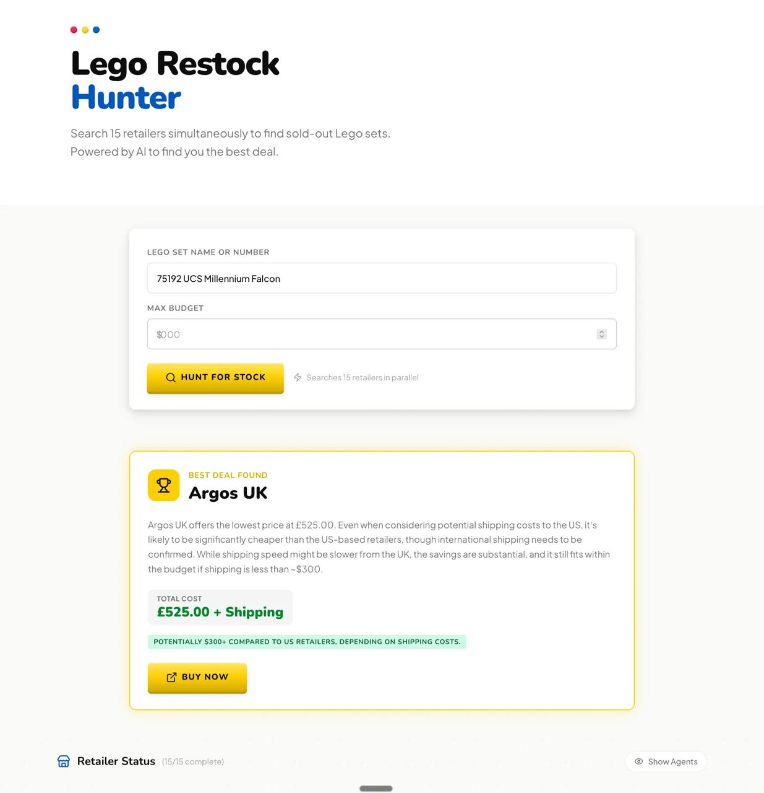

# Lego Restock Hunter

Search 15+ retailers simultaneously to find sold-out Lego sets back in stock. Uses TinyFish browser agents for parallel scraping and OpenAI for deal analysis.

**Live Demo:** https://cookbook-lego-hunter.vercel.app/



## What This Project Is

A cookbook example showing how to use the [TinyFish API](https://tinyfish.ai) to deploy parallel browser automation agents. Given a Lego set name, the app scrapes 15 retailer websites at the same time, extracts stock and pricing data, and recommends the best deal.

## How It Works

1. **User enters a Lego set name and budget** -- e.g. "75192 Millennium Falcon", $900
2. **OpenAI generates retailer search URLs** -- AI creates direct search URLs for 15 retailers (Amazon, Walmart, LEGO.com, Target, BrickLink, etc.)
3. **TinyFish agents scrape each retailer in parallel** -- 15 browser agents launch simultaneously, each navigating a retailer site and extracting stock status, price, currency, and shipping info as structured JSON
4. **OpenAI analyzes the best deal** -- all results are passed to OpenAI, which recommends the best retailer based on price, shipping, and reliability

## TinyFish API Usage

The core integration lives in `app/api/search-lego/route.ts`. Each retailer gets its own TinyFish agent via the SSE endpoint:

```typescript
const response = await fetch('https://agent.tinyfish.ai/v1/automation/run-sse', {
  method: 'POST',
  headers: {
    'X-API-Key': TINYFISH_API_KEY,
    'Content-Type': 'application/json'
  },
  body: JSON.stringify({
    url: retailer.url,
    goal: 'Search for "75192 Millennium Falcon" Lego set. Extract inStock, price, currency, shipping, and productUrl as JSON.',
    browser_profile: 'lite'
  })
})

// Stream SSE events for progress and results
const reader = response.body.getReader()
// ... parse SSE events with streaming_url, purpose, status, result_json
```

The SSE stream provides:
- `streaming_url` -- live browser preview URL
- `purpose` -- progress updates describing what the agent is doing
- `status: "COMPLETED"` + `result_json` -- final extracted data
- `status: "FAILED"` + `error` -- error information

## Tech Stack

- **Next.js 16** (App Router) -- full-stack framework
- **TinyFish API** -- parallel browser automation agents
- **OpenAI GPT-4o Mini** (via Vercel AI SDK) -- URL generation and deal analysis
- **Tailwind CSS 4** -- styling with custom Lego brick theme
- **canvas-confetti** -- celebration effects when stock is found
- **TypeScript** -- end-to-end type safety

## Setup

1. Install dependencies:
```bash
npm install
```

2. Copy `.env.example` to `.env.local` and fill in your keys:
```bash
cp .env.example .env.local
```

```
TINYFISH_API_KEY=your-tinyfish-api-key
OPENAI_API_KEY=your-openai-api-key
```

3. Start the dev server:
```bash
npm run dev
```

4. Open [http://localhost:3000](http://localhost:3000)

## Architecture

```
User
  |
  v
[Next.js Frontend] -- page.tsx (SSE consumer, Lego brick UI)
  |
  |-- POST /api/generate-urls
  |     |
  |     v
  |   [GPT-4o Mini] -- generates 15 retailer search URLs
  |
  |-- POST /api/search-lego (SSE stream)
        |
        |-- [TinyFish Agent 1]  --> Amazon
        |-- [TinyFish Agent 2]  --> Walmart
        |-- [TinyFish Agent 3]  --> LEGO.com
        |-- [TinyFish Agent 4]  --> Target
        |-- ...                 --> (11 more retailers)
        |
        v
      [GPT-4o Mini] -- analyzes all results, picks best deal
        |
        v
      SSE: analysis_complete (best retailer + reasoning)
```
