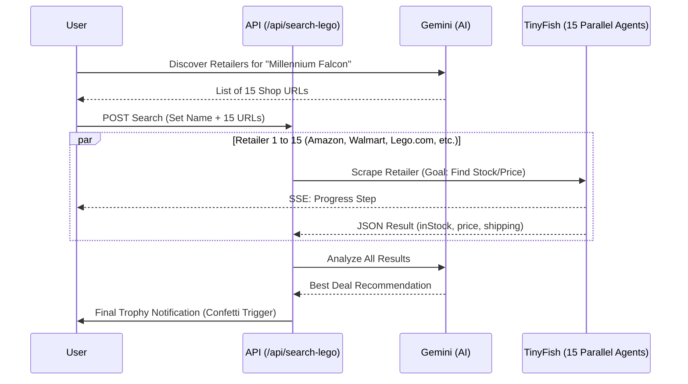

# Lego Restock Hunter - Global Inventory Finder

## Demo


**Live Demo:** https://lego-hunter.vercel.app/

The Lego Restock Hunter is a powerful inventory search tool designed to find rare or sold-out Lego sets across 15+ global retailers simultaneously. It uses AI to discover the best retailers for a specific set, deploys parallel TinyFish browser agents to check stock and pricing, and finishes with a Gemini-powered analysis to recommend the single best deal (balancing price and shipping).

---

## How TinyFish API is Used

The TinyFish API powers browser automation for this use case. See the code snippet below for implementation details.

### Code Snippet

```bash
curl -N -X POST "https://agent.tinyfish.ai/v1/automation/run-sse" \
  -H "X-API-Key: $TINYFISH_API_KEY" \
  -H "Content-Type: application/json" \
  -d '{
    "url": "https://www.lego.com/en-us/search?q=75192",
    "goal": "Search for Millennium Falcon Lego set. Extract inStock, price, and shipping. Return JSON.",
    "browser_profile": "lite"
  }'
```

---

## How to Run

### Prerequisites

- Node.js 18+
- TinyFish API key (get from [tinyfish.ai](https://tinyfish.ai))
- Google Generative AI API key (for Gemini-powered URL generation and deal analysis)

### Setup

1. Clone the repository:
```bash
git clone <repo-url>
cd lego-hunter
```

2. Install dependencies:
```bash
npm install
```

3. Create `.env.local` file:
```bash
TINYFISH_API_KEY=your-tinyfish-api-key
GOOGLE_GENERATIVE_AI_API_KEY=your-google-ai-api-key
```

4. Run the development server:
```bash
npm run dev
```

5. Open [http://localhost:3000](http://localhost:3000) in your browser

---

## Architecture Diagram

```mermaid
graph TD
    subgraph Frontend [Next.js Client]
        UI[User Interface - Lego Brick Style]
        State[Retailer Status & Best Deal]
    end

    subgraph Backend [Next.js API Routes]
        UrlGen[/api/generate-urls]
        Search[/api/search-lego]
    end

    subgraph External_APIs [External Services]
        Gemini[Gemini 2.0 - URL Gen & Analysis]
        TinyFish[TinyFish API - Browser Automation]
    end

    %% User Interactions
    UI -->|Lego Set Name| UrlGen
    UrlGen -->|AI Discovery| Gemini

    %% Scrape Phase
    UrlGen -->|Return 15 URLs| UI
    UI -->|Trigger Parallel Scrape| Search

    Search -->|Deploy 15 Agents| TinyFish
    TinyFish --.->|SSE Streams| UI
    TinyFish --.->|Product JSON| Search

    %% Final Analysis
    Search -->|Analyze All Deals| Gemini
    Gemini -->|Best Retailer Recommendation| Search
    Search --.->|Final Best Deal Event| UI
```


```mermaid
sequenceDiagram
    participant U as User
    participant S as API (/api/search-lego)
    participant G as Gemini (AI)
    participant M as TinyFish (15 Parallel Agents)

    U->>G: Discover Retailers for "Millennium Falcon"
    G-->>U: List of 15 Shop URLs

    U->>S: POST Search (Set Name + 15 URLs)

    par Retailer 1 to 15 (Amazon, Walmart, Lego.com, etc.)
        S->>M: Scrape Retailer (Goal: Find Stock/Price)
        M-->>U: SSE: Progress Step
        M-->>S: JSON Result (inStock, price, shipping)
    end

    S->>G: Analyze All Results
    G-->>S: Best Deal Recommendation
    S->>U: Final Trophy Notification (Confetti Trigger)
```
