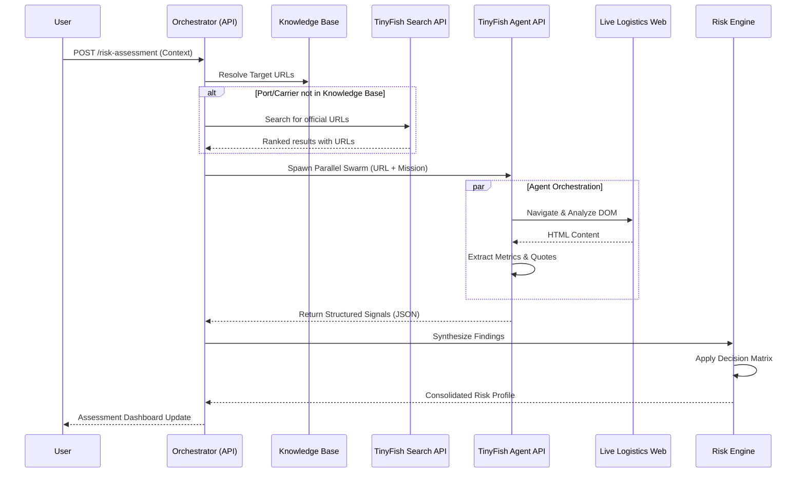
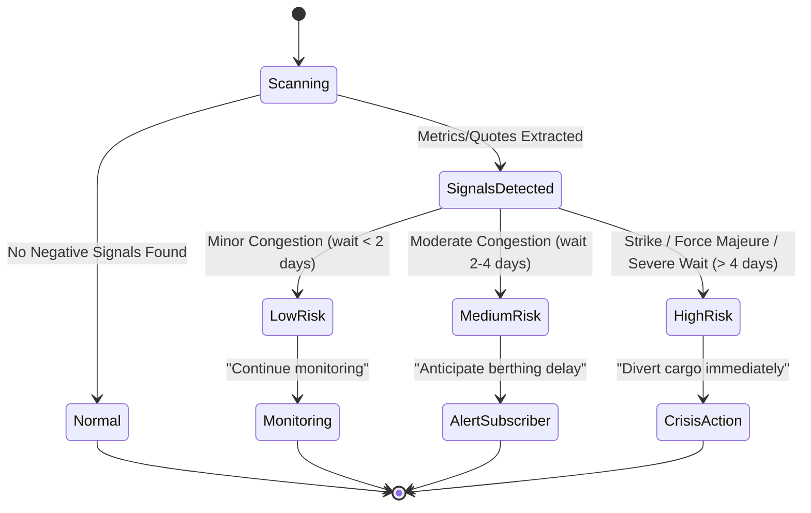

# TinyFish - Logistics Intelligence Sentry

**Live Demo:** [https://inventory-agent-three.vercel.app/](https://inventory-agent-three.vercel.app/)

A comprehensive logistics intelligence platform that helps supply chain teams track port congestion, carrier advisories, and operational risks across multiple sources simultaneously. Uses the **Discovery → Scouting → Synthesis** pipeline pattern with parallel TinyFish browser agents to provide real-time, source-backed operational signals.

## Demo

> Add your demo video or screenshot here

## How TinyFish APIs are Used

This app uses two TinyFish APIs:

**Search API** — used in the discovery phase when a port or carrier is not in the knowledge base. Instead of sending a browser agent to DuckDuckGo, the Search API finds the right official URLs directly:

```javascript
import { TinyFish } from "@tiny-fish/sdk";

const client = new TinyFish({ apiKey: process.env.TINYFISH_API_KEY });

const res = await client.search.query({
    query: "Port of Rotterdam port authority operations status advisories",
});

const urls = res.results.slice(0, 2).map(r => r.url);
```

**Agent API** — used in the scouting phase to navigate discovered URLs, extract deep metrics, quotes, and operational signals:

```javascript
const stream = await client.agent.stream(
    { url, goal, browser_profile: "stealth" }
);

for await (const event of stream) {
    if (event.type === EventType.COMPLETE) {
        // event.result contains structured signals JSON
        break;
    }
}
```

## Intelligence Lifecycle



## Risk Decision Logic



## How to Run

### Prerequisites

- Node.js 18+
- TinyFish API key ([get one here](https://agent.tinyfish.ai/api-keys))

### Setup

1. Install dependencies:

```bash
npm install
```

2. Create a `.env.local` file:
