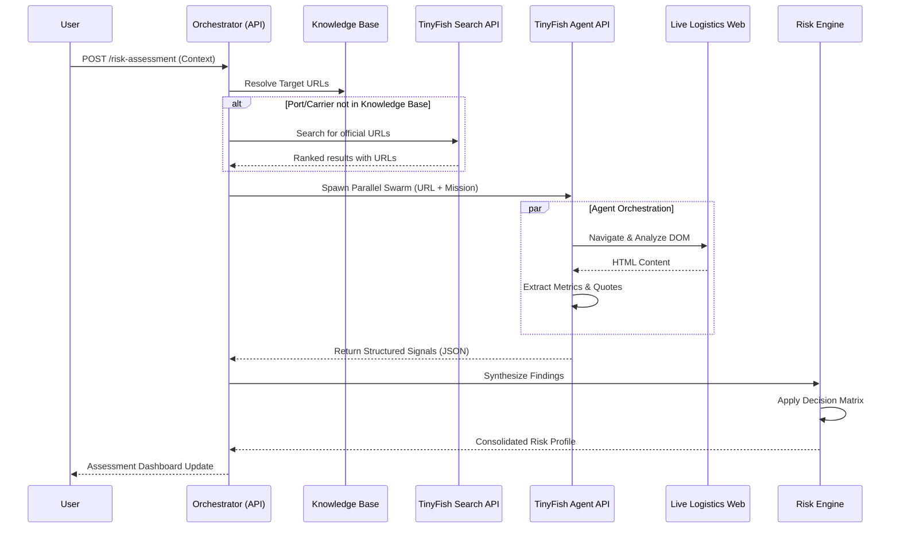
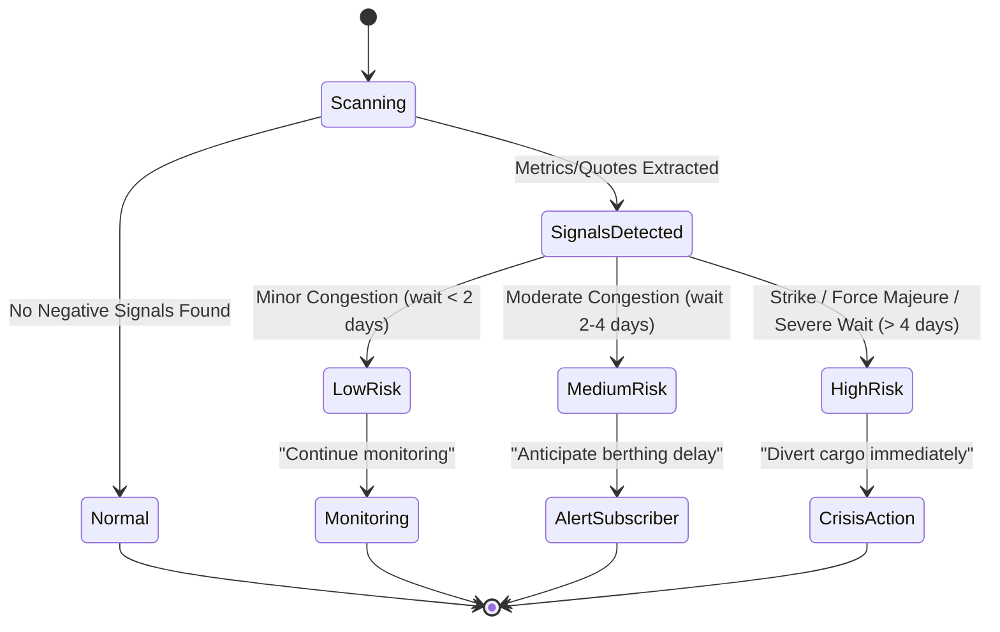

# Logistics Sentry
**Live Demo: https://inventory-agent-three.vercel.app/**

**Logistics intelligence platform — parallel TinyFish agents track port congestion, carrier advisories, and competitive pricing in real time.**

Supply chain teams use Logistics Sentry to monitor operational risks across multiple ports and carriers simultaneously. The app uses a Discovery → Scouting → Synthesis pipeline: the Search API finds official URLs for unknown ports and carriers, then Agent API browser sessions navigate those pages, extract structured signals, and stream results back for risk scoring.

## Architecture

```
┌─────────────────────────────────────────────────────────────┐
│                      Browser (Client)                       │
│                                                             │
│  InventoryInput → RiskAssessment → ActivityFeed             │
│  LiveStream (agent terminal) → DecisionReasoning            │
└──────────────────────────┬──────────────────────────────────┘
                           │
          ┌────────────────┼──────────────────┐
          ▼                ▼                  ▼
  POST /api/agent/run  POST /api/pricing/run  POST /api/logistics/risk-assessment
          │                │                  │
          ▼                ▼                  ▼
┌──────────────────────────────────────────────────────────────┐
│               lib/tinyfish.js  (shared SDK wrapper)          │
│                                                              │
│  client.agent.stream({ url, goal, browser_profile: "stealth" })│
│  EventType.COMPLETE + RunStatus.COMPLETED → validate result  │
│  // COMPLETED only means browser ran — always validate result │
└──────────────────────────────────────────────────────────────┘
```

### Two TinyFish APIs — each for what it does best

```
Search API  → client.search.query({ query })
              Used in logistics/agent.js when port or carrier is NOT
              in SOURCE_KNOWLEDGE_BASE — finds official URLs directly
              instead of sending an agent to a search engine

Agent API   → client.agent.stream({ url, goal, browser_profile: "stealth" })
              Used for all three routes — navigates live pages,
              extracts structured signals JSON, streams events via SSE
```

## Intelligence Lifecycle



## Risk Decision Logic



## Three API Routes

| Route | Purpose |
|---|---|
| `POST /api/agent/run` | Inventory audit agent — deep integrity check for a given SKU |
| `POST /api/pricing/run` | Competitive pricing intelligence — extracts pricing tiers from competitor pages |
| `POST /api/logistics/risk-assessment` | Port + carrier risk — parallel swarm across all monitored nodes |

## Key Patterns

**SOURCE_KNOWLEDGE_BASE fallback** (`lib/logistics/agent.js`) — known high-traffic ports and carriers (Port of LA, Shanghai, Mumbai, Maersk, MSC) have pre-mapped URLs. Unknown ports/carriers fall back to `client.search.query()` to discover official URLs before scouting.

**Concurrency-limited parallel agents** (`lib/pricing-intelligence.js`) — `MAX_CONCURRENCY = 5`, per-agent `AbortController` with 35s timeout, custom SSE-to-SSE proxy so results stream back to the client as each agent finishes.

**Educational comment in `lib/tinyfish.js:80-82`:**
```javascript
// COMPLETED only means the browser ran without crashing
// — always validate result content, not just the status.
```

## Setup

### Prerequisites

- Node.js 18+
- TinyFish API key

### Environment Variables

```bash
cp .env.example .env.local
```

Then fill in:

```env
# TinyFish Web Agent API key (server-side only)
# Get yours at: https://agent.tinyfish.ai/api-keys
TINYFISH_API_KEY=your-tinyfish-api-key
```

### Install & Run

```bash
npm install
npm run dev
```

Open http://localhost:3000

## Project Structure

```
logistics-sentry/
├── src/
│   ├── app/
│   │   ├── layout.js
│   │   ├── page.js                          # Main dashboard
│   │   ├── globals.css
│   │   ├── competitive-pricing/page.js      # Pricing intelligence page
│   │   └── api/
│   │       ├── agent/run/route.js           # Inventory audit agent
│   │       ├── pricing/run/route.js         # Competitive pricing agent
│   │       └── logistics/risk-assessment/   # Port + carrier risk swarm
│   ├── components/
│   │   ├── AgentHeader.js
│   │   └── TinyFishAgentAesthetics.js
│   ├── hooks/
│   │   └── use-toast.js
│   └── lib/
│       ├── tinyfish.js                      # Shared SDK wrapper (Search + Agent)
│       ├── logistics/agent.js               # KB lookup + Search API fallback
│       ├── pricing-intelligence.js          # Concurrent pricing agents
│       ├── decision-engine.js               # Risk scoring + decision matrix
│       └── utils.js
├── .env.example
├── .gitignore
└── package.json
```

## Constraint Checklist

| Constraint | Status |
|---|---|
| External database used? | NO (pure in-memory) |
| Both TinyFish APIs used? | YES (Search for discovery, Agent for scouting) |
| Parallel agents? | YES (`Promise.all` across ports + carriers) |
| Concurrency limited? | YES (`MAX_CONCURRENCY = 5` in pricing intelligence) |
| Result validation? | YES (COMPLETED status ≠ goal achieved — content always validated) |
| Cancellation support? | YES (per-agent `AbortController` with 35s timeout) |

## Tech Stack

- **Framework:** Next.js 14 (App Router), JavaScript, Tailwind CSS
- **Browser Agents:** TinyFish SDK (`client.agent.stream`, `client.search.query`)
- **Deployment:** Vercel
