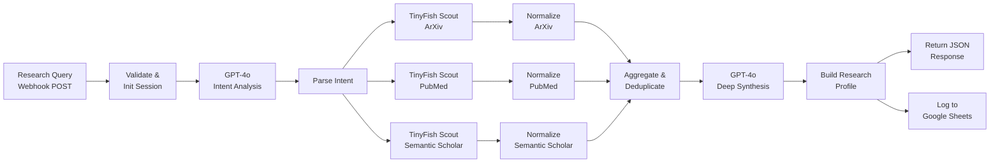

# N8N Research Sentry — TinyFish Autonomous Research Agent

An n8n workflow that deploys three parallel **TinyFish Web Agents** to live-browse ArXiv, PubMed, and Semantic Scholar for any research topic. GPT-4o handles intent analysis (converting your query into targeted search goals) and deep synthesis (identifying themes, breakthroughs, and research gaps). The TinyFish API (`POST /v1/automation/run`) powers each scout to extract structured paper data from live academic portals.

## Demo

> After importing the workflow into n8n and setting credentials, send a POST request and receive a full research profile JSON:

```bash
curl -X POST "http://localhost:5678/webhook/research-sentry" \
  -H "Content-Type: application/json" \
  -d '{"query": "LLM hallucination mitigation"}'
```

## TinyFish API Usage

Each of the three scout nodes calls the TinyFish automation endpoint to browse a different academic source:

```json
POST https://agent.tinyfish.ai/v1/automation/run
Headers: { "X-API-Key": "<YOUR_TINYFISH_API_KEY>", "Content-Type": "application/json" }

{
  "url": "https://arxiv.org/search/",
  "goal": "Navigate to arxiv.org/search, search for 'LLM hallucination mitigation', extract the top 8 papers as JSON array: [{title, authors, abstract, url, published_date, arxiv_id}]",
  "browser_profile": "stealth",
  "proxy_config": { "enabled": false }
}
```

The same pattern is used for PubMed (`https://pubmed.ncbi.nlm.nih.gov/`) and Semantic Scholar (`https://www.semanticscholar.org/`), each with a source-specific extraction goal generated by GPT-4o.

## How to Run

### Prerequisites

| Need | Purpose |
|------|---------|
| **n8n** | Desktop, Docker, or Cloud |
| **TinyFish API key** | Three parallel scout nodes (Header Auth: `X-API-Key`) |
| **OpenAI API key** | GPT-4o intent analysis + synthesis |
| **Google account** (optional) | Google Sheets logging |

### Setup

1. **Import workflow:** In n8n, go to Workflows > Import from file, select `research_sentry_tinyfish_workflow.json`, save.

2. **Add TinyFish credential:** Credentials > New > Header Auth. Header Name: `X-API-Key`, Header Value: your TinyFish key (no Bearer). Assign to all three Scout nodes.

3. **Add OpenAI credential:** Credentials > New > OpenAI API. Paste key. Assign to both GPT-4o nodes.

4. **Google Sheets (optional):** Set up Google Sheets OAuth2, assign to both Sheets nodes, set your spreadsheet ID. Create tabs `Research Log` and `Papers Database`.

5. **Activate** the workflow and POST to the webhook:

```bash
curl -X POST "http://localhost:5678/webhook/research-sentry" \
  -H "Content-Type: application/json" \
  -d '{"query": "transformer efficiency 2024", "sources": ["arxiv", "pubmed", "semantic_scholar"]}'
```

### Environment Variables

No `.env` file needed — all credentials are configured directly in n8n's Credentials UI:

- `OpenAI API` — your OpenAI key
- `TinyFish API Key` (Header Auth) — your TinyFish key via `X-API-Key` header
- `Google Sheets OAuth2` (optional) — Google OAuth client ID/secret

## Architecture Diagram



**Flow:** Webhook receives query -> GPT-4o plans search goals per source -> three parallel TinyFish scouts browse ArXiv, PubMed, Semantic Scholar -> results normalized and deduplicated -> GPT-4o synthesizes themes, breakthroughs, and gaps -> returns structured research profile JSON (+ optional Sheets logging).

## Output

Returns a JSON research profile containing:

- **research_context** — topic, sources, intent, session ID
- **discovery_summary** — themes, confidence, trend, breakthroughs, gaps
- **papers_discovered** — array of papers with title, authors, abstract, URL, citations
- **top_recommendations** — top 3 papers
- **recommended_action** — suggested next step
