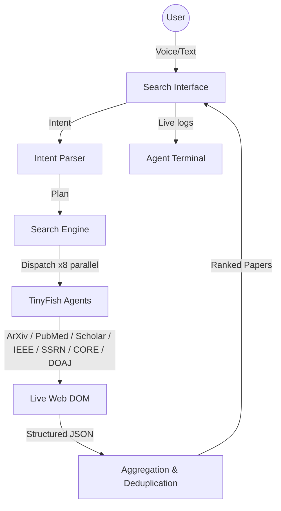

# Research Sentry

**A voice-first academic research co-pilot** that scans live portals (ArXiv, PubMed, Semantic Scholar, IEEE Xplore, Google Scholar, SSRN, CORE, DOAJ) to assemble verified paper metadata and summaries. It uses the **TinyFish Web Agent** to automate multi-step portal navigation and extract structured results in real time.

Live: https://cookbook-research-sentry.vercel.app/

Demo video: https://cookbook-research-sentry.vercel.app/

---

## How It Works

1. **Voice / text input** — speak or type your research query.
2. **Intent parsing** — extracts topic, keywords, and target sources from your query.
3. **TinyFish agents scrape 8 academic portals in parallel** — each portal gets its own headless browser session via the TinyFish Agent API.
4. **Results aggregated & deduplicated** — papers from every source are merged, normalized, and ranked by citation count.
5. **Summarize, compare, export** — ask follow-up questions, compare papers side-by-side, track citations, or export BibTeX.

---

## Key Features

- **Voice input** — record a question and Whisper transcribes it into a search query.
- **Multi-source search** — scrapes ArXiv, PubMed, Semantic Scholar, Google Scholar, IEEE Xplore, SSRN, CORE, and DOAJ simultaneously.
- **Paper comparison** — select papers and get a structured methodology/results comparison.
- **Citation tracking** — monitor a paper's citation velocity and predicted impact.
- **BibTeX export** — download selected papers as a `.bib` file.
- **Conversational follow-ups** — ask the AI assistant questions about your results.

---

## TinyFish API Usage

The core integration lives in `lib/tinyfish.ts`. The app uses `@tiny-fish/sdk` to dispatch one Agent per academic portal. Each agent navigates the portal's live DOM, reads search results, and returns structured paper metadata:

```typescript
import { TinyFish, EventType, RunStatus } from '@tiny-fish/sdk';

const client = new TinyFish({ apiKey: process.env.TINYFISH_API_KEY });

const stream = await client.agent.stream(
  {
    url,
    goal,
    browser_profile: stealth ? 'stealth' : 'lite',
  },
  {
    onComplete: (event) => {
      if (event.status === RunStatus.COMPLETED) {
        result = event.result ?? null;
      } else if (event.status === RunStatus.FAILED) {
        console.error('Run failed:', event.error?.message);
      }
    },
  }
);

// Drain the stream so the onComplete callback fires
for await (const event of stream) {
  if (event.type === EventType.COMPLETE) break;
}
```

Each portal gets a tight, focused goal prompt — for example, ArXiv:

```typescript
`Go to https://arxiv.org/search/?query=${encodeURIComponent(topic)}&searchtype=all
 — you are already on the results page. DO NOT navigate elsewhere.
 Extract the first 5 papers visible on screen RIGHT NOW.
 For each paper return: title, authors (array), abstract, arxivId, publishedDate, url, pdfUrl.
 Return ONLY a JSON array. No explanations.`
```

Google Scholar and IEEE Xplore use `browser_profile: 'stealth'` to bypass bot detection.

---

## Tech Stack

| Layer | Technology |
|---|---|
| Framework | Next.js (App Router) |
| Web scraping | TinyFish Agent API (`@tiny-fish/sdk`) |
| Speech-to-text | OpenAI Whisper |
| Styling | Tailwind CSS |
| Icons | Lucide React |

---

## Setup

```bash
# 1. Install dependencies
npm install

# 2. Create your env file
cp .env.local.example .env.local

# 3. Add your API keys to .env.local
#    TINYFISH_API_KEY  — get one at https://agent.tinyfish.ai/api-keys
#    OPENAI_API_KEY    — get one at https://platform.openai.com

# 4. Start the dev server
npm run dev
```

Open http://localhost:3000 to use the app.

---

## Folder Structure

```
research-sentry/
├── app/
│   ├── api/
│   │   ├── citations/track/route.ts   # Citation velocity analysis
│   │   ├── compare/route.ts           # Paper comparison endpoint
│   │   ├── conversation/route.ts      # Conversational follow-ups
│   │   ├── emails/extract/route.ts    # Author email extraction
│   │   ├── export/bibtex/route.ts     # BibTeX export
│   │   ├── health/route.ts            # Health check
│   │   ├── search/text/route.ts       # Text search endpoint
│   │   ├── search/voice/route.ts      # Voice search endpoint
│   │   └── summarize/route.ts         # Paper summarization
│   ├── globals.css
│   ├── layout.tsx
│   └── page.tsx                       # Main UI
├── components/
│   ├── CitationTracker.tsx
│   ├── ConversationInterface.tsx
│   ├── CoPilotMode.tsx
│   ├── ErrorMessage.tsx
│   ├── LoadingSpinner.tsx
│   ├── PaperCard.tsx
│   ├── PaperComparison.tsx
│   ├── PaperSummary.tsx
│   ├── ResultsGrid.tsx
│   ├── SearchInterface.tsx
│   ├── TinyFishAgentTerminal.tsx      # Live agent log display
│   ├── VoiceRecorder.tsx
│   └── WorkflowSelector.tsx
├── hooks/
│   └── useVoiceCommands.ts
├── lib/
│   ├── aggregator.ts                  # Deduplication & ranking
│   ├── audio-utils.ts
│   ├── citation-tracker.ts
│   ├── comparator.ts
│   ├── conversation.ts
│   ├── email-utils.ts
│   ├── intent-parser.ts               # Query intent parsing
│   ├── pdf-utils.ts
│   ├── search.ts                      # Multi-source search engine
│   ├── summarizer.ts
│   ├── tinyfish.ts                    # TinyFish Agent client
│   ├── types.ts
│   └── workflows.ts
└── .env.local.example
```

---

## Architecture


