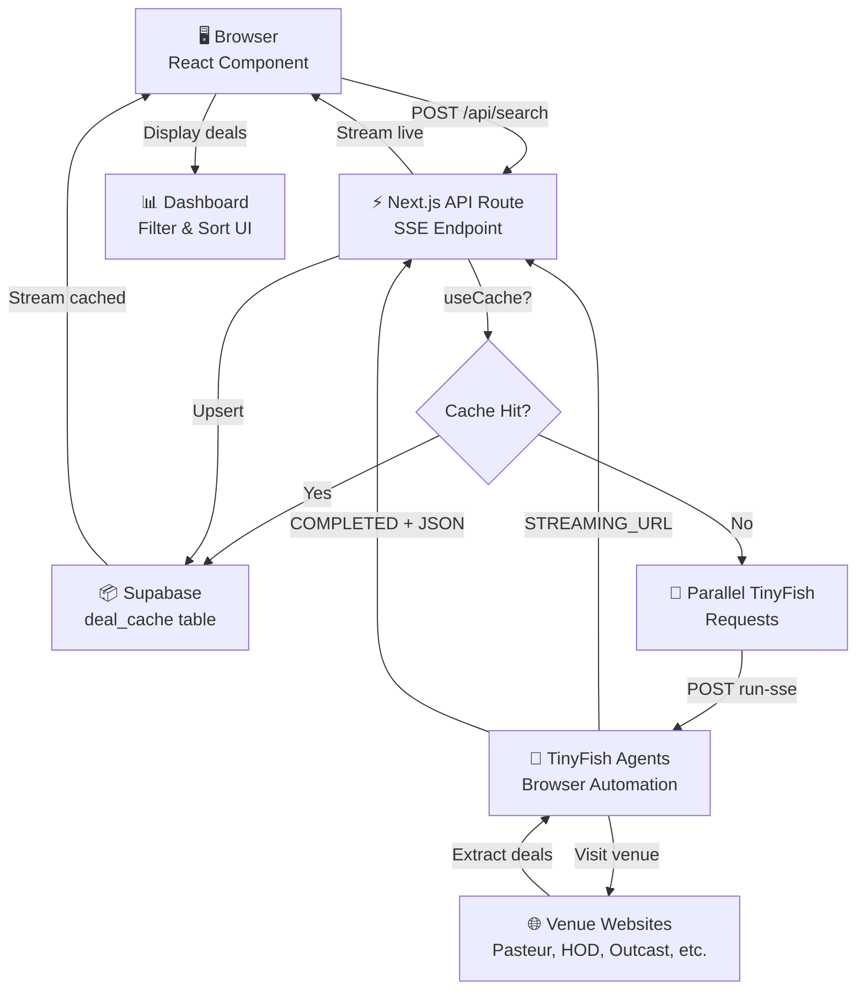

# 🍻 Saigon Happy Hour Sniper

> Find happy hour deals across Saigon in seconds — powered by [TinyFish](https://tinyfish.ai/) parallel browser agents.

**Live demo → [saigon-happy-hour-sniper.vercel.app](https://saigon-happy-hour-sniper.vercel.app)**

---

## What it does

Happy hour deals in Saigon are scattered across dozens of bar websites, each with different layouts, languages, and formats. This app sends TinyFish browser agents to all of them **simultaneously**, extracts structured deal data, and streams results back to a unified dashboard in real time.

- Search **3 districts at once** — District 1, Thao Dien, District 3
- Filter by **deal type** — Happy Hour, Ladies Night, Brunch, Live Music, Daily Specials
- **Sort by time** and **filter by venue name** (Pasteur Street, Heart of Darkness, Saigon Outcast, etc.)
- Watch **live browser agent iframes** — up to 5 active agent windows per search, auto-removed when done
- Toggle between **live scraping** and **cached results** (6-hour TTL)
- Results stream in as each venue completes — no waiting for the slowest one

---

## Demo

> 📹 Demo video coming soon

---

## How it works

```
User clicks Search
       │
       ▼
POST /api/search
       │
       ├── Cache hit? → stream result instantly via SSE
       │
        └── Cache miss? → fire TinyFish SDK requests for all venues in parallel
                              │
                              ├── STREAMING_URL event → forward iframe URL to client
                              │
                              └── COMPLETE event → parse JSON, stream to client, upsert to cache
```

Each district has 2–5 target venues. TinyFish handles all the hard parts: cookie banners, dynamic loading, Vietnamese language translation, pagination. The API route streams results via **Server-Sent Events** so the UI updates as venues finish — typically within 15–30 seconds for a full district scrape.

---

## TinyFish API snippet

Here's how the app calls TinyFish to scrape each venue:

```typescript
import { TinyFish } from "@tiny-fish/sdk";

const client = new TinyFish();

const stream = await client.agent.stream(
  {
    url: venueUrl,
    goal: GOAL_PROMPT,
  },
  {
    onStreamingUrl: (event) => {
      console.log(event.streaming_url);
    },
    onComplete: (event) => {
      console.log(event.run_id);
      console.log(event.result);
    },
  },
);

for await (const event of stream) {
  if (event.type === "COMPLETE") {
    // Parse JSON and stream to client
  }
}
```

The `GOAL_PROMPT` tells TinyFish exactly what to extract: deal name, type, days/times, prices, and conditions. TinyFish returns structured JSON with all deals found on the venue's website.

---

## Tech stack

| Layer | Choice | Why |
|---|---|---|
| Framework | Next.js 16 (App Router) | SSE streaming via Node.js runtime |
| UI | React 19 + Tailwind CSS 4 + shadcn/ui | Fast, clean, no design system overhead |
| Scraping | [TinyFish API](https://tinyfish.ai/) | Parallel browser agents, structured JSON output |
| Caching | Supabase (Postgres) | 6-hour TTL, graceful degradation if unavailable |
| Hosting | Vercel | Zero-config, auto-deploys |
| Validation | Zod 4 | Type-safe schema validation |

---

## Running locally

```bash
git clone https://github.com/tinyfish-io/tinyfish-cookbook.git
cd tinyfish-cookbook/saigon-happy-hour-sniper
npm install
```

Create a `.env.local` file:

```env
# Required — get a key at https://tinyfish.ai/
TINYFISH_API_KEY=your_key_here

# Optional — for result caching (app works fine without it)
NEXT_PUBLIC_SUPABASE_URL=your_supabase_url
SUPABASE_SERVICE_ROLE_KEY=your_service_role_key
```

Then:

```bash
npm run dev
```

Open [http://localhost:3000](http://localhost:3000).

---

## Architecture diagram



---

## Covered venues

| District | Venue | URL |
|---|---|---|
| 🏙️ District 1 | Pasteur Street | https://pasteurstreet.com/events/ |
| 🏙️ District 1 | Heart of Darkness Brewery | https://heartofdarknessbrewery.com/ |
| 🏙️ District 1 | Chill Saigon | https://www.chillsaigon.com/ |
| 🏙️ District 1 | Momento Rooftop | https://momentorooftop.com/happy-hour-momento-rooftop/ |
| 🏙️ District 1 | Mia Saigon | https://www.miasaigon.com/offers/rooftop-happy-hour-at-the-muse/ |
| 🌴 Thao Dien | The Deck Saigon | https://www.thedecksaigon.com/bar/ |
| 🌴 Thao Dien | Saigon Outcast | https://www.saigonoutcast.com/ |
| 🌴 Thao Dien | Bia Craft | https://biacraft.com/ |
| 🍜 District 3 | Pasteur Street | https://pasteurstreet.com/ |
| 🍜 District 3 | Bia Craft | https://biacraft.com/ |

---

## Features

- **Real-time streaming** — Results appear as venues finish scraping, not all at once
- **Graceful degradation** — App works without Supabase; caching is optional
- **Live agent preview** — Watch TinyFish browser agents work in real-time iframes
- **Smart caching** — 6-hour TTL keeps results fresh without hammering venues
- **Vietnamese support** — TinyFish translates deal descriptions to English automatically
- **Responsive design** — Works on mobile, tablet, desktop
- **Type-safe** — Full TypeScript + Zod validation end-to-end

---

## Project structure

```
src/
├── app/
│   ├── page.tsx              # Main UI — district selection, filter toolbar, results
│   └── api/search/route.ts   # SSE endpoint — cache lookup + TinyFish orchestration
├── hooks/
│   └── use-search.ts         # SSE client, state management, streaming logic
├── lib/
│   ├── district-sites.ts     # Venue URLs, goal prompt, cache TTL
│   ├── supabase.ts           # Supabase admin client (graceful degradation)
│   └── types.ts              # TypeScript types (District, Deal, etc.)
└── components/
    ├── search-form.tsx       # District + deal type selector
    ├── results-grid.tsx      # Venue cards grouped by district
    ├── deal-card.tsx         # Individual deal listing
    └── live-preview-grid.tsx # Live iframe grid (max 5 active per search)
```

---

Built as a take-home demo for [TinyFish](https://tinyfish.ai) — showing what's possible when you give TinyFish a list of niche local websites and let it run in parallel.
