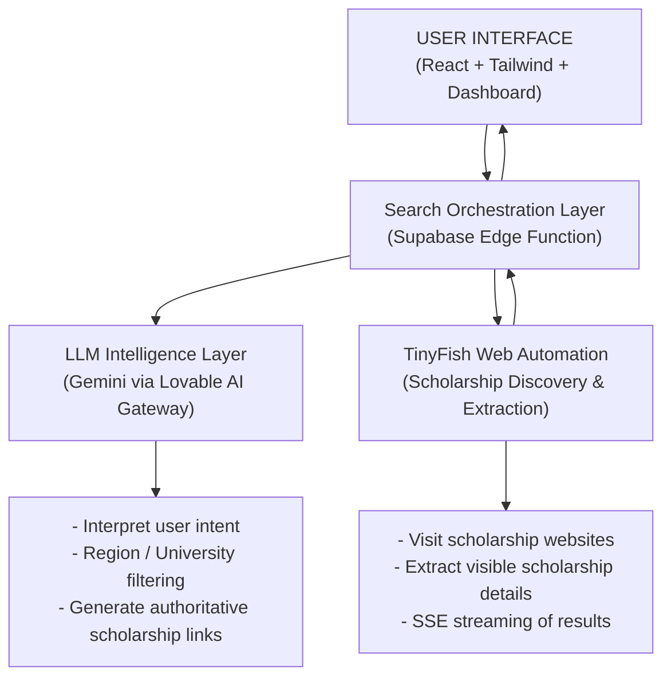

# Scholarship Finder

**Live Link:** https://tinyfishscholarshipfinder.lovable.app/

**Demo Video:** https://drive.google.com/file/d/1GXZhJOjiVUP5XcGvTAvRGcYhTWoKXlsE/view?usp=sharing

## What This Project Is

An AI-powered scholarship discovery engine that automatically finds, scrapes, and structures scholarship information from official websites worldwide. Instead of relying on outdated databases, the system pulls live data directly from source websites and returns it in a clean, comparable format.

Users search by scholarship type, university, or region. The system uses an LLM to identify relevant scholarship websites, then dispatches parallel TinyFish browser agents to scrape each site and extract structured scholarship data in real time.

## How It Works

1. **User searches** -- Enters scholarship type (e.g., "need-based"), optionally a university and region.
2. **LLM finds URLs** -- An LLM (via Lovable AI Gateway) identifies 5-8 official scholarship websites matching the query.
3. **TinyFish agents scrape in parallel** -- Each URL is sent to the TinyFish web automation API. Browser agents visit each site, navigate pages, and extract structured scholarship data. All agents run concurrently.
4. **Results streamed back** -- The Supabase Edge Function streams SSE events to the frontend: agent status updates, live browser previews, and extracted scholarships as they arrive. The UI renders results progressively.

## TinyFish API Usage

The core integration lives in the Supabase Edge Function. Here is the key pattern from `supabase/functions/search-scholarships/index.ts`:

```typescript
// Launch a TinyFish browser agent against a scholarship website
const response = await fetch("https://agent.tinyfish.ai/v1/automation/run-sse", {
  method: "POST",
  headers: {
    "Content-Type": "application/json",
    "X-API-Key": TINYFISH_API_KEY,
  },
  body: JSON.stringify({
    url: site.url,  // e.g. "https://sfs.mit.edu/undergraduate-students/"
    goal: goal,     // Prompt describing what scholarship data to extract
  }),
});

// Process the SSE stream from TinyFish
const reader = response.body.getReader();
const decoder = new TextDecoder();
let buffer = "";

while (true) {
  const { done, value } = await reader.read();
  if (done) break;

  buffer += decoder.decode(value, { stream: true });
  const lines = buffer.split("\n");
  buffer = lines.pop() || "";

  for (const line of lines) {
    if (line.startsWith("data: ")) {
      const data = JSON.parse(line.slice(6).trim());

      // Live browser view URL (embed in an iframe)
      if (data.type === "STREAMING_URL" && data.streamingUrl) {
        console.log("Live view:", data.streamingUrl);
      }

      // Progress updates while the agent navigates
      if (data.type === "PROGRESS" && data.purpose) {
        console.log("Agent status:", data.purpose);
      }

      // Final structured scholarship data
      if (data.type === "COMPLETE" && data.resultJson) {
        console.log("Extracted scholarships:", data.resultJson);
      }
    }
  }
}
```

## Tech Stack

- **Frontend:** React + TypeScript + Vite + Tailwind CSS + shadcn/ui
- **Backend:** Supabase Edge Functions (Deno)
- **AI:** Lovable AI Gateway (Gemini) for URL discovery
- **Web Automation:** TinyFish API for parallel browser scraping
- **Hosting:** Lovable

## Setup

### 1. Install dependencies

```bash
npm install
```

### 2. Set up environment variables

Copy the example env file and fill in your values:

```bash
cp .env.example .env
```

You need:
- `VITE_SUPABASE_URL` -- Your Supabase project URL
- `VITE_SUPABASE_PUBLISHABLE_KEY` -- Your Supabase anon/public key

### 3. Set Supabase Edge Function secrets

```bash
supabase secrets set TINYFISH_API_KEY=your_tinyfish_api_key
supabase secrets set LOVABLE_API_KEY=your_lovable_api_key
```

### 4. Deploy the Edge Function

```bash
supabase functions deploy search-scholarships
```

### 5. Run locally

```bash
npm run dev
```

## Architecture Diagram


```mermaid
flowchart TB

%% =======================
%% UI LAYER
%% =======================
UI["USER INTERFACE<br/>(React + Tailwind + Dashboard)"]

%% =======================
%% INPUT & ORCHESTRATION
%% =======================
ORCH["Search Orchestration Layer<br/>(Supabase Edge Function)"]

%% =======================
%% INTELLIGENCE LAYER
%% =======================
LLM["LLM Intelligence Layer<br/>(Gemini via Lovable AI Gateway)"]

%% =======================
%% AUTOMATION LAYER
%% =======================
TF["TinyFish Web Automation<br/>(Scholarship Discovery & Extraction)"]

%% =======================
%% DETAIL NODES
%% =======================
LLMD["- Interpret user intent<br/>- Region / University filtering<br/>- Generate authoritative scholarship links"]
TFD["- Visit scholarship websites<br/>- Extract visible scholarship details<br/>- SSE streaming of results"]

%% =======================
%% CONNECTIONS
%% =======================
UI --> ORCH

ORCH --> LLM
LLM --> LLMD

ORCH --> TF
TF --> TFD

TF --> ORCH

ORCH --> UI
```
