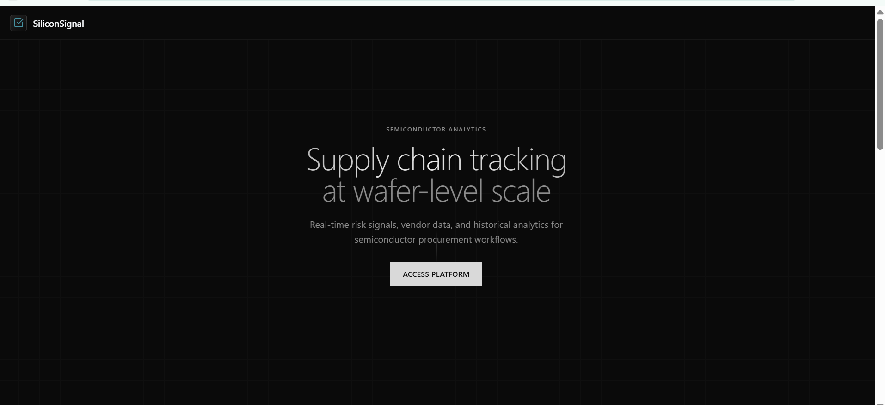
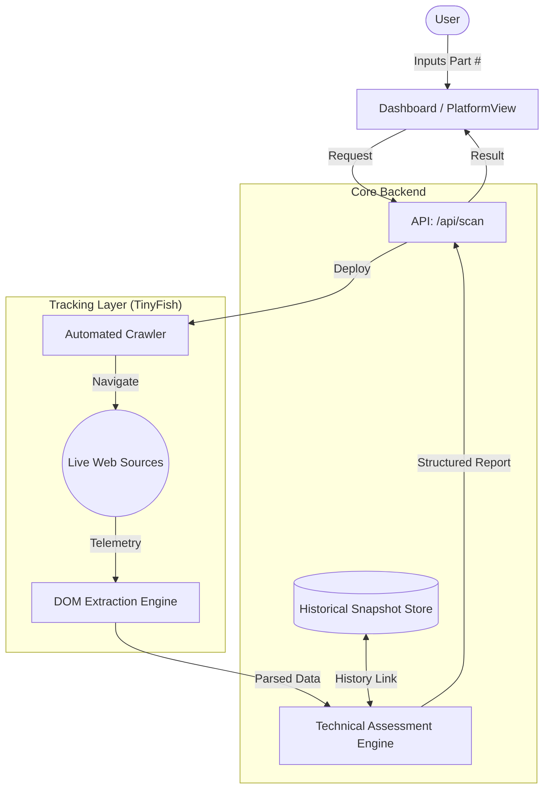
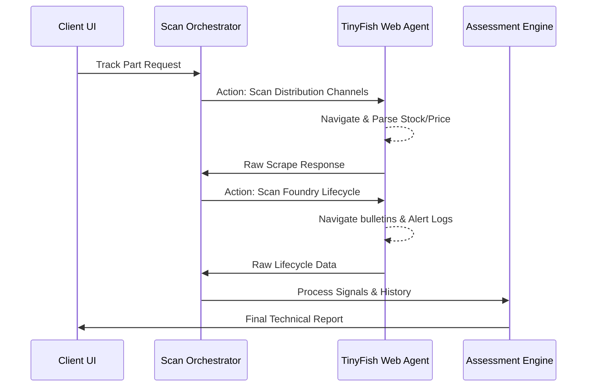
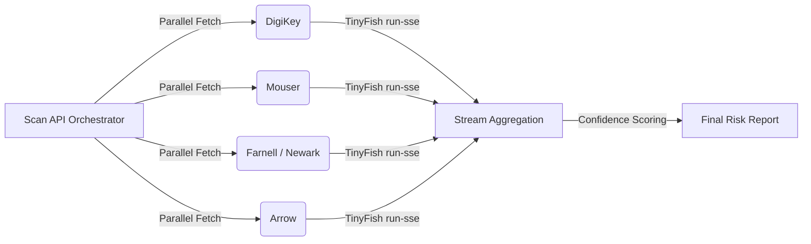
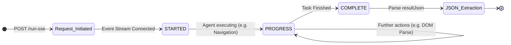

# SiliconSignal — Automated Semiconductor Tracking Tool

**Real-time semiconductor supply chain intelligence for automated risk assessment and lifecycle monitoring.**

### **Mission Critical Supply Chain Visibility**
SiliconSignal is a high-precision monitoring platform designed to detect logistics risks, lead-time shifts, and lifecycle transitions in real-time. By leveraging the TinyFish web agent, it extracts live signals directly from foundry bulletins and primary distributor channels.

---

##  System Interface


---

## 1. Technical Framework

The system operates as a distributed data collector, mapping part-level signatures to identified web sources.

### **Data Acquisition Strategy**
| Stage | Technical Operation | Purpose |
| :--- | :--- | :--- |
| **Source Mapping** | Heuristic identification of relevant foundry/distributor URLs. | Minimize scan latency and maximize signal relevance. |
| **Web Tracking** | Execution of headless browser instances for multi-step navigation. | Bypassing static caches to reach live inventory and status pages. |
| **Signal Extraction** | DOM-level parsing of unstructured lead times, stock levels, and MOQ. | Converting fragmented web data into structured technical metrics. |
| **Logic Assessment** | Rule-based comparison against historical snapshots. | Detecting factual deviations (e.g., NRND status change). |

### **Output Data Schema**
```json
{
  "tracking_metrics": {
    "part_number": "STM32F407VGT6",
    "lifecycle": "NRND",
    "lead_time": 18,
    "availability": "Limited"
  },
  "logistics_risk": {
    "score": 75,
    "level": "HIGH",
    "reasoning": "Detected 4-week lead-time spike compared to baseline + NRND signal at source."
  },
  "telemetry_logs": [
    "[TinyFish] identified 3 sources: DigiKey, Mouser, TI Direct",
    "[TinyFish] Pricing: Detected price point around $5.20"
  ]
}
```

---

## 2. Integration & Usage

### **API Implementation**
SiliconSignal exposes a robust REST API for integration into procurement and PLM workflows.

#### **cURL Example**
```bash
curl -X POST "http://localhost:3000/api/scan" \
  -H "Content-Type: application/json" \
  -d '{"part_number": "STM32F407"}'
```

#### **TypeScript Implementation**
```typescript
const fetchRiskProfile = async (part: string) => {
  const res = await fetch("/api/scan", {
    method: "POST",
    headers: { "Content-Type": "application/json" },
    body: JSON.stringify({ part_number: part }),
  });
  return await res.json();
};
```

---

## 3. System Architecture

### **Data Flow Pipeline**

```mermaid
graph TD
    User([User]) -->|Inputs Part #| DP[Dashboard / PlatformView]
    
    subgraph "Core Backend"
        API[API: /api/scan]
        Store[(Historical Snapshot Store)]
        Engine[Technical Assessment Engine]
    end

    subgraph "Tracking Layer (TinyFish)"
        Crawler[Automated Crawler]
        DOM[DOM Extraction Engine]
        Sources((Live Web Sources))
    end

    DP -->|Request| API
    API -->|Deploy| Crawler
    Crawler -->|Navigate| Sources
    Sources -->|Telemetry| DOM
    DOM -->|Parsed Data| Engine
    Store <-->|History Link| Engine
    Engine -->|Structured Report| API
    API -->|Result| DP
```

### **Monitoring Workflow**

```mermaid
sequenceDiagram
    participant U as Client UI
    participant S as Scan Orchestrator
    participant M as TinyFish Web Agent
    participant E as Assessment Engine

    U->>S: Track Part Request
    S->>M: Action: Scan Distribution Channels
    M-->>M: Navigate & Parse Stock/Price
    M->>S: Raw Scrape Response
    S->>M: Action: Scan Foundry Lifecycle
    M-->>M: Navigate bulletins & Alert Logs
    M->>S: Raw Lifecycle Data
    S->>E: Process Signals & History
    E->>U: Final Technical Report
```

### **Parallel Execution Architecture**

```mermaid
graph LR
    API[Scan API Orchestrator] -->|Parallel Fetch| DK(DigiKey)
    API -->|Parallel Fetch| MS(Mouser)
    API -->|Parallel Fetch| FN(Farnell / Newark)
    API -->|Parallel Fetch| AR(Arrow)
    
    DK -->|TinyFish run-sse| Merge[Stream Aggregation]
    MS -->|TinyFish run-sse| Merge
    FN -->|TinyFish run-sse| Merge
    AR -->|TinyFish run-sse| Merge
    
    Merge -->|Confidence Scoring| Final[Final Risk Report]
```

### **SSE Event Stream Lifecycle**

```mermaid
stateDiagram-v2
    direction LR
    [*] --> Request_Initiated: POST /run-sse
    Request_Initiated --> STARTED: Event Stream Connected
    STARTED --> PROGRESS: Agent executing (e.g. Navigation)
    PROGRESS --> PROGRESS: Further actions (e.g. DOM Parse)
    PROGRESS --> COMPLETE: Task Finished
    COMPLETE --> JSON_Extraction: Parse resultJson
    JSON_Extraction --> [*]
```

---

##  Key Capabilities
*   **Live Web Verification**: Real-time checking of foundry and distributor pages for direct status signals.
*   **Logbook Transparency**: Dedicated terminal logs showing exact tracking steps and identification success.
*   **Logistics History**: Persistence layer to track changes in lead times and status over months.
*   **Industrial Aesthetic**: Premium dark-mode interface designed for professional engineering environments.

---

##  Engineering Standards
*   **Concurrency**: All outbound requests use timeouts, retries, and capped parallelism.
*   **Input Validation**: Part numbers are normalized and validated before scan execution.
*   **Caching**: Recent scans are cached with TTL to reduce repeated work.
*   **Signal Priority**: Explicit signals override inferred heuristics.
*   **Readability**: Shared helpers and clear log messages for maintainability.

---

##  Scan results and user feedback

*   **Sample parts:** The scan form includes one-click sample parts (e.g. NE555, ATmega328P, STM32F103C8T6) that typically return lifecycle and availability from distributor scans.
*   **No N/A in main fields:** When a scan finds at least one source, lifecycle shows parsed value or “Active”; availability, price, and lead time show parsed values or “—” when not found.
*   **Traceability Evidence:** Use the Ref links under each result to open distributor pages for price and lead time when those fields show “—”.
*   **Manufacturer:** Filling the optional manufacturer field (e.g. Texas Instruments, Microchip) can improve parsing. The “lacks manufacturer information” message only appears when no distributor sources were found.

---

##  Getting Started

### **Environment Setup**
Create a `.env.local` in the `frontend` directory:
```env
TINYFISH_API_KEY=your_key_here
```
The TinyFish tracker runs without API keys, but adding `TINYFISH_API_KEY` enables enhanced telemetry logging.

### **Running Locally**
```bash
cd frontend
npm install
npm run dev
```
If port `3000` is already in use, stop the existing process or run with a different port.
PowerShell example:
```powershell
$env:PORT=3000; npm run dev
```

---

