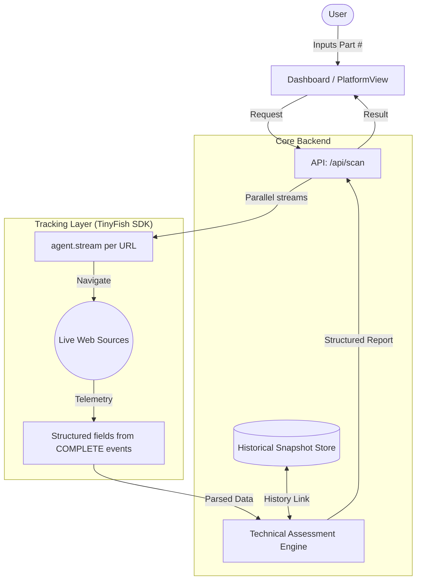
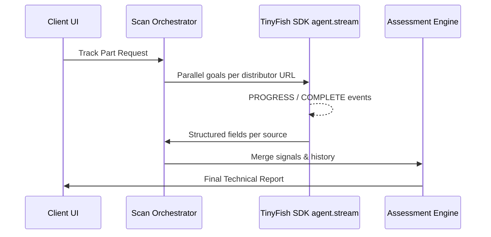
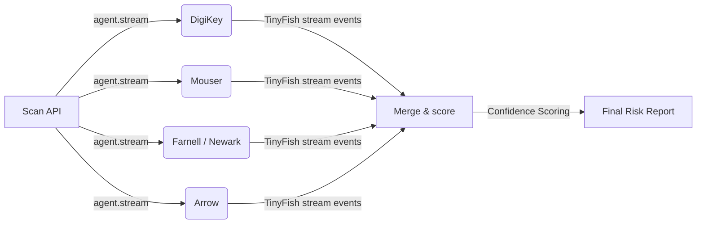
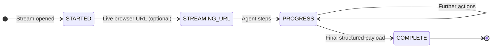

# SiliconSignal — Automated Semiconductor Tracking Tool

**Real-time semiconductor supply chain intelligence for automated risk assessment and lifecycle monitoring.**

### Mission Critical Supply Chain Visibility

SiliconSignal maps a part number to major distributor search URLs, runs the **TinyFish web agent** through the official **`@tiny-fish/sdk`** (streaming API), and aggregates structured signals (price, availability, lead time, lifecycle) into a single risk-oriented report with traceable evidence links.

---

## System Interface


---

## 1. Technical Framework

The app is a **Next.js** application: the UI calls `POST /api/scan`, which orchestrates **parallel** TinyFish runs per distributor URL, then normalizes results and compares against local history.

### Data Acquisition Strategy

| Stage | Technical Operation | Purpose |
| :--- | :--- | :--- |
| **Source mapping** | Deterministic distributor search URLs from the part number. | Fast, repeatable targets for the agent. |
| **Web automation** | `TinyFish agent.stream({ url, goal, browser_profile, proxy_config })` via `@tiny-fish/sdk`. | Live pages, not static caches; progress via SSE-style events. |
| **Signal extraction** | Parse `COMPLETE` events into structured fields; normalize strings and numbers. | Stable JSON-like fields for the UI and risk logic. |
| **Logic assessment** | Rule-based merge + history comparison (`data/history.json` or `/tmp`). | Detect lifecycle shifts and lead-time spikes. |

### TinyFish integration (post-migration)

- **Package**: `@tiny-fish/sdk`
- **Runtime**: `TINYFISH_API_KEY` in environment (required for real scans)
- **Mode**: **Streaming** (`agent.stream`) so telemetry logs can show `STREAMING_URL`, `PROGRESS`, and `COMPLETE` per source
- **Concurrency**: One stream per distributor; `Promise.all` across sources; per-source timeout

### Output Data Schema (illustrative)

```json
{
  "tracking_metrics": {
    "part_number": "STM32F407VGT6",
    "lifecycle": "NRND",
    "lead_time": 18,
    "availability": "Limited"
  },
  "logistics_risk": {
    "score": 75,
    "level": "HIGH",
    "reasoning": "Detected 4-week lead-time spike compared to baseline + NRND signal at source."
  },
  "telemetry_logs": [
    "[TinyFish] identified 3 sources: DigiKey, Mouser, TI Direct",
    "[TinyFish] Pricing: Detected price point around $5.20"
  ]
}
```

---

## 2. Integration & Usage

### API

SiliconSignal exposes `POST /api/scan` for the UI and for integrations.

#### cURL

```bash
curl -X POST "http://localhost:3000/api/scan" \
  -H "Content-Type: application/json" \
  -d '{"part_number": "STM32F407"}'
```

#### TypeScript (client)

```typescript
const fetchRiskProfile = async (part: string) => {
  const res = await fetch("/api/scan", {
    method: "POST",
    headers: { "Content-Type": "application/json" },
    body: JSON.stringify({ part_number: part }),
  });
  return await res.json();
};
```

---

## 3. System Architecture

### Data Flow Pipeline


```mermaid
graph TD
    User([User]) -->|Inputs Part #| DP[Dashboard / PlatformView]

    subgraph "Core Backend"
        API[API: /api/scan]
        Store[(Historical Snapshot Store)]
        Engine[Technical Assessment Engine]
    end

    subgraph "Tracking Layer (TinyFish SDK)"
        Crawler[agent.stream per URL]
        DOM[Structured fields from COMPLETE events]
        Sources((Live Web Sources))
    end

    DP -->|Request| API
    API -->|Parallel streams| Crawler
    Crawler -->|Navigate| Sources
    Sources -->|Telemetry| DOM
    DOM -->|Parsed Data| Engine
    Store <-->|History Link| Engine
    Engine -->|Structured Report| API
    API -->|Result| DP
```

### Monitoring Workflow


```mermaid
sequenceDiagram
    participant U as Client UI
    participant S as Scan Orchestrator
    participant M as TinyFish SDK agent.stream
    participant E as Assessment Engine

    U->>S: Track Part Request
    S->>M: Parallel goals per distributor URL
    M-->>M: PROGRESS / COMPLETE events
    M->>S: Structured fields per source
    S->>E: Merge signals & history
    E->>U: Final Technical Report
```

### Parallel Execution


```mermaid
graph LR
    API[Scan API] -->|agent.stream| DK(DigiKey)
    API -->|agent.stream| MS(Mouser)
    API -->|agent.stream| FN(Farnell / Newark)
    API -->|agent.stream| AR(Arrow)

    DK -->|TinyFish stream events| Merge[Merge & score]
    MS -->|TinyFish stream events| Merge
    FN -->|TinyFish stream events| Merge
    AR -->|TinyFish stream events| Merge

    Merge -->|Confidence Scoring| Final[Final Risk Report]
```

### Stream Event Lifecycle (SDK)


```mermaid
stateDiagram-v2
    direction LR
    [*] --> STARTED: Stream opened
    STARTED --> STREAMING_URL: Live browser URL (optional)
    STREAMING_URL --> PROGRESS: Agent steps
    PROGRESS --> PROGRESS: Further actions
    PROGRESS --> COMPLETE: Final structured payload
    COMPLETE --> [*]
```

---

## Key Capabilities

- **Live web verification**: Distributor pages queried through TinyFish automation.
- **Logbook transparency**: `agent_logs` reflect stream progress and per-source outcomes.
- **Logistics history**: File-backed snapshots for trend and change detection.
- **Industrial UI**: Dark-mode dashboard and platform views.

---

## Engineering Standards

- **Concurrency**: Parallel per-source streams with per-source timeouts and an overall scan budget.
- **Input validation**: Part numbers validated before any TinyFish call.
- **Caching**: Optional response cache exists in code (`CACHE_TTL_MS`); default is **0** (cache off).
- **Signal priority**: Explicit normalized values preferred over inferred text.
- **Dependencies**: `@tiny-fish/sdk` — no direct `fetch` to TinyFish HTTP endpoints in application code.

---

## Scan Results and User Feedback

- **Sample parts:** The scan form includes sample parts (e.g. NE555, ATmega328P, STM32F103C8T6) that often return lifecycle and availability from distributor scans.
- **Main fields:** When at least one source responds, lifecycle shows a parsed value or “Active”; availability, price, and lead time show parsed values or fallbacks as implemented in `/api/scan`.
- **Traceability:** Use Ref links under each result to open distributor pages.
- **Manufacturer:** Optional; helps context in the UI; absence matters most when no sources were found.

---

## Getting Started

### Prerequisites

- Node.js compatible with Next.js 16 (see `package.json`).
- A **TinyFish API key** from [TinyFish](https://agent.tinyfish.ai) (stored locally, never committed).

### Environment

Create `.env.local` in the **silicon-signal** project directory:

```env
TINYFISH_API_KEY=your_key_here
```

Without `TINYFISH_API_KEY`, distributor scans do not run successfully (sources will appear blocked).

See `.env.example` for the variable name.

### Run Locally

From the repository root (adjust path if your clone layout differs):

```bash
cd silicon-signal
npm install
npm run dev
```

If port `3000` is in use, stop the other process or choose another port.

**PowerShell:**

```powershell
$env:PORT=3000; npm run dev
```

### Scripts

| Command | Description |
| :--- | :--- |
| `npm run dev` | Development server |
| `npm run build` | Production build |
| `npm run start` | Start production server |
| `npm run lint` | ESLint |

---

## Package

- **npm name**: `silicon-signal` (see `package.json`)
