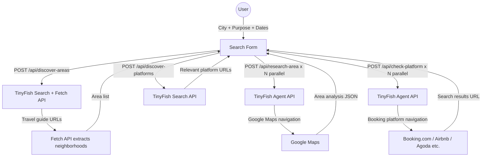

# Stay Scout Hub

A smart hotel research tool that helps travelers find the right area and platform before booking. Enter your destination, travel purpose, and dates — Stay Scout discovers the best neighborhoods for your trip, researches each area via Google Maps using TinyFish agents, and checks availability across all relevant booking platforms.

## Demo

> Add your demo video or screenshot here

---

## How It Works

1. **Enter your trip details** — city, purpose (business, sightseeing, airport transit, etc.), dates, and guests.
2. **Area discovery** — the TinyFish Search API finds travel guides for your city and purpose, then the Fetch API extracts neighborhood recommendations from those pages.
3. **Area research** — TinyFish agents navigate Google Maps for each neighborhood, extracting suitability scores, pros/cons, walkability, noise level, safety notes, and top-rated hotels.
4. **Platform discovery** — the TinyFish Search API finds which booking platforms are most relevant for your destination.
5. **Platform check** — TinyFish agents navigate each booking platform, enter your dates and guests, and return a direct search results URL.

---

## TinyFish API Usage

The app uses all three TinyFish APIs, each chosen for what it does best:

### Search API — Area & Platform Discovery

Used in `/api/discover-areas` and `/api/discover-platforms` to find relevant travel guides and booking platforms for a given city:

```typescript
import { TinyFish } from "@tiny-fish/sdk";

const client = new TinyFish({ apiKey: process.env.TINYFISH_API_KEY });

// Find neighborhood guides for the city and travel purpose
const searchRes = await client.search.query({
  query: `best neighborhoods to stay in ${city} ${purposeKeyword} travel guide`,
});

const urls = searchRes.results.slice(0, 3).map(r => r.url);
```

### Fetch API — Content Extraction

Used in `/api/discover-areas` to extract neighborhood names and descriptions from the travel guide pages found by the Search API:

```typescript
// Extract clean markdown content from all guide pages at once
const fetchRes = await client.fetch.get_contents({ urls, format: "markdown" });

for (const page of fetchRes.results) {
  // page.text contains clean markdown — parse headings as neighborhood names
}
```

### Agent API — Area Research & Platform Checks

Used in `/api/research-area` and `/api/check-platform` for tasks that require real browser navigation — Google Maps area research and booking platform searches:

```typescript
const stream = await client.agent.stream(
  { url: searchUrl, goal },
  {
    onStreamingUrl: (event) => {
      // Forward live browser preview to frontend
    },
    onComplete: (event) => {
      if (event.status === RunStatus.COMPLETED) {
        // event.result contains structured area analysis or search results URL
      }
    },
  }
);

for await (const event of stream) {
  if (event.type === EventType.COMPLETE) break;
}
```

---

## API Routes

| Route | Method | TinyFish API | What it does |
|---|---|---|---|
| `/api/discover-areas` | POST | Search + Fetch | Finds neighborhood recommendations for city + purpose |
| `/api/research-area` | POST | Agent | Researches a specific area on Google Maps |
| `/api/discover-platforms` | POST | Search | Finds relevant booking platforms for the destination |
| `/api/check-platform` | POST | Agent | Navigates a booking platform and returns search results URL |

---

## Tech Stack

| Layer | Technology |
|---|---|
| Framework | Next.js 15 (App Router) |
| Web scraping | TinyFish Agent, Search, and Fetch APIs (`@tiny-fish/sdk`) |
| UI | React + Tailwind CSS + shadcn/ui + Framer Motion |
| Validation | Zod |

---

## Setup

```bash
# 1. Install dependencies
npm install

# 2. Create your env file
cp .env.example .env.local

# 3. Add your TinyFish API key
#    TINYFISH_API_KEY — get one at https://agent.tinyfish.ai/api-keys

# 4. Start the dev server
npm run dev
```

Open [http://localhost:3000](http://localhost:3000)

---

## Architecture


