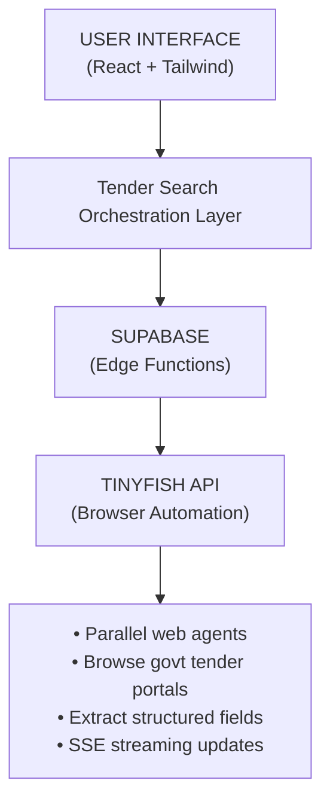

# Government Tender Finder - Singapore

**Live Demo:** https://tender-scout-singapore.lovable.app

## What This Project Is

An AI-powered government tender discovery tool for Singapore. It scrapes multiple tender portals in parallel using the TinyFish API, extracts structured tender data, and presents results in a clean, comparable format.

**How TinyFish API is used:** TinyFish browser agents are deployed in parallel to scrape Singapore government tender portals (GeBIZ, Tenders On Time, Bid Detail, etc.), extracting structured fields like tender title, ID, deadline, and eligibility from dynamic pages.

---

## Demo

**Demo Video:** https://drive.google.com/file/d/1GXZhJOjiVUP5XcGvTAvRGcYhTWoKXlsE/view?usp=sharing

---

## Code Snippet

```bash
curl -N -X POST "https://agent.tinyfish.ai/v1/automation/run-sse" \
  -H "X-API-Key: $TINYFISH_API_KEY" \
  -H "Content-Type: application/json" \
  -d '{
    "url": "https://www.gebiz.gov.sg",
    "goal": "Extract the latest open government tenders. Return JSON with tenderTitle, agency, tenderID, submissionDeadline, tenderStatus, and tenderLink."
  }'
```

---

## Tech Stack

- **Vite + React (TypeScript)**
- **TinyFish API** (browser automation)
- **Supabase** (edge functions for API proxying)

## How to Run

### Prerequisites

- Node.js 18+
- Supabase project (for edge functions)
- TinyFish API key (get from [tinyfish.ai](https://tinyfish.ai))

### Setup

1. Clone the repository:
```bash
git clone <repo-url>
cd tenders-finder
```

2. Install dependencies:
```bash
npm install
```

3. Create `.env` from the example:
```bash
cp .env.example .env
```

4. Set your Supabase credentials in `.env`:
```
VITE_SUPABASE_URL=https://your-project.supabase.co
VITE_SUPABASE_PUBLISHABLE_KEY=your_supabase_anon_key
```

5. Set TinyFish API key in Supabase secrets:
```bash
supabase secrets set TINYFISH_API_KEY=your_tinyfish_api_key
```

6. Deploy Supabase edge functions:
```bash
supabase functions deploy tinyfish-tender-search
supabase functions deploy discover-tender-links
```

7. Run the development server:
```bash
npm run dev
```

---

## Architecture Diagram



---

## Environment Variables

| Variable | Where | Description |
|----------|-------|-------------|
| `VITE_SUPABASE_URL` | `.env` | Supabase project URL |
| `VITE_SUPABASE_PUBLISHABLE_KEY` | `.env` | Supabase anon key |
| `TINYFISH_API_KEY` | Supabase secrets | TinyFish API key |

Contributor: Krishna Agarwal (@KrishnaAgarwal7531)
