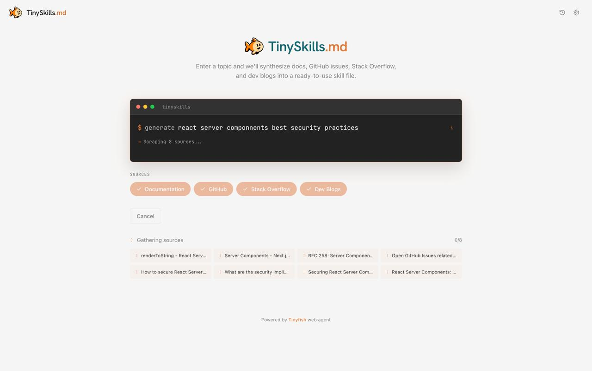

# TinySkills

**Live:** [https://tinyskills.vercel.app](https://tinyskills.vercel.app)

TinySkills generates comprehensive technical **SKILL.md** guides by combining **TinyFish Search** (discover URLs by source type), **TinyFish Fetch** (pull clean page text in batches), and an **LLM** (OpenAI or OpenRouter) that synthesizes everything into a single markdown skill. It is aimed at learning or documenting a technology from **documentation**, **GitHub**, **Stack Overflow**, and **developer blogs** in one run.

## Demo



## How it works (three phases)

### 1. Identify sources — `/api/identify-sources`

The user enters a **topic** and selects which **source types** to include (docs, GitHub, Stack Overflow, blog). The server calls `identifySources()` in `lib/ai-client.ts`, which follows this order:

1. **TinyFish Search (primary)** — If `TINYFISH_API_KEY` is set, the app runs **one Search query per enabled source type in parallel** via `identifySourcesViaTinyFishSearch()` (`lib/tinyfish-source-discovery.ts`). Each query is tailored so results skew toward the right kind of page (see [Search queries](#tinyfish-search-url-discovery) below).
2. **LLM fallback** — If Search returns **no URLs**, or Search throws, control falls back to `identifySourcesViaLlm()`, which asks the configured model to output a JSON list of URLs with types, titles, and reasons.

**Requirements:** You need at least **TinyFish** *or* an **LLM** key for this step to succeed; full app flows also need an LLM for synthesis (see [Environment variables](#environment-variables)).

### 2. Fetch content — `/api/scrape-sources`

For every identified URL, the app calls the **TinyFish Fetch API** through the SDK: `client.fetch.getContents()`. This renders pages in a real browser and returns **markdown-oriented text**, which is ideal for feeding the synthesis model.

Key behaviors:

- **Batching:** Up to **10 URLs per `getContents` call** (`FETCH_BATCH_SIZE` in `app/api/scrape-sources/route.ts`). Example: 8 sources → usually **one** batch; 16 sources → **two batches**.
- **Parallel batches:** Multiple batches run with **`Promise.all`**, so total wall-clock time stays closer to “one heavy round trip” than “N sequential fetches.”
- **Format:** Requests use `format: "markdown"` so the `text` field is ready for LLM consumption.
- **Resilience:** The Fetch API returns **per-URL errors** in an `errors` array without failing the whole batch; the route maps those to `source_error` SSE events.
- **SSE:** The client still receives a **server-sent event stream**: `scrape_start`, `source_start`, `source_step`, `source_complete` or `source_error`, then `scrape_complete`. There is **no live browser preview URL** in this path (unlike the older TinyFish Agent stream).

### 3. Synthesize — `/api/synthesize`

Collected markdown is passed to **`synthesizeSkill()`** in `lib/ai-client.ts`, which streams a **SKILL.md**-style document (YAML frontmatter + sections such as Quick Start, Core Concepts, Pitfalls, etc.) using the same LLM provider as the fallback step.

---

## TinyFish Search (URL discovery)

The Search API returns ranked results with **title**, **snippet**, **URL**, and metadata. TinySkills uses the official **`@tiny-fish/sdk`**:

```typescript
import { TinyFish } from "@tiny-fish/sdk";

const client = new TinyFish(); // uses TINYFISH_API_KEY from the environment
const response = await client.search.query({
  query: "site:stackoverflow.com react hooks",
});
// response.results[].url, .title, .snippet, .position, ...
```

### Query strings per source type

In `lib/tinyfish-source-discovery.ts`, each `SourceType` maps to a dedicated query (topic = user input, trimmed):

| Source type   | Query pattern (conceptually) |
|---------------|------------------------------|
| **docs**      | `{topic} official documentation programming` |
| **github**    | `site:github.com {topic}` |
| **stackoverflow** | `site:stackoverflow.com {topic}` |
| **blog**      | `{topic} developer tutorial blog` |

These are **not** arbitrary site lists from an LLM—they are **live search results**, which tends to surface real, linkable pages.

### Parallelism and deduplication

- All enabled types are queried with **`Promise.all`**, so identification latency is roughly **one Search round-trip per “wave”**, not the sum of four serial calls.
- URLs are **normalized** (fragment stripped) and **deduplicated** across types so the same page is not scraped twice.
- Up to **`maxPerType`** results are taken per type (default **2** per type in settings, configurable from the UI / API).
- Each `IdentifiedSource` stores **title** from Search, and **reason** from the **snippet** (or a short fallback string referencing the query and hit position).

### When Search is skipped or supplemented

- **LLM-only discovery** can run if TinyFish Search is not configured or returns nothing—see `identifySources()` in `lib/ai-client.ts`.
- **Synthesis always requires** `OPENAI_API_KEY` or `OPENROUTER_API_KEY` unless you change the app.

Official Search API overview: [TinyFish Search API](https://docs.tinyfish.ai/search-api).

---

## TinyFish Fetch (page content)

Fetch turns **known URLs** into **clean extracted text** (HTML, Markdown, or JSON tree depending on options). TinySkills only needs **markdown** for the skill body.

### SDK usage (conceptually what the server does)

```typescript
import { TinyFish } from "@tiny-fish/sdk";

const client = new TinyFish();
const result = await client.fetch.getContents({
  urls: [
    "https://example.com/docs/page-a",
    "https://example.com/docs/page-b",
    // ... up to 10 URLs per request in this app
  ],
  format: "markdown",
});
// result.results[] — per-URL title, description, text, final_url, …
// result.errors[] — per-URL failures without failing siblings
```

### How TinySkills uses the response

For each successful row, the API route builds a single string for synthesis:

1. Optional **`# title`** from `title`
2. **`description`** as introductory text when present
3. Main body from **`text`** (markdown)

If the API returns **JSON**-shaped content for a URL, the route stringifies it for inclusion so nothing is dropped silently.

### Performance characteristics

- **Batched Fetch** replaces **per-URL browser agents** for this step, which keeps latency and cost lower for typical documentation and article pages.
- **Heavy or interactive-only content** may still be imperfect; the tradeoff is speed and simplicity vs. a full **TinyFish Agent** run (not used in the current scrape route).

Official Fetch API overview: [TinyFish Fetch API](https://docs.tinyfish.ai/fetch-api).

---

## End-to-end flow (default settings)

With all four source types enabled and **2 URLs per type** (8 sources total):

1. **Search** runs **4 parallel** queries → up to **8** distinct URLs with titles and snippets.
2. **Fetch** runs **`getContents`** in **one batch** (≤10 URLs) with **parallel batch execution** if you ever exceed 10 URLs.
3. **Synthesize** streams one **SKILL.md** from the combined markdown.

---

## Architecture diagram

```
┌─────────────────────────────────────────────────────────────┐
│                     User (browser)                          │
│  Next.js UI — topic, source toggles, max per type, Generate │
└────────────────────────────┬────────────────────────────────┘
                             │
                             ▼
              ┌──────────────────────────┐
              │   POST /api/identify-sources   │
              └────────────┬─────────────┘
                           │
         ┌─────────────────┴─────────────────┐
         ▼                                   ▼
┌────────────────────┐              ┌────────────────────┐
│ TinyFish Search    │   (fallback) │ OpenAI / OpenRouter │
│ client.search.query│              │ identifySourcesViaLlm│
│ per source type    │              │ JSON URLs + reasons  │
└─────────┬──────────┘              └──────────┬───────────┘
          │                                   │
          └──────────────┬────────────────────┘
                         ▼
              { sources: IdentifiedSource[] }
                         │
                         ▼
              ┌──────────────────────────┐
              │  POST /api/scrape-sources     │
              │  SSE stream to client         │
              └────────────┬─────────────┘
                           │
                           ▼
              ┌──────────────────────────┐
              │ TinyFish Fetch           │
              │ client.fetch.getContents │
              │ batches of ≤10 URLs      │
              │ format: markdown         │
              └────────────┬─────────────┘
                           │
                           ▼
              ┌──────────────────────────┐
              │  POST /api/synthesize       │
              │  streamText → SKILL.md      │
              └─────────────────────────────┘
```

---

## Environment variables

| Variable | Required | Role |
|----------|----------|------|
| `TINYFISH_API_KEY` | Strongly recommended | **Search** + **Fetch** via `@tiny-fish/sdk` ([API keys](https://agent.tinyfish.ai/api-keys)) |
| `OPENAI_API_KEY` | For synthesis / fallback | Preferred LLM when set (`gpt-4.1-mini` default in code) |
| `OPENROUTER_API_KEY` | Alternative to OpenAI | Used if `OPENAI_API_KEY` is unset (default model `google/gemini-2.5-flash-lite`) |

Copy `.env.local.example` to `.env.local` and fill in values. **Restart** the dev server after changes.

---

## Setup

### Prerequisites

- Node.js 18+
- TinyFish API key (Search + Fetch)
- OpenAI and/or OpenRouter key for LLM steps

### Install and run

```bash
git clone https://github.com/tinyfish-io/tinyfish-cookbook.git
cd tinyfish-cookbook/tinyskills
npm install
cp .env.local.example .env.local
# Edit .env.local — at minimum TINYFISH_API_KEY and one LLM key

npm run dev
```

Open [http://localhost:3000](http://localhost:3000).

---

## Key features

| Feature | Description |
|---------|-------------|
| **TinyFish Search** | Typed web queries per source; parallel execution; deduplicated URLs |
| **TinyFish Fetch** | Batched URL → markdown extraction; parallel batches when needed |
| **LLM synthesis** | Structured SKILL.md with frontmatter and deep sections |
| **LLM fallback** | URL discovery when Search returns no usable hits |
| **SSE scraping** | Live progress for identify → scrape → synthesize pipeline |
| **Streaming output** | Skill guide streams from `/api/synthesize` |
| **Local history** | Saved in `localStorage` (keys use a legacy `skillforge_*` prefix for compatibility — see `types/index.ts`) |
| **Settings** | Default sources, max per type, export/import |

---

## Example output (conceptual)

For a topic like **“React Server Components”**, TinySkills may:

1. **Search** — Find doc pages, GitHub threads, Stack Overflow questions, and blog posts matching the typed queries.
2. **Fetch** — Pull full readable text from each URL.
3. **Synthesize** — Produce a skill that includes overview, patterns, pitfalls, and examples drawn from those sources.

---

## Project layout

| Path | Purpose |
|------|---------|
| `lib/tinyfish-client.ts` | Singleton-style `getTinyFishClient()` for SDK access |
| `lib/tinyfish-source-discovery.ts` | Search queries + `identifySourcesViaTinyFishSearch` |
| `lib/ai-client.ts` | LLM provider, `identifySources`, `identifySourcesViaLlm`, `synthesizeSkill` |
| `lib/utils.ts` | Shared helpers (`cn`, `countWords`, etc.) |
| `app/api/identify-sources/route.ts` | Identify API |
| `app/api/scrape-sources/route.ts` | Fetch + SSE |
| `app/api/synthesize/route.ts` | Streaming synthesis |

Package name in `package.json`: **`tinyskills`**.

---

## Further reading

- [TinyFish Search API](https://docs.tinyfish.ai/search-api)
- [TinyFish Fetch API](https://docs.tinyfish.ai/fetch-api)
- [TinyFish Browser API](https://docs.tinyfish.ai/browser-api) — not used in this app’s default path; documented for comparison

---

Built with [TinyFish](https://tinyfish.ai). Part of the [TinyFish Cookbook](https://github.com/tinyfish-io/tinyfish-cookbook).
